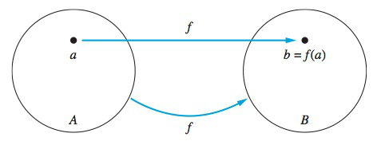
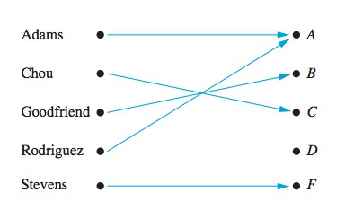
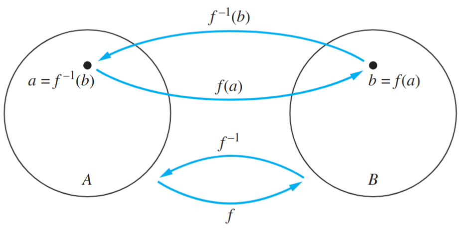
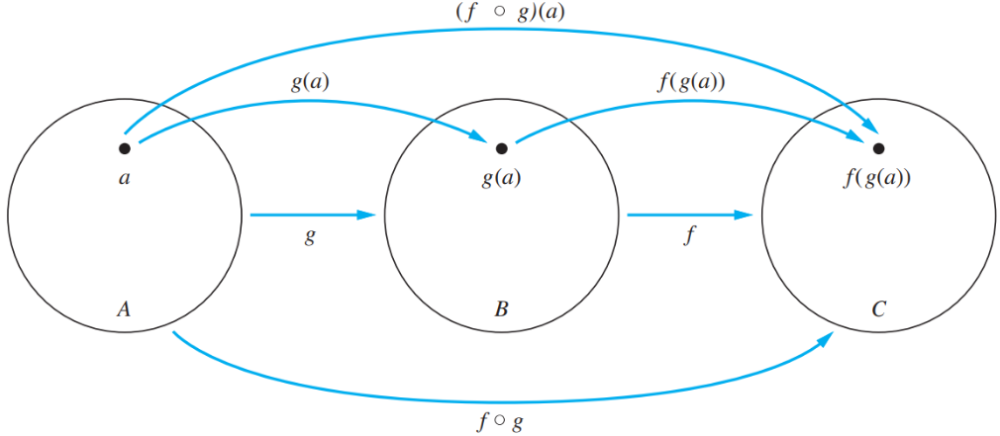
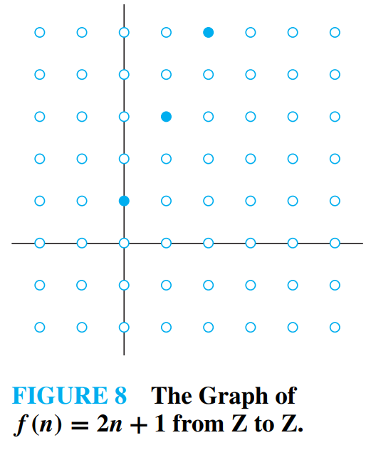

---
# Copyright (c) 2026 Angela Villota, and collaborators from the CyED block
# Licensed under the PolyForm Noncommercial License 1.0.0.
# Commercial use is prohibited without prior written authorization.
title: "Unidad 2: Relaciones y Funciones"
---

# Unidad 2: Relaciones y Funciones

## Definición de relación

**Relación binaria.** Sean $A$ y $B$ dos conjuntos, una relación de $A$ en $B$ es un subconjunto de $A \times B$.

**Ejemplo.** Sea $A$ el conjunto de todas las ciudades y $B$ el conjunto de los países de Sudamérica. Se define $R$ tal que $(a,b)\in R$ si la ciudad $a$ está en el país $b$.

$$
(\text{Barranquilla},\text{Colombia}),\;
(\text{Rosario},\text{Argentina}),\;
(\text{Sao Paulo},\text{Brasil}),
$$
$$
(\text{Antofagasta},\text{Chile}),\;
(\text{Maracaibo},\text{Venezuela})
$$

pertenecen a $R$.

**Ejemplo.** Sean $A=\{0,1,2\}$ y $B=\{a,b\}$. Entonces

$$
R=\{(0,a),(0,b),(1,a),(2,b)\}
$$

es una relación de $A$ en $B$. Esto significa que $0Ra$ pero $1\not R b$.

Sean

$$
A=\{1,2,3,4\}, \quad B=\{-1,-2,-3\}
$$

se presentan a continuación algunas relaciones:

- $R_1=\{(2,-1),(3,-2),(1,-1)\}$
- $R_2=\{(1,-1),(2,-2),(3,-3)\}$
- $R_3=\{(1,-2),(1,-3),(2,-2),(2,-3),(3,-2),(3,-3)\}$
- $R_4=\{(3,-1)\}$

Cada relación es un subconjunto de:

$$
A \times B =
\{
\begin{aligned}
&(1,-1),(1,-2),(1,-3),\\
&(2,-1),(2,-2),(2,-3),\\
&(3,-1),(3,-2),(3,-3),\\
&(4,-1),(4,-2),(4,-3)
\}
\end{aligned}
$$

**Relación en $A$.** Una relación definida en un conjunto $A$ es una relación de $A$ en $A$.

Sea

$$
A=\{1,2,3,4,5\}
$$

se presentan algunas relaciones de $A$ en $A$:

- $R_1=\{(4,2),(1,3),(1,5)\}$
- $R_2=\{(1,1),(2,2),(3,3),(4,4),(5,5)\}$
- $R_3=\{(1,1),(3,1),(4,1),(4,2),(4,3)\}$
- $R_4=\{(2,1),(3,2),(4,3)\}$

$$
A \times A =
\left\{
\begin{aligned}
&(1,1),(1,2),(1,3),(1,4),(1,5),\\
&(2,1),(2,2),(2,3),(2,4),(2,5),\\
&(3,1),(3,2),(3,3),(3,4),(3,5),\\
&(4,1),(4,2),(4,3),(4,4),(4,5),\\
&(5,1),(5,2),(5,3),(5,4),(5,5)
\end{aligned}
\right\}
$$

Sea $A=\{1,2,3,4\}$ muestre las siguientes relaciones:

- $R_1=\{(a,b)\mid a<b\}$
- $R_2=\{(a,b)\mid a=b\}$
- $R_3=\{(a,b)\mid a=b+1\}$
- $R_4=\{(a,b)\mid a \text{ divide } b\}$
- $R_5=\{(a,b)\mid a+b \leq 3\}$

$$
A\times A =
\{
\begin{aligned}
&(1,1),(1,2),(1,3),(1,4),\\
&(2,1),(2,2),(2,3),(2,4),\\
&(3,1),(3,2),(3,3),(3,4),\\
&(4,1),(4,2),(4,3),(4,4)
\}
\end{aligned}
$$

Sea $A=\{1,2,3,4\}$ muestre las siguientes relaciones:

- $R_1=\{(1,2),(1,3),(1,4),(2,3),(2,4),(3,4)\}$
- $R_2=\{(1,1),(2,2),(3,3),(4,4)\}$
- $R_3=\{(2,1),(3,2),(4,3)\}$
- $R_4=\{(1,1),(1,2),(1,3),(1,4),(2,2),(2,4),(3,3),(4,4)\}$
- $R_5=\{(1,1),(1,2),(2,1)\}$

$$
A\times A =
\{
\begin{aligned}
&(1,1),(1,2),(1,3),(1,4),\\
&(2,1),(2,2),(2,3),(2,4),\\
&(3,1),(3,2),(3,3),(3,4),\\
&(4,1),(4,2),(4,3),(4,4)
\}
\end{aligned}
$$

Sea $A=\{-2,-1,1,2,3,4\}$ muestre las siguientes relaciones:

- $R_1=\{(a,b)\mid a>0 \;\wedge\; b<0\}$
- $R_2=\{(a,b)\mid a=-b\}$
- $R_3=\{(a,b)\mid a+b<2\}$

Sea $A=\{-2,-1,1,2,3,4\}$ muestre las siguientes relaciones:

- $R_1=\{(1,-2),(1,-1),(2,-2),(2,-1),(3,-2),(3,-1),(4,-2),(4,-1)\}$
- $R_2=\{(-2,2),(2,-2),(-1,1),(1,-1)\}$
- $R_3=\{(-2,-2),(-2,-1),(-2,1),(-2,3),(-1,-2),(-1,-1),(-1,1),(-1,2),(1,-2),(1,-1),(2,-2),(2,-1),(3,-2)\}$

**Función.** Una función es una relación $R$ de $A$ en $B$ tal que cada elemento de $A$ le corresponde un único elemento de $B$. Es decir, a cada $a \in A$ le asignamos un único $b \in B$ tal que $f(a)=b$ y $(a,b)\in R$.

**Diferencias.** En una relación se puede dar que un elemento de $A$ esté relacionado con más de un elemento de $B$.

Las relaciones son una generalización de las funciones y pueden emplearse para expresar una clase mucho más amplia de relaciones entre conjuntos.

## Definición de función

**Noción de función.** Una función permite representar la relación entre dos conjuntos.

**Ejemplo.** Sea $A=\{\text{Arias},\text{Benavides},\text{Calero},\text{Cardona},\text{Navarrete}\}$ y $B=\{1.2,\,4.5,\,5.0,\,2.9,\,4.9\}$, con

$$
\text{Arias}\to 4.5,\quad \text{Benavides}\to 1.2,\quad \text{Calero}\to 2.9,\quad \text{Cardona}\to 5.0,\quad \text{Navarrete}\to 4.9.
$$

Así, $f(\text{Arias}) = 4.5$ y $f(\text{Benavides}) = 1.2$.

**Función.** Dados dos conjuntos $A$ y $B$, una función $f$ de $A$ a $B$, denotada como $f: A \rightarrow B$, asigna a cada elemento de $A$ exactamente un elemento de $B$.

**Ejemplo.** Sea $A=\{x,y,z\}$ y $B=\{1,4\}$, con $x\to 1$ y $y\to 4$. No es función porque $z$ no tiene imagen.

**Ejemplo.** Sea $A=\{x,y\}$ y $B=\{1,4,5\}$, con $x\to 1$ y $y\to 4$. Como cada elemento de $A$ tiene una única imagen, $f(x)=1,\; f(y)=4$.

**Ejemplo.** Sea $A=\{x,y\}$ y $B=\{1,4,5\}$, con $x\to 1$, $y\to 4$ y $y\to 5$. No es función porque un elemento ($y$) tiene dos imágenes.

**Ejemplo.** Sea $A=\{\text{Arias},\text{Benavides}\}$ y $B=\{1.2,\,2.9,\,4.0\}$, con Arias$\to 1.2$, Benavides$\to 2.9$ y Benavides$\to 4.0$. No es función, ya que Benavides tiene dos imágenes.

**Ejemplo.** Sea $A=\{x,y,z\}$ y $B=\{1,4\}$, con $x\to 1$, $y\to 1$ y $z\to 4$. Es función y $f(x)=1,\; f(y)=1,\; f(z)=4$.

**Ejemplo.** Sea $A=\{x,y,z\}$ y $B=\{1,4,8\}$, con $x\to 1$, $y\to 1$ y $z\to 1$. Es función y $f(x)=1,\; f(y)=1,\; f(z)=1$.

**Ejemplo.** Sea $A=\{x,y,z\}$ y $B=\{1,4,8\}$, con $x\to 1$, $x\to 4$ y $x\to 8$. No es función, ya que $x$ tiene tres imágenes.

**Ejemplo.** Indique si la siguiente relación entre los conjuntos $A=\{w,x,y,z\}$ y $B=\{1,2,3,4\}$ es una función:

$$
f(w)=3,\; f(x)=4,\; f(y)=4,\; f(z)=3
$$

Es función, ya que cada elemento de $A$ tiene una única imagen (aunque dos elementos compartan la misma imagen).

**Ejemplo.** Indique si la siguiente relación entre los conjuntos $A=\{a,b,c,d\}$ y $B=\{a,b,c,d\}$ es una función:

$$
f(c)=d,\; f(a)=c,\; f(b)=a,\; f(c)=b,\; f(d)=c
$$

No es función, ya que $c$ tiene dos imágenes ($d$ y $b$).

Las funciones se pueden especificar por medio de fórmulas, por ejemplo,

$$
f(x)=x+1,\quad \text{de } \mathbb{Z} \text{ a } \mathbb{Z}
$$

que asigna, entre otros, $-1\to 0$, $0\to 1$, $1\to 2$, $2\to 3$.

Indique si cada $f$ es, o no, una función de $\mathbb{R}$ en $\mathbb{R}$:

- $f(x)=\frac{1}{x}$: **no es una función** porque $f(0)$ no está definida.
- $f(x)=\sqrt{x}$: **no es una función** porque $f(-1)$ no está definida.
- $f(x)=\pm x$: **no es una función** porque asigna dos valores a $x$.
- $f(x)=x^2+1$: **sí es una función**.

---
**· Contenido adicional ·**

### Funciones

En matemáticas, una función representa una relación entre dos conjuntos, donde a cada elemento del conjunto de partida (dominio) le corresponde exactamente un elemento del conjunto de llegada (codominio). Las funciones permiten modelar dependencias entre cantidades, analizar fenómenos naturales, y formalizar conceptos fundamentales en disciplinas como la informática, la física y la ingeniería.

Una función se denota comúnmente como:

$$
f : A \rightarrow B
$$

lo que significa que $f$ asigna a cada elemento de $A$ un único elemento de $B$.

#### Objetivos

- Comprender la noción formal de función como asignación entre conjuntos.
- Identificar el dominio, codominio, imagen y preimagen de una función.
- Distinguir tipos de funciones: inyectiva, sobreyectiva y biyectiva.
- Analizar funciones crecientes y decrecientes en el contexto de los números reales.
- Aplicar operaciones básicas con funciones como suma y producto.

#### Usos

- Matemáticas: Estudio de relaciones, límites, derivadas e integrales.
- Informática: Diseño de algoritmos, programación funcional y estructuras de datos.
- Ciencias naturales: Modelado de fenómenos físicos, biológicos y económicos.
- Educación: Construcción de funciones como herramienta de razonamiento lógico.

---

## Dominio, Codominio y Rango

Si $f$ es una función de $A$ a $B$, se dice que:

- $A$ es el **dominio**
- $B$ es el **codominio**
- El **rango** de $f$ es el conjunto de todas las imágenes de los elementos de $A$. Si $f(a)=b$ se dice que $b$ es la imagen de $a$.

**Ejemplo.** Indique el dominio, codominio y rango de la función con dominio $\{x,y\}$, codominio $\{1,4,8\}$ y $x\to 1$, $y\to 4$.

- **Dominio** $=\{x,y\}$
- **Codominio** $=\{1,4,8\}$
- **Rango** $=\{1,4\}$

**Ejemplo.** Indique el dominio, codominio y rango de la función con dominio $\{x,y,z\}$, codominio $\{a,b,c,d,e\}$ y $x\to c$, $y\to e$, $z\to a$.

- **Dominio** $=\{x,y,z\}$
- **Codominio** $=\{a,b,c,d,e\}$
- **Rango** $=\{a,c,e\}$

---
**· Contenido adicional ·**

### Funciones

**¿Qué es una función?**

**Definición:**
Sean $A$ y $B$ conjuntos. Una función $f$ de $A$ en $B$ es una asignación de exactamente un elemento de $B$ a cada elemento de $A$. Escribimos $f(a) = b$ si $b$ es el único elemento de $B$ asignado por la función $f$ al elemento $a$ de $A$. Si $f$ es una función de $A$ en $B$, escribimos:

$$
f : A \rightarrow B
$$

---

**¿Qué es el dominio y el codominio de una función?**

**Definición:**
Si $f$ es una función de $A$ en $B$, entonces:
- $A$ es el **dominio** de $f$.
- $B$ es el **codominio** de $f$.

---

**¿Qué es la imagen y la preimagen de una función?**

**Definición:**
Si $f(a) = b$, entonces:
- $b$ es la **imagen** de $a$.
- $a$ es una **preimagen** de $b$.

---

**¿Qué es el rango o imagen de una función?**

**Definición:**
El **rango** o **imagen** de $f$ es el conjunto de todas las imágenes de elementos de $A$.

**Ejemplo:**
Sea $G$ la función que asigna una letra a una persona.

- El dominio de $G$ es:
  $ \{ \text{Adams, Chou, Goodfriend, Rodríguez, Stevens} \} $

- El codominio de $G$ es:
  $ \{ A, B, C, D, F \} $

- La imagen de $G$ es:
  $ \{ A, B, C, F \} $

---

#### Operaciones con funciones reales

**Suma y multiplicación de funciones**

**Definición:**
Sean $f_1$ y $f_2$ funciones de $A$ en $\mathbb{R}$. Entonces, $f_1 + f_2$ y $f_1 f_2$ también son funciones de $A$ en $\mathbb{R}$ definidas por:

$$
(f_1 + f_2)(x) = f_1(x) + f_2(x)
$$

$$
(f_1 f_2)(x) = f_1(x) \cdot f_2(x)
$$

---

**Ejemplo:**

Sean $f_1(x) = x^2$ y $f_2(x) = x - x^2$. ¿Cuáles son $f_1 + f_2$ y $f_1 f_2$?

**Solución:**

$$
(f_1 + f_2)(x) = x^2 + (x - x^2) = x
$$

$$
(f_1 f_2)(x) = x^2 (x - x^2) = x^3 - x^4
$$

---

#### Imagen de un subconjunto

**Imagen de un subconjunto del dominio**

**Definición:**
Sea $f : A \rightarrow B$ una función, y sea $S \subseteq A$. La **imagen** de $S$ es el subconjunto de $B$ formado por todas las imágenes de los elementos de $S$:

$$
f(S) = \{ f(s) \mid s \in S \}
$$

---

**Ejemplo:**
Sean:

- $A = \{ a, b, c, d, e \} $
- $B = \{ 1, 2, 3, 4 \} $

Definimos $f$ como:

$$
f(a) = 2,\quad f(b) = 1,\quad f(c) = 4,\quad f(d) = 1,\quad f(e) = 1
$$

Sea $S = \{ b, c, d \} $. ¿Cuál es $f(S)$?

**Solución:**

$$
f(S) = \{ 1, 4 \}
$$

---

**Ejemplo.** Indique el rango de la función $f(x)=x^2$, de los reales a los reales.

- **Dominio** $=\mathbb{R}$
- **Codominio** $=\mathbb{R}$
- **Rango** $=\mathbb{R}^+ \cup \{0\}$

**Ejemplo.** Indique el rango de la función $f(x)=x^2+4$, de los reales a los reales.

- **Dominio** $=\mathbb{R}$
- **Codominio** $=\mathbb{R}$
- **Rango** $=[4,\infty)$

**Ejemplo.** Sea $f$ la función que toma cualquier cadena de 3 bits y devuelve la cantidad de 1's. El dominio es el conjunto de las 8 cadenas de 3 bits ($000,001,010,011,100,101,110,111$) y el rango es $\{0,1,2,3\}$, ya que:

$$
000\to 0,\quad 001,010,100\to 1,\quad 011,101,110\to 2,\quad 111\to 3.
$$

## Funciones inyectivas, sobreyectivas y biyectivas

Tipos de funciones: inyectiva, sobreyectiva, biyectiva.

### Inyectividad

**Función inyectiva.** Una función $f$ se llama **uno a uno** o **inyectiva**, si y solo si, cada imagen asociada es única.

**Ejemplo.** Sea $A=\{x,y,z\}$ y $B=\{1,4,8\}$, con $x\to 1$, $y\to 1$ y $z\to 4$. **No es inyectiva** (dos elementos distintos, $x$ y $y$, comparten la misma imagen).

**Ejemplo.** Sea $A=\{x,y,z\}$ y $B=\{1,4,8\}$, con $x\to 1$, $y\to 8$ y $z\to 4$. **Es inyectiva**.

**Ejemplo.** Sea $A=\{x,y,z\}$ y $B=\{1,4,8,10\}$, con $x\to 1$, $y\to 4$ y $z\to 8$. **Es inyectiva**.

Indique cuáles de las siguientes funciones son inyectivas:

- $f:\{a,b,c,d\} \to \{1,2,3,4,5\}$ donde $f(a)=4,\; f(b)=5,\; f(c)=1,\; f(d)=3$
- $f(x)=x^2$ de los enteros a los enteros
- $f(x)=x+1$ de los enteros a los enteros

La primera función, con $a\to 4$, $b\to 5$, $c\to 1$, $d\to 3$, **es inyectiva** (todas las imágenes son distintas).

- $f(x)=x^2$ de los enteros a los enteros, **no es inyectiva** porque $f(1)=f(-1)=1$.
- $f(x)=x+1$ de los enteros a los enteros, **sí es inyectiva** porque cada $x$ tiene un solo $y$ asignado, $x+1$.

**Ejemplo.** Determine si la función $f(x)=x+1$ del conjunto de los enteros al conjunto de los enteros es inyectiva. Suponemos que $f(x)=f(y)$, luego $x+1=y+1$, por tanto $x=y$ y probamos que es inyectiva.

**Ejemplo.** Determine si la función $f(x)=x^2$ del conjunto de los enteros al conjunto de los enteros es inyectiva. La función $f(x)=x^2$ no es inyectiva pues, por ejemplo, $f(1)=f(-1)$ pero $1\neq -1$.

**Definición.** Una función $f$ cuyo dominio y codominio son subconjuntos del conjunto de los números reales se denomina **estrictamente creciente** si $f(x) < f(y)$ siempre que $x < y$ y tanto $x$ como $y$ estén en el dominio de $f$. Es decir,

$$
\forall x \forall y \, ((x<y) \rightarrow (f(x)<f(y))).
$$

**Definición.** Una función $f$ cuyo dominio y codominio son subconjuntos del conjunto de los números reales se denomina **estrictamente decreciente** si $f(x) > f(y)$ siempre que $x < y$ y tanto $x$ como $y$ estén en el dominio de $f$. Es decir,

$$
\forall x \forall y \, ((x<y) \rightarrow (f(x)>f(y))).
$$

---
**· Contenido adicional ·**

### Funciones Inyectivas

**¿Qué es una función inyectiva?**

Una función $f$ es **inyectiva** si y solo si $f(x) = f(y)$ implica que $x = y$ para todo $x$ y $y$ en el dominio de $f$. Es decir, dos elementos distintos del dominio no pueden tener la misma imagen.

Expresado formalmente:

$$
\forall x \forall y \, ((f(x)=f(y)) \Rightarrow (x=y)).
$$

**Ejemplo visual:**

:::{image} images/inyectiva.png
:alt: Función inyectiva
:width: 100%
:::

---

**Ejemplo 1:**

Sea $f(x) = x + 1$, una función del conjunto de los enteros en los enteros.
Supongamos $f(x) = f(y)$, entonces $x+1 = y+1$, por lo tanto $x = y$.

**Conclusión:** La función es inyectiva.

**Ejemplo 2:**

Sea $f(x) = x^2$, del conjunto de los enteros en los enteros.
$f(1) = 1 = f(-1)$ pero $1 \neq -1$.

**Conclusión:** La función **no** es inyectiva.

---

### Funciones Estrictamente Crecientes

Una función $f$ cuyo dominio y codominio son subconjuntos de los números reales es **estrictamente creciente** si:

$$
x < y \Rightarrow f(x) < f(y)
$$

o de forma formal:

$$
\forall x \forall y \, ((x < y) \Rightarrow (f(x) < f(y)))
$$

---

### Funciones Estrictamente Decrecientes

Una función $f$ es **estrictamente decreciente** si:

$$
x < y \Rightarrow f(x) > f(y)
$$

o formalmente:

$$
\forall x \forall y \, ((x < y) \Rightarrow (f(x) > f(y)))
$$

---

### Sobreyectividad

**Función sobreyectiva.** Una función $f$ es sobreyectiva, si y solo si, para cada elemento $b \in B$ (codominio), existe un elemento $a \in A$ tal que $f(a)=b$. Una función es sobreyectiva si el codominio es igual al rango.

**Ejemplo.** Sea $A=\{x,y,z\}$ y $B=\{1,8\}$, con $x\to 1$, $y\to 1$ y $z\to 8$. **Es sobreyectiva**.

**Ejemplo.** Sea $A=\{x,y\}$ y $B=\{1,8,10\}$, con $x\to 1$ y $y\to 8$. **No es sobreyectiva** porque existe un elemento del codominio ($10$) para el cual no existe ningún elemento del dominio que lo tenga como imagen.

**Ejemplo.** Sea $A=\{x,y,z\}$ y $B=\{1,8,10\}$, con $x\to 1$, $y\to 10$ y $z\to 8$. **Es sobreyectiva**.

**Ejemplo.** Sea $A=\{x,y,z\}$ y $B=\{8\}$, con $x\to 8$, $y\to 8$ y $z\to 8$. **Es sobreyectiva**.

Indique cuáles de las siguientes funciones son sobreyectivas:

- $f:\{a,b,c,d\} \to \{1,2,3\}$ donde $f(a)=3,\; f(b)=2,\; f(c)=1,\; f(d)=3$
- $f(x)=x^2$ de los enteros a los enteros
- $f(x)=x+1$ de los enteros a los enteros

La primera función, con $a\to 3$, $b\to 2$, $c\to 1$, $d\to 3$, **es sobreyectiva** (todo el codominio $\{1,2,3\}$ es alcanzado).

- $f(x)=x^2$ de los enteros a los enteros, **no es sobreyectiva** porque $-1$, que está en el codominio, no pertenece al rango.
- $f(x)=x+1$ de los enteros a los enteros, **sí es sobreyectiva** porque cada elemento del codominio es imagen de algún entero.

**Ejemplo.** Determine si la función $f(x)=x+1$ del conjunto de los enteros al conjunto de los enteros es sobreyectiva. Debemos mostrar que para todo $y$ existe un $x$ tal que $f(x)=y$. Como $f(x)=y$ entonces $x+1=y$ y $x=y-1$, que cumple $f(x)=y$ ya que $f(y-1)=y-1+1=y$.

**Ejemplo.** Determine si la función $f(x)=x^2$ del conjunto de los enteros al conjunto de los enteros es sobreyectiva. La función $f(x)=x^2$ no es sobreyectiva porque, por ejemplo, no hay ningún entero $x$ tal que $x^2=-1$.

---
**· Contenido adicional ·**

### Funciones Sobreyectivas

Una función $f: A \rightarrow B$ es **sobreyectiva** si **cada elemento del codominio** es imagen de al menos un elemento del dominio. Es decir, para todo $b \in B$, existe $a \in A $ tal que $f(a) = b$.

Formalmente:

$$
(\forall b \in B, \exists a \in A, | f(a) = b)
$$

**Ejemplo visual:**

:::{image} images/sobreyectiva.png
:alt: Función sobreyectiva
:width: 100%
:::

---

**Ejemplo 1:**

Sea $f(x) = x + 1$, de los enteros en los enteros.
Dado cualquier $y \in \mathbb{Z}$, existe $x = y - 1$ tal que $f(x) = y$.

**Conclusión:** La función es sobreyectiva.

**Ejemplo 2:**

Sea $f(x) = x^2$, de los enteros en los enteros.
No existe $x \in \mathbb{Z}$ tal que $f(x) = -1$.

**Conclusión:** La función **no** es sobreyectiva.

---

### Biyectividad

**Función biyectiva.** Una función $f$ es biyectiva si es inyectiva y sobreyectiva.

**Ejemplo.** Sea $A=\{x,y,z\}$ y $B=\{1,8,10\}$, con $x\to 1$, $y\to 10$ y $z\to 8$. **Es biyectiva**.

**Ejemplo.** Sea $A=\{x,y,z\}$ y $B=\{1,8\}$, con $x\to 1$, $y\to 8$ y $z\to 8$. **No es biyectiva porque no es inyectiva**.

**Ejemplo.** Sea $A=\{x,y\}$ y $B=\{1,8,10\}$, con $x\to 1$ y $y\to 8$. **No es biyectiva porque no es sobreyectiva**.

**Ejemplo.** Indique si la función $f:\{a,b,c,d\} \to \{1,2,3,4\}$ donde $f(a)=4,\; f(b)=2,\; f(c)=1,\; f(d)=3$ es biyectiva. **Es biyectiva**.

Clasifique cada una de las siguientes funciones como inyectiva, sobreyectiva o biyectiva.

- $A=\{a,b,c\}$, $B=\{1,2,3,4\}$, con $a\to 3$, $b\to 4$, $c\to 1$: **Inyectiva pero no sobreyectiva**.
- $A=\{a,b,c,d\}$, $B=\{1,2,3\}$, con $a\to 2$, $b\to 1$, $c\to 3$, $d\to 2$: **Sobreyectiva pero no inyectiva**.
- $A=\{a,b,c,d\}$, $B=\{1,2,3,4\}$, con $a\to 4$, $b\to 1$, $c\to 3$, $d\to 2$: **Biyectiva**.
- $A=\{a,b,c,d\}$, $B=\{1,2,3,4\}$, con $a\to 2$, $b\to 1$, $c\to 2$, $d\to 3$: **Ni inyectiva ni sobreyectiva**.
- $A=\{a,b,c\}$, $B=\{1,2,3,4\}$, con $a\to 1$, $a\to 4$, $b\to 2$, $c\to 3$: **No es función** (pues $a$ tiene dos imágenes).

---
**· Contenido adicional ·**

### Funciones Biyectivas

Una función es **biyectiva** si es **inyectiva y sobreyectiva** al mismo tiempo. Esto significa que:

- Cada elemento del codominio tiene **exactamente una preimagen** en el dominio.
- No hay elementos del codominio sin imagen, ni dos elementos del dominio que se asignen al mismo valor.

**Ejemplo visual:**

:::{image} images/biyeccion.png
:alt: Función biyectiva
:width: 100%
:::

## Función inversa

**Definición.** Sea $f$ una función biyectiva del conjunto $A$ en el conjunto $B$. La función inversa de $f$ es la función que asigna a un elemento $b$ que pertenece a $B$ el único elemento $a$ de $A$ tal que $f(a)=b$. La función inversa de $f$ se denota por $f^{-1}$. Así, $f^{-1}(b)=a$ cuando $f(a)=b$.

¿Cuándo se puede obtener la inversa de una función? Cuando dicha función es biyectiva.

¿Por qué no se puede invertir una función que no es biyectiva? Si la función no es una biyección, no podemos asignar a cada elemento $b$ del codominio un único elemento $a$ del dominio tal que $f(a)=b$, ya que para algún $b$ hay o bien más de un elemento $a$ o ninguno.

Dada una función $f:A \to B$, la función inversa de $f$, denotada por $f^{-1}$, asigna a un elemento $b \in B$ un único elemento $a \in A$ tal que $f(a)=b$.

**Ejemplo.** Sea $A=\{a,b,c\}$ y $B=\{1,2,3\}$, con $a\to 1$, $b\to 3$ y $c\to 2$. Entonces:

$$
f^{-1}(1)=a,\qquad f^{-1}(2)=c,\qquad f^{-1}(3)=b.
$$

**Ejemplo.** Muestre la inversa para $f:A \to B$, donde $A=\{a,b,c,d\}$, $B=\{1,2,3,4\}$ y $f(a)=2,\ f(b)=3,\ f(c)=1,\ f(d)=4$.

$$
f^{-1}(1)=c,\qquad f^{-1}(2)=a,\qquad f^{-1}(3)=b,\qquad f^{-1}(4)=d.
$$

**Ejemplo.** Muestre la inversa para $f:A \to B$, donde $A=\{x,y,z\}$, $B=\{a,b\}$ y $f(x)=a,\ f(y)=a,\ f(z)=b$. La relación $B \to A$ no es una función, pues $a$ tendría dos preimágenes ($f^{-1}(a)=x$ y $f^{-1}(a)=y$).

**Conclusión:** $f^{-1}$ no está definida cuando $f$ no es inyectiva.

**Ejemplo.** Muestre la inversa para $f:A \to B$, donde $A=\{x,y\}$, $B=\{a,b,c\}$ y $f(x)=a,\ f(y)=b$. La relación $B \to A$ no es una función porque no se tiene $f^{-1}(c)$.

**Conclusión:** $f^{-1}$ no está definida cuando $f$ no es sobreyectiva.

¿Qué es una función invertible? Es una función biyectiva. Se le denomina invertible ya que se puede definir su inversa.

¿Cuándo una función es no invertible? Cuando dicha función no es biyectiva, ya que la inversa de tal función no existe.

Una función $f:A \to B$ es **invertible** si es biyectiva.

**Ejemplo.** Indique cuáles de las siguientes funciones, $f:\mathbb{R} \to \mathbb{R}$, son invertibles:

- $f(x)=2x+1$, **es invertible**
- $f(x)=x^2+1$, **no es invertible** porque no es inyectiva ($f(-1)=f(1)=2$)
- $f(x)=x^3$, **es invertible**
- $f(x)=\dfrac{x^2+1}{x^2+2}$, **no es invertible**: no es inyectiva y no es sobreyectiva (por ejemplo, $1$ no pertenece a la imagen)

**Ejemplo.** Determine si las siguientes funciones, de $\mathbb{R}$ a $\mathbb{R}$, son invertibles:

- $f(x)=\lfloor x/2 \rfloor$, no es invertible (no es inyectiva; por ejemplo $f(1)=f(2)=1$)
- $f(x)=3x^2+7$, no es invertible (no es inyectiva; $f(1)=f(-1)=10$)
- $f(x)=\dfrac{x+1}{x+2}$, no es invertible (no es sobreyectiva; $1$ no pertenece a la imagen)
- $f(x)=x^5+1$, sí es invertible

**Ejemplo.** Sea $f$ la función de $\{a,b,c\}$ en $\{1,2,3\}$ definida por $f(a)=2$, $f(b)=3$ y $f(c)=1$. ¿Es $f$ invertible? Si lo es, ¿cuál es su inversa?

**Solución:** La función $f$ es invertible puesto que es una biyección. La función inversa $f^{-1}$ invierte la correspondencia dada por $f$, de tal forma que $f^{-1}(1)=c$, $f^{-1}(2)=a$ y $f^{-1}(3)=b$.

**Ejemplo.** Sea $f$ la función de $\mathbb{Z}$ en $\mathbb{Z}$ dada por $f(x)=x^2$. ¿Es $f$ invertible?

**Solución:** Como $f(-1)=f(1)=1$, $f$ no es inyectiva. Si se definiese una función inversa, a $1$ se le asignarían dos elementos. Por tanto $f$ no es invertible.

Dadas las siguientes funciones de los enteros a los enteros, complete la tabla indicando si cumple, o no, cada propiedad:

- $f_1(x)=x^2-1$
- $f_2(x)=5x-8$

| | Inyectiva | Sobreyectiva | Biyectiva |
|---|---|---|---|
| $f_1$ | | | |
| $f_2$ | | | |

Justifique solamente las propiedades que no se cumplen.

## Composición de funciones

¿Qué es una composición de funciones?

**Definición.** Sea $g$ una función del conjunto $A$ al conjunto $B$ y sea $f$ una función del conjunto $B$ al conjunto $C$. La composición de las funciones $f$ y $g$, denotada por $f \circ g$, se define por

$$
(f \circ g)(a) = f(g(a))
$$

$f \circ g$ es la función que asigna al elemento $a$ de $A$ el elemento asignado por $f$ a $g(a)$.

¿Cuándo se pueden componer dos funciones? La composición de dos funciones $f \circ g$ se puede definir si, y sólo si, la imagen de $g$ es un subconjunto del dominio de $f$.

Dadas dos funciones $f:A \to B$ y $g:B \to C$ se denomina composición de las funciones $f$ y $g$ a la función $f \circ g : A \to C$ tal que:

$$
(f \circ g)(a) = f(g(a))
$$

**Ejemplo.** Sea $g$ la función del conjunto $\{a,b,c\}$ en sí mismo, definida por $g(a)=b$, $g(b)=c$ y $g(c)=a$. Sea $f$ la función del conjunto $\{a,b,c\}$ en $\{1,2,3\}$ tal que $f(a)=3$, $f(b)=2$ y $f(c)=1$. ¿Cuál es la composición de $f$ y $g$? ¿Y la composición de $g$ y $f$?

**Solución:** La composición $f \circ g$ se define como

$$
(f \circ g)(a)=f(g(a))=f(b)=2,
$$
$$
(f \circ g)(b)=f(g(b))=f(c)=1,
$$
$$
(f \circ g)(c)=f(g(c))=f(a)=3.
$$

En cuanto a $g \circ f$, no se puede definir ya que la imagen de $f$ no es subconjunto del dominio de $g$.

**Ejercicio.** Sean las funciones

$$
s(x)=\sqrt{x}
\qquad \text{y} \qquad
t(x)=x^2+2x+1.
$$

- Componga ambas funciones $(s \circ t)(x)$.
- Verifique por qué es posible realizar la composición, teniendo en cuenta los dominios y codominios.

**Solución:** Observemos que

$$
t(x)=x^2+2x+1=(x+1)^2.
$$

Como $(x+1)^2 \ge 0$ para todo $x \in \mathbb{R}$, la imagen de $t$ está contenida en el dominio de $s(x)=\sqrt{x}$, que es $[0,\infty)$.

Por tanto, la composición es posible.

Componiendo algebraicamente:

$$
(s \circ t)(x)
= s(t(x))
= \sqrt{x^2+2x+1}
= \sqrt{(x+1)^2}
$$

**Dominio:** $\mathbb{R}$.

**Rango:** $[0,\infty)$.

**Ejercicio.** Para cada uno de los siguientes pares de funciones $f$ y $g$: calcule las funciones compuestas $f \circ g$ y $g \circ f$, y determine el dominio de cada composición.

**a)** $f(x)=2x-5$, $g(x)=x^2-3x$

**b)** $f(x)=\sqrt{3x-1}$, $g(x)=x^2$

**c)** $f(x)=\sqrt{3x-1}$, $g(x)=\dfrac{1}{x}$

**d)** $f(x)=\sqrt{3x-1}$, $g(x)=\dfrac{x^2+1}{x}$

**e)** $f(x)=x^2-3$, $g(x)=|x|$

**Solución:**

**(a)** $(f\circ g)(x)=2x^2-6x-5$, Dom: $\mathbb{R}$; $(g\circ f)(x)=4x^2-26x+40$, Dom: $\mathbb{R}$

**(b)** $(f\circ g)(x)=\sqrt{3x^2-1}$, Dom: $(-\infty,-\tfrac{1}{\sqrt3}] \cup [\tfrac{1}{\sqrt3},\infty)$; $(g\circ f)(x)=3x-1$, Dom: $[\tfrac13,\infty)$

**(c)** $(f\circ g)(x)=\sqrt{\tfrac{3}{x}-1}$, Dom: $(0,3]$; $(g\circ f)(x)=\dfrac{1}{\sqrt{3x-1}}$, Dom: $(\tfrac13,\infty)$

**(d)** $(f\circ g)(x)=\sqrt{\dfrac{3x^2-x+3}{x}}$, Dom: $(0,\infty)$; $(g\circ f)(x)=\dfrac{3x}{\sqrt{3x-1}}$, Dom: $(\tfrac13,\infty)$

**(e)** $(f\circ g)(x)=x^2-3$, Dom: $\mathbb{R}$; $(g\circ f)(x)=|x^2-3|$, Dom: $\mathbb{R}$

## Otros conceptos relacionados a funciones

¿Qué es la gráfica de una función?

**Definición.** Sea $f$ una función del conjunto $A$ al conjunto $B$. La gráfica de una función $f$ es el conjunto de pares ordenados $\{(a,b)\mid a\in A \land f(a)=b\}$. La gráfica de una función $f$ de $A$ en $B$ es el subconjunto de $A\times B$ que contiene los pares ordenados con la segunda entrada igual al elemento de $B$ asignado por $f$ a la primera entrada.

**Ejemplo.** Dibuje la gráfica de la función $f(n)=2n+1$ del conjunto de los enteros al conjunto de los enteros.

**Solución:** La gráfica de $f$ es el conjunto de pares ordenados $(n,2n+1)$, donde $n$ es un entero.

*Fuente: Rosen, Discrete Mathematics and Its Applications, Cap. 2*

¿Qué es la función parte entera? La función parte entera o función piso, asigna a un número real $x$ el mayor entero que es menor o igual que $x$. El valor de la función parte entera se denota por $\lfloor x \rfloor$.

¿Qué es la función parte entera por exceso? La función parte entera por exceso o función techo, asigna a un número real $x$ el menor entero que es mayor o igual que $x$. El valor de la función parte entera por exceso se denota por $\lceil x \rceil$.

**Ejemplo.** Estos son algunos valores de las funciones parte entera y parte entera por exceso:

$$
\lfloor \tfrac{1}{2} \rfloor = 0, \quad
\lceil \tfrac{1}{2} \rceil = 1, \quad
\lfloor -\tfrac{1}{2} \rfloor = -1, \quad
\lceil -\tfrac{1}{2} \rceil = 0,
$$
$$
\lfloor 3.1 \rfloor = 3, \quad
\lceil 3.1 \rceil = 4, \quad
\lfloor 7 \rfloor = 7, \quad
\lceil 7 \rceil = 7.
$$

¿Cómo se define un número real? Sea $x$ un número real, $x = n + \epsilon$ tal que $n \in \mathbb{Z}$, $\epsilon \in \mathbb{R}$ y $0 < \epsilon < 1$.

---

Continúa con los [ejercicios de Relaciones y Funciones](exercises.md).

*Material adaptado del material original de los profesores Oscar Bedoya, Andrés Aristizábal y Marlon Gomez.*
