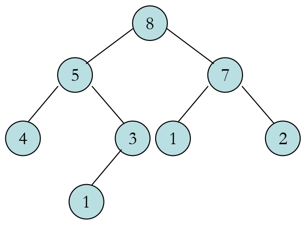
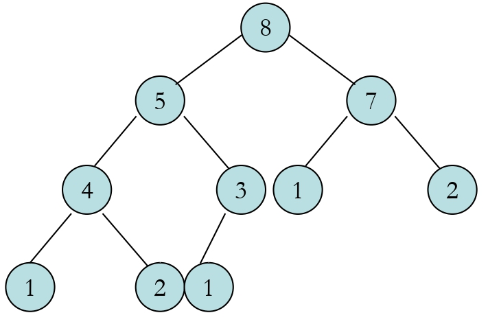
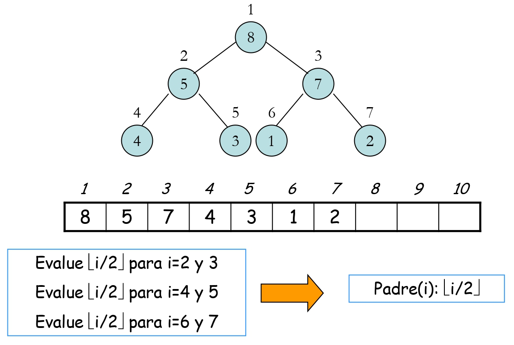
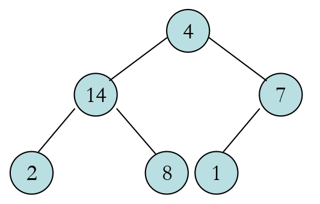
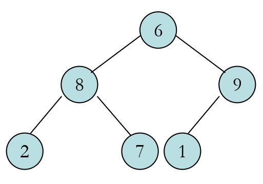

---
# Copyright (c) 2026 Angela Villota, and collaborators from the CyED block
# Licensed under the PolyForm Noncommercial License 1.0.0.
# Commercial use is prohibited without prior written authorization.
title: "Cola de prioridad: Ejercicios"
---

# Cola de prioridad: Ejercicios

Use esta página después de leer el [material de estudio de Cola de prioridad](index.md).

---
**· Contenido adicional ·**

### Ejercicios de montículos (heaps)

**Indique si se cumplen las propiedades de orden y de forma para los siguientes montículos:**

**Ejercicio 1**

**Ejercicio 2**

**Ejercicio adicional**

**Indique si se cumplen las propiedades de orden y de forma para:**

1. $A=\{20, 10, 5, 4, 3, 1\}$ donde $heap\_size[A]=6$ y $length[A]=6$
2. $A=\{8, 4, 2, 1, 7, 9\}$ donde $heap\_size[A]=4$ y $length[A]=6$

**Ejercicio**

**Aplicar el algoritmo MAX-HEAPIFY(A, 1) en los siguientes casos:**

**Ejercicio 1**

**Ejercicio 2**

**Ejercicio**

**Aplique BUILD-HEAP(A) para:**

$$
A=\{5, 7, 10, 1, 4, 6, 8, 2, 9, 12\}
$$

con $heapsize(A) = 10$

---

*Material adaptado del material original del profesor Marlon Gomez.*
