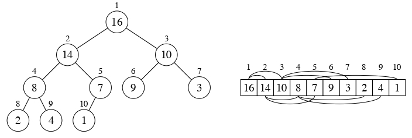
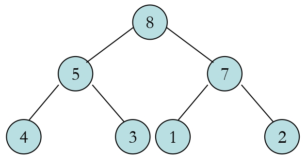
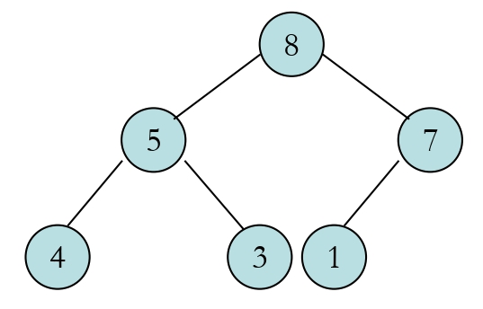
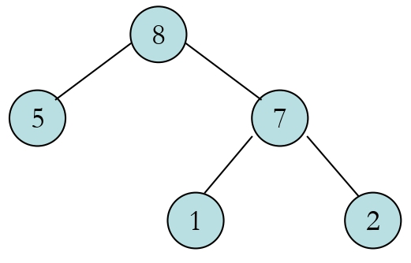
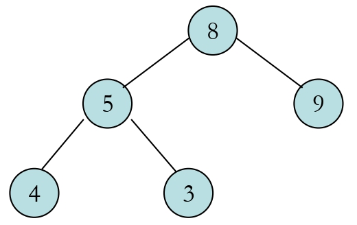
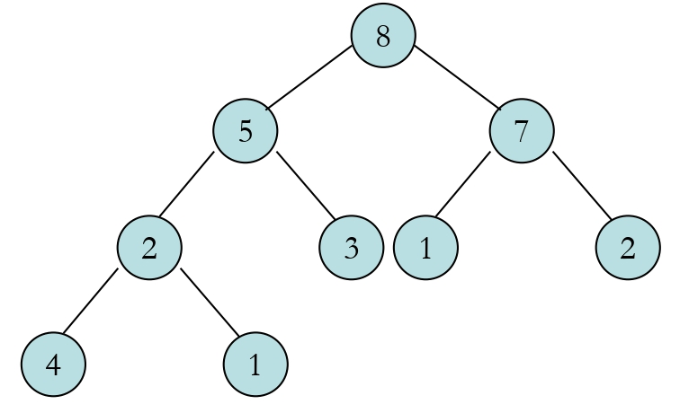
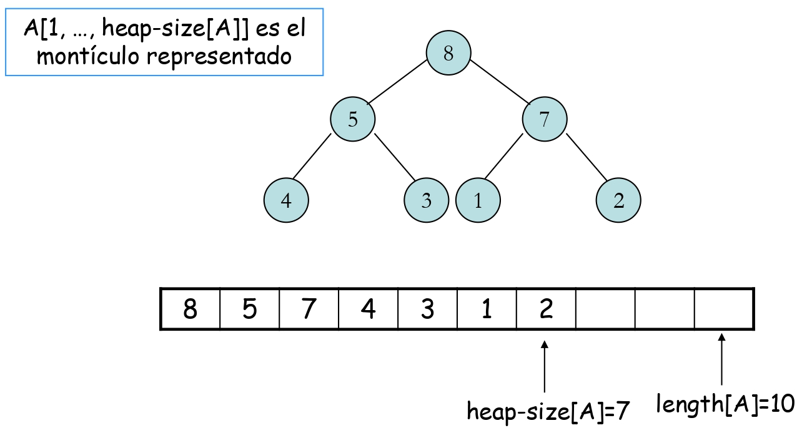

---
# Copyright (c) 2026 Angela Villota, and collaborators from the CyED block
# Licensed under the PolyForm Noncommercial License 1.0.0.
# Commercial use is prohibited without prior written authorization.
title: "Unidad 3: Cola de prioridad"
---

# Unidad 3: Cola de prioridad

## De cola FIFO a cola de prioridad

**¿Qué cambia y qué se conserva?**

**Cola FIFO**

El orden de salida es **el orden de llegada**. Si entran, en ese orden, los elementos A, B, C, D, entonces A sale siempre antes que D, sin importar nada más (A es 1°, B es 2°, C es 3°, D es 4° tanto al entrar como al salir).

**Cola de prioridad**

El orden de salida es **la prioridad asignada**. Si entran, en ese orden, A (p=5), B (p=2), C (p=9), D (p=1), entonces C sale primero (p=9), aunque llegó en 3er lugar.

**Lo que cambia:**

| Cola FIFO | Cola de prioridad |
|---|---|
| `DEQUEUE` (saca el frente) | `EXTRACT-MAX` (saca el de mayor prioridad) |
| no necesita comparar | compara prioridades |
| orden implícito (posición) | orden explícito (campo `prioridad`) |

**Estructura interna: Cola vs Cola de prioridad**

*Cola* — arreglo circular:

| Índice | 0 | 1 | 2 | 3 | 4 |
|---|---|---|---|---|---|
| valores | 5 | 1 | 9 | 6 | |

`head` en el índice 0, `tail` en el índice 4.

- Un solo arreglo de `int`.
- El orden físico **es** el orden lógico.
- `head/tail` marcan inicio y fin.
- Extrae siempre por `head`.

*Cola de prioridad* — dos arreglos paralelos:

| Índice | 0 | 1 | 2 | 3 | 4 |
|---|---|---|---|---|---|
| valores | 7 | 3 | 15 | 9 | |
| prio | 1 | 3 | 5 | 8 | |

MAX en el índice 3 (`size-1`).

- **Dos** arreglos paralelos sincronizados.
- Ordenados ascendente por prioridad.
- El máximo siempre en `size-1`.
- Extrae siempre por `size-1`.

**Clave:** En la Cola normal el orden viene de la **posición** (`head/tail`). En la Cola de prioridad el orden viene de un **campo de prioridad** explícito y el arreglo se mantiene siempre **ordenado**.

**`INSERT` paso a paso — estado inicial**

4 elementos insertados, ordenados por prioridad ascendente:

| Índice | [0] | [1] | [2] | [3] | [4] |
|---|---|---|---|---|---|
| valores | 20 | 8 | 15 | 3 | _ |
| prio | 1 | 2 | 5 | 7 | _ |

Ordenado ascendente por prioridad; `size-1` → MAX (p=7); `size=4`.

Queremos insertar **valor=12, prioridad=4**.

1. Recorremos de derecha a izquierda buscando dónde insertar.
2. $p=4$ es mayor que $p[1]=2$ pero menor que $p[2]=5$.
3. Todo elemento con $p \geq 4$ se **desplaza un lugar a la derecha**.
4. El hueco resultante en el índice 2 recibe el nuevo par.

**`INSERT` paso a paso — desplazamiento e inserción**

Bucle: `while (i >= 0 && prioridades[i] > p)`

Antes:

| Índice | [0] | [1] | [2] | [3] | [4] |
|---|---|---|---|---|---|
| valores | 20 | 8 | 15 | 3 | _ |
| prio | 1 | 2 | 5 | 7 | _ |

$p[2]=5>4$ → mueve; $p[3]=7>4$ → mueve.

Después:

| Índice | [0] | [1] | [2] | [3] | [4] |
|---|---|---|---|---|---|
| valores | 20 | 8 | **12** | 15 | 3 |
| prio | 1 | 2 | **4** | 5 | 7 |

Inserción en el índice 2; `size=5`.

**Pseudocódigo del desplazamiento**

```
i = size - 1
while (i >= 0 && prioridades[i] > p) {
    valores[i+1]     = valores[i]
    prioridades[i+1] = prioridades[i]
    i--
}
valores[i+1]     = nuevoValor
prioridades[i+1] = p
size++
```

## Colas de prioridad

**Motivación**

En una cola FIFO el orden de atención depende **únicamente** del momento de llegada. Sin embargo, en muchos sistemas reales algunos elementos deben atenderse antes que otros independientemente de cuándo llegaron.

**Ejemplos:**

- Sistema operativo: procesos con mayor prioridad obtienen la CPU primero.
- Sala de urgencias: pacientes críticos se atienden antes que leves.
- Algoritmos de grafos: Dijkstra, Prim extraen siempre el nodo de menor costo.

**Cola de prioridad**

Estructura de datos en la que cada elemento tiene asociada una **prioridad**, y la operación de extracción siempre devuelve el elemento de **mayor prioridad**, sin importar el orden de inserción.

**TAD Cola de prioridad — operaciones**

| Operación | Descripción |
|---|---|
| `PRIORITY-QUEUE-EMPTY(PQ)` | retorna verdadero si la cola no tiene elementos |
| `INSERT(PQ, x, p)` | inserta el valor $x$ con prioridad $p$ |
| `MAXIMUM(PQ)` | retorna el valor de mayor prioridad *sin extraerlo* |
| `EXTRACT-MAX(PQ)` | extrae y retorna el valor de mayor prioridad |

**Invariante central:** La cola garantiza que `EXTRACT-MAX` siempre entrega el elemento con la prioridad más alta, independientemente del orden de inserción.

**Implementación con arreglo ordenado**

Se usan dos arreglos paralelos de tamaño $n$, mantenidos en orden **ascendente** de prioridad: el elemento de **mayor** prioridad ocupa siempre el índice `size-1`.

| Índice | 0 | 1 | 2 | 3 | 4 |
|---|---|---|---|---|---|
| valores | 15 | 8 | 3 | 12 | 20 |
| prioridades | 1 | 2 | 4 | 5 | 9 |

`size-1` ← `MAXIMUM`

- El arreglo siempre está ordenado: $p[0] \le p[1] \le \cdots \le p[\texttt{size}-1]$.
- `EXTRACT-MAX`: toma el último elemento — $O(1)$.
- `INSERT`: desplaza hacia la derecha hasta encontrar la posición — $O(n)$.

**`INSERT`(PQ, x, p)**

```
1  if size[PQ] == n
2      then error "overflow"
3      else i = size[PQ] - 1
4           while i >= 0 and prioridad[PQ][i] > p
5               valores[PQ][i+1] = valores[PQ][i]
6               prioridad[PQ][i+1] = prioridad[PQ][i]
7               i = i - 1
8           valores[PQ][i+1] = x
9           prioridad[PQ][i+1] = p
10          size[PQ] = size[PQ] + 1
```

$T(n) = O(n)$ — el bucle desplaza hasta $n$ elementos en el peor caso.

**`MAXIMUM`(PQ)**

```
1  if size[PQ] == 0
2      then error "underflow"
3      else return valores[PQ][size[PQ]]
```

$T(n) = O(1)$

**`EXTRACT-MAX`(PQ)**

```
1  if size[PQ] == 0
2      then error "underflow"
3      else x = valores[PQ][size[PQ]]
4           size[PQ] = size[PQ] - 1
5           return x
```

$T(n) = O(1)$

**Clave de la implementación:** Como el arreglo está ordenado ascendente, el máximo siempre está en la última posición (`size-1`). Extraerlo solo requiere decrementar `size` — sin desplazamientos.

---
**· Contenido adicional ·**

### Montículos (heaps)

**¿Qué es un montículo o heap?**

- Es un arreglo que puede verse como un árbol binario casi completo.
- Cada nodo del árbol corresponde a un elemento del arreglo.
- El árbol se encuentra lleno en casi todos sus niveles:
  - Con la excepción de posiblemente el nivel más bajo.
  - Este se encuentra lleno desde la izquierda hasta cierto punto.

**¿Qué nos dice esta última propiedad sobre la forma de un montículo?**

- El árbol está lleno en casi todos sus niveles con excepción de posiblemente el último. La longitud de toda rama es $h$ o $h-1$, donde $h$ es la altura del árbol.
- El último nivel se llena de izquierda a derecha. No puede existir una rama de longitud $h$ a la derecha de una rama de longitud $h-1$.

**¿Cuál es la altura de un nodo del montículo?**

- Es el número de aristas en el camino simple más largo desde el nodo hasta la hoja.

**¿Cuál es la altura del montículo?**

- Al estar basado en un árbol binario completo, es:

$$
\Theta (\log n)
$$

**Ejemplo de un montículo:**



**¿Cómo es ese arreglo $A$ que representa al montículo?**

- Es un arreglo con dos atributos:
  - $A.length$ → Número de elementos del arreglo.
  - $A.heap\_size$ → Número de elementos del montículo dentro del arreglo.
  - $A[1..A.length]$ puede contener números.
  - Solamente los elementos $A[1..A.heap\_size]$, donde $0 \leq A.heap\_size \leq A.length$, son válidos.

**¿Qué más se puede decir de ese arreglo $A$?**

- La raíz del árbol es $A[1]$.
- El padre de $A[i]$ es:

$$
A[\lfloor i/2 \rfloor]
$$

- El hijo izquierdo de $A[i]$ es:

$$
A[2i]
$$

- El hijo derecho de $A[i]$ es:

$$
A[2i+1]
$$

- El cómputo de estas operaciones es rápido utilizando la representación binaria.

**¿Cuáles son los dos tipos de montículos?**

- **Max-heap**
  - Para todos los nodos $i$, excluyendo la raíz:

  $$
  A[Padre(i)] \geq A[i]
  $$

- **Min-heap**
  - Para todos los nodos $i$, excluyendo la raíz:

  $$
  A[Padre(i)] \leq A[i]
  $$

**Ejemplos de montículos**

Analicemos las propiedades de orden y forma de estos montículos:

**Ejemplo 1**



**Ejemplo 2**



**Ejemplo 3**



**Ejemplo 4**



**Ejemplo 5**



**¿Cómo se almacenan los elementos de un montículo en el arreglo?**

- Los datos se almacenan en el arreglo recorriendo, por niveles, de izquierda a derecha.



**Operaciones en montículos**

**¿Cuáles son las operaciones más importantes que se realizan con montículos?**

- **HEAPIFY**: $O(\log n)$
- **BUILD-HEAP**: $O(n)$
- **HEAPSORT**: $O(n \log n)$

**¿Qué hace la operación HEAPIFY?**

- Es importante para manipular montículos.
- Se usa para garantizar la propiedad de orden del montículo.

**¿Qué hace la operación MAX-HEAPIFY?**

- Se usa para garantizar la propiedad de orden del **max-heap**.
- Antes de aplicar MAX-HEAPIFY, $A[i]$ puede ser menor que sus hijos.
- Se asume que los subárboles izquierdo y derecho son max-heaps.
- Luego de MAX-HEAPIFY, el subárbol con raíz $i$ es un max-heap.

**Algoritmo MAX-HEAPIFY**

:::{image} images/heap10.png
:alt: MAX-HEAPIFY
:width: 100%
:::

**¿Cómo funciona el MAX-HEAPIFY?**

- Compara $A[i], A[LEFT(i)], A[RIGHT(i)]$.
- Si es necesario, intercambia $A[i]$ con el mayor de sus hijos para preservar la propiedad del max-heap.
- Continúa con el proceso bajando sobre el montículo hasta que el subárbol con raíz $i$ sea un max-heap.

**Ejemplo de MAX-HEAPIFY**

:::{image} images/heap11.png
:alt: Heap 11
:width: 100%
:::

:::{image} images/heap12.png
:alt: Heap 12
:width: 100%
:::

:::{image} images/heap13.png
:alt: Heap 13
:width: 100%
:::

**¿Qué hace la operación BUILD-MAX-HEAP?**

- Utiliza MAX-HEAPIFY para convertir un arreglo $A[1..n]$ en un max-heap.

**Algoritmo BUILD-MAX-HEAP**

:::{image} images/buildmax.png
:alt: BUILD-MAX-HEAP
:width: 100%
:::

**Ejemplo de BUILD-MAX-HEAP**

:::{image} images/b1.png
:alt: Paso 1
:width: 100%
:::

:::{image} images/b2.png
:alt: Paso 2
:width: 100%
:::

:::{image} images/b3.png
:alt: Paso 3
:width: 100%
:::

:::{image} images/b4.png
:alt: Paso 4
:width: 100%
:::

:::{image} images/b5.png
:alt: Paso 5
:width: 100%
:::

:::{image} images/b6.png
:alt: Paso 6
:width: 100%
:::

---

## Implementación en Java

**`ColaPrioridad.java` — estructura**

```java
public class ColaPrioridad {
  private int[] valores;
  private int[] prioridades;
  private int size;
  private int size_max;

  public ColaPrioridad(int n) {
    this.size_max    = n;
    this.size        = 0;
    this.valores     = new int[n];
    this.prioridades = new int[n];
  }

  public boolean isEmpty() {
    return size == 0;
  }
}
```

- Dos arreglos paralelos de tamaño $n$: uno para valores, otro para prioridades.
- Ambos se mantienen sincronizados: `valores[i]` tiene prioridad `prioridades[i]`.
- Orden ascendente por prioridad: índice `size-1` → mayor prioridad.

**`ColaPrioridad.java` — `insert`**

```java
public void insert(int x, int p) {
  if (size == size_max)
    throw new RuntimeException("Overflow");

  int i = size - 1;
  while (i >= 0 && prioridades[i] > p) {
    valores[i + 1]     = valores[i];
    prioridades[i + 1] = prioridades[i];
    i--;
  }
  valores[i + 1]     = x;
  prioridades[i + 1] = p;
  size++;
}
```

- Recorre hacia la izquierda desplazando elementos de mayor prioridad.
- Inserta $x$ en la posición correcta para mantener el orden.
- Sincroniza **ambos** arreglos en cada desplazamiento.
- Costo: $O(n)$.

**`ColaPrioridad.java` — `extractMax` y `maximum`**

```java
public int maximum() {
  if (size == 0)
    throw new NoSuchElementException();
  return valores[size - 1];
}

public int extractMax() {
  if (size == 0)
    throw new NoSuchElementException();
  int val = valores[size - 1];
  size--;
  return val;
}
```

- `maximum`: solo lee `valores[size-1]` — no modifica nada.
- `extractMax`: lee el último elemento y decrementa `size`; **no hay desplazamiento**.
- Ambos: $O(1)$.

| Operación | Costo |
|---|---|
| `isEmpty` | $O(1)$ |
| `maximum` | $O(1)$ |
| `extractMax` | $O(1)$ |
| `insert` | $O(n)$ |

---

Continúa con los [ejercicios de Cola de prioridad](exercises.md).

*Material adaptado del material original de los profesores Oscar Bedoya y Marlon Gomez.*
