---
# Copyright (c) 2026 Angela Villota, and collaborators from the CyED block
# Licensed under the PolyForm Noncommercial License 1.0.0.
# Commercial use is prohibited without prior written authorization.
title: "Unidad 3: Crecimiento de funciones y Análisis de algoritmos"
---

# Unidad 3: Crecimiento de funciones y Análisis de algoritmos

---
**· Contenido adicional ·**

### Estructuras no recursivas

Las estructuras no recursivas son fundamentales en el diseño de algoritmos y programas eficientes. Se caracterizan por tener una organización lineal o jerárquica sin recurrencia directa, y permiten representar, almacenar y manipular datos de manera estructurada y eficiente.

**Objetivos**

- Comprender el funcionamiento de estructuras como pilas, colas, tablas hash y colas de prioridad.
- Diseñar e implementar tipos abstractos de datos (TAD) que resuelvan problemas específicos.
- Analizar el impacto de estas estructuras en la eficiencia temporal y espacial de los algoritmos.
- Aplicar principios como el desacoplamiento y el uso de generics para escribir código flexible y reutilizable.

**Usos**

- Gestión de tareas y estructuras de control.
- Programación de sistemas, compiladores y motores de búsqueda.
- Implementación de algoritmos de ordenamiento, búsqueda y manejo de prioridades.
- Optimización del acceso y almacenamiento de datos en memoria.

Estas estructuras son la base para resolver problemas comunes en informática de manera eficiente, y constituyen un paso previo al estudio de estructuras más complejas como árboles y grafos.

---

## Crecimiento de funciones

---
**· Contenido adicional ·**

### Análisis de Complejidad Temporal

**¿Qué es la notación asintótica?**

- Son aquellas notaciones utilizadas para describir el tiempo de ejecución asintótico de un algoritmo.
- Se definen en términos de funciones cuyo dominio es el conjunto de los números naturales.
- Se aplica sobre funciones:
  - Aquellas que caracterizan el tiempo de ejecución de un algoritmo.
  - Otros aspectos de los algoritmos (espacio).
  - Funciones que nada tienen que ver con algoritmos.

**¿Qué se debe tener en cuenta antes de aplicar la notación asintótica?**

- El tiempo de ejecución sobre el que se va a trabajar: peor caso, mejor caso, para cualquier instancia del problema.

**¿Qué notaciones conocemos?**

- Notación $\Theta$.
- Notación $O$.
- Notación $\Omega$.

---

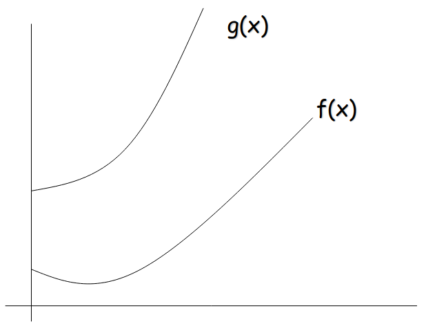

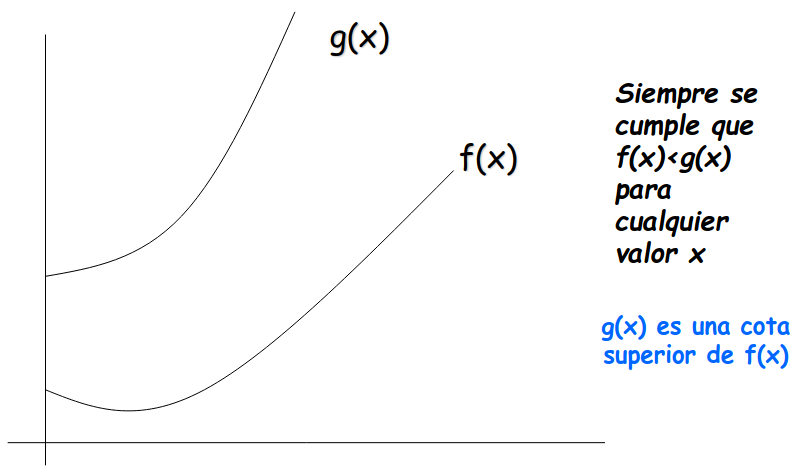

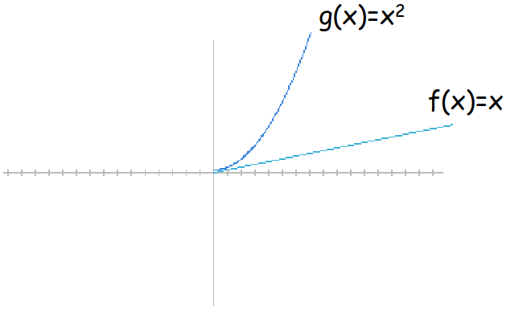

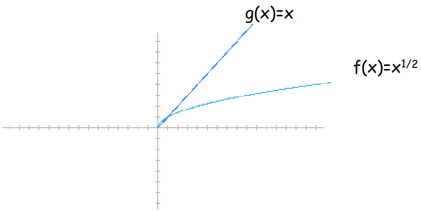

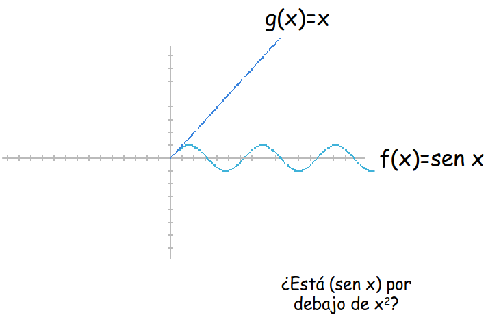

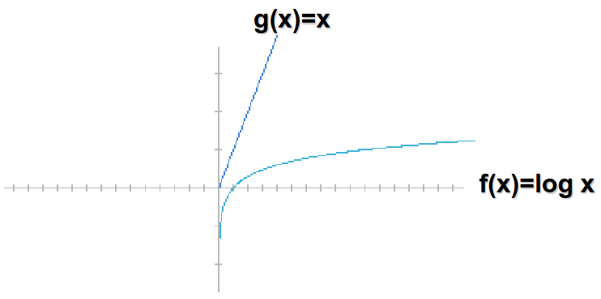

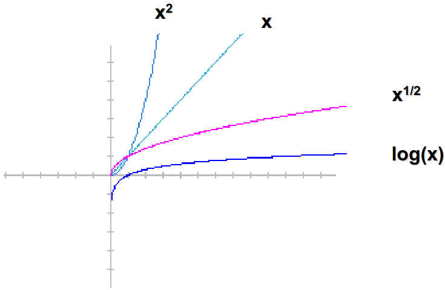

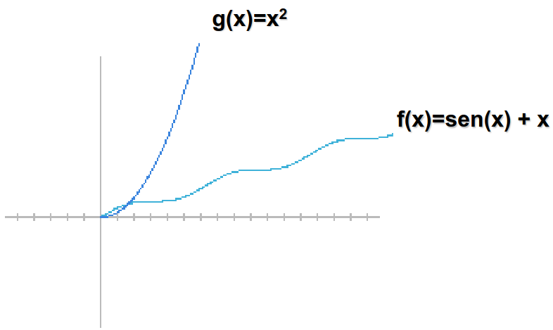

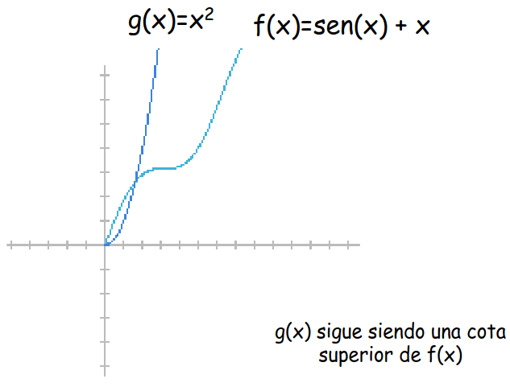

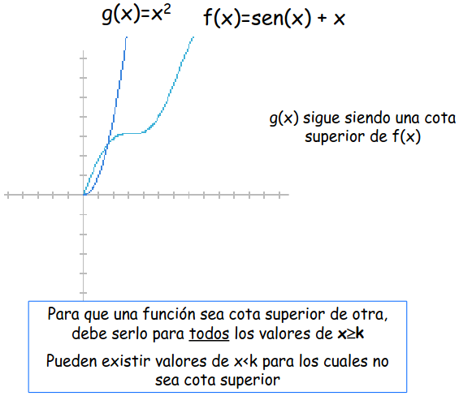

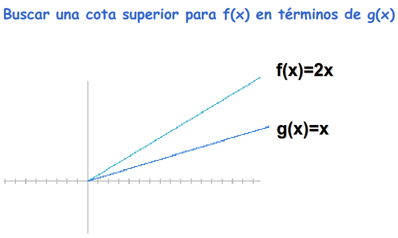

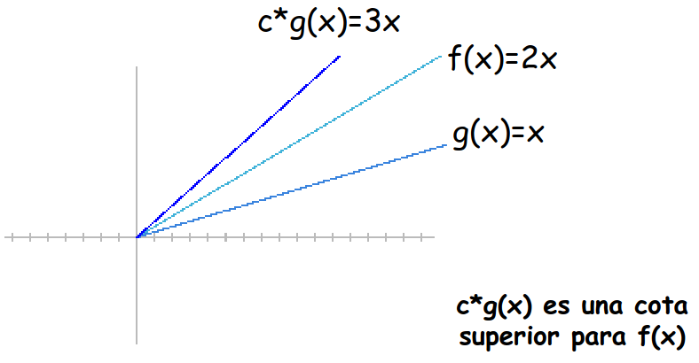

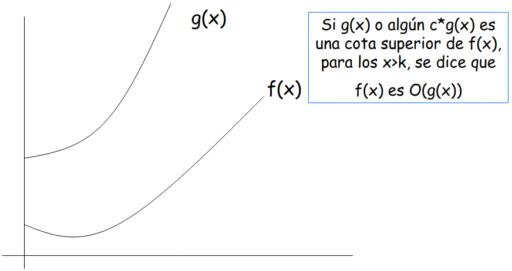

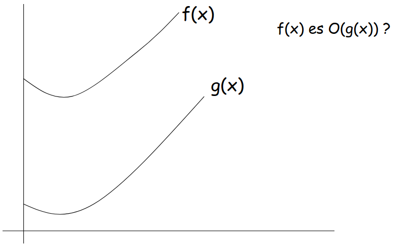

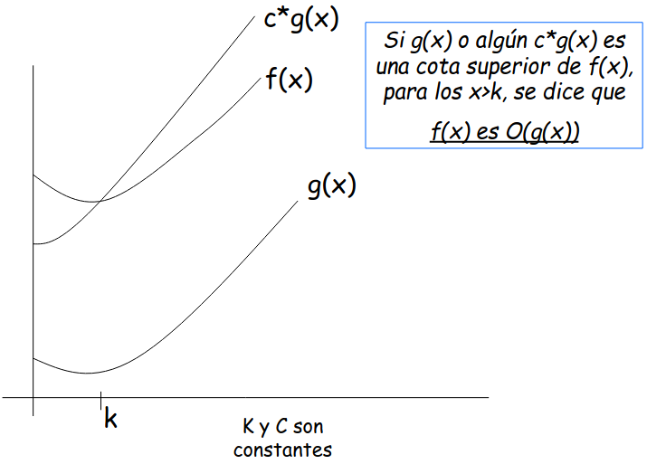

Dadas dos funciones $f$ y $g$, se dice que $f(x)$ es $O(g(x))$ si existen constantes $C$ y $k$ tales que:

$$
f(x) \leq C \cdot g(x)
$$

se cumple para todos los $x \geq k$

> Donald Knuth (1938 - ) — Símbolo de Landau

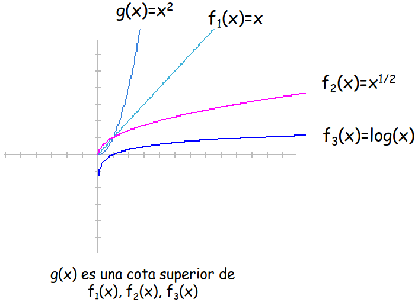

## Notación $O$

Formalmente la notación $O$ representa un **conjunto de funciones**

$$
O(g(x)) = \{ f(x) \mid \text{existen constantes positivas } c \text{ y } k, \text{tales que } 0 \leq f(x) \leq c \cdot g(x), \text{ para todos los } x \geq k \}
$$

**En otras palabras:** $O(g(x))$ es el conjunto de **todas las funciones que son acotadas superiormente por** $c \cdot g(x)$ a partir de algún punto $k$.

- Cuando decimos $\mathbf{f(x) = O(g(x))}$, en realidad significa $\mathbf{f(x) \in O(g(x))}$: $f$ **pertenece** al conjunto de funciones que $g$ acota por arriba (salvo constante).

- La función $g(x)$ actúa como **cota superior asintótica**: para $x \geq k$, $f(x)$ nunca supera a $c \cdot g(x)$, sin importar cuán grande sea $x$.

Por ejemplo, todas estas funciones pertenecen a $O(x^2)$:

$$
O(x^2) \ni \quad x^2, \quad x^2 + 5x + 3, \quad x, \quad x^{1/2}, \quad \log(x), \quad \ldots
$$

- $x^2 \in O(x^2)$ porque $x^2 \leq 1 \cdot x^2$ para $x \geq 1$
- $x \in O(x^2)$ porque $x \leq 1 \cdot x^2$ para $x \geq 1$
- $\log(x) \in O(x^2)$ porque $\log(x) \leq 1 \cdot x^2$ para $x \geq 1$

En cambio, $x^3 \notin O(x^2)$ porque ningún $c$ y $k$ logran que $x^3 \leq c \cdot x^2$ para todo $x$ suficientemente grande.

**Muestre que $5x = O(x^2)$**

**Estrategia:** elegir $C = 1$ y despejar la condición sobre $x$.

*Demostración algebraica:* Queremos encontrar $k$ tal que para $x \geq k$:

$$
5x \leq 1 \cdot x^2
$$

Dividiendo ambos lados por $x > 0$:

$$
5 \leq x
$$

La desigualdad se cumple exactamente cuando $x \geq 5$.

Por lo tanto, tomando $C = 1$ y $k = 5$:

$$
5x \leq x^2 \quad \forall\, x \geq 5 \quad \blacksquare
$$

*Verificación:*

| $x$ | $x^2$ | $5x$ | |
|---|---|---|---|
| 3 | 9 | 15 | ✗ |
| 4 | 16 | 20 | ✗ |
| 5 | 25 | 25 | ✓ |
| 6 | 36 | 30 | ✓ |

La tabla confirma el resultado algebraico: el cruce ocurre en $x = 5$.

**Muestre que $2x + 3 = O(x)$**

**Estrategia:** Elegir $C = 3$ para que $3x$ absorba el coeficiente $2$ de $x$ y la constante $+3$.

*Demostración algebraica:* Necesitamos encontrar $k$ tal que:

$$
2x + 3 \leq 3x
$$

Restando $2x$ de ambos lados:

$$
3 \leq x
$$

La desigualdad se cumple cuando $x \geq 3$.

**Conclusión:** $C = 3$ y $k = 3$

$$
2x + 3 \leq 3x \quad \forall\, x \geq 3 \quad \blacksquare
$$

*Verificación:*

| $x$ | $3x$ | $2x+3$ | |
|---|---|---|---|
| 1 | 3 | 5 | ✗ |
| 2 | 6 | 7 | ✗ |
| 3 | 9 | 9 | ✓ |
| 4 | 12 | 11 | ✓ |

El margen $(3-2)x = x$ absorbe la constante $+3$ cuando $x \geq 3$.

**Muestre que $7x^2 = O(x^3)$**

**Estrategia:** elegir $C = 1$ y despejar la condición sobre $x$.

*Demostración algebraica:* Queremos encontrar $k$ tal que para $x \geq k$:

$$
7x^2 \leq 1 \cdot x^3
$$

Dividiendo ambos lados por $x^2 > 0$:

$$
7 \leq x
$$

La desigualdad se cumple exactamente cuando $x \geq 7$.

Por lo tanto, tomando $C = 1$ y $k = 7$:

$$
7x^2 \leq x^3 \quad \forall\, x \geq 7 \quad \blacksquare
$$

*Verificación:*

| $x$ | $x^3$ | $7x^2$ | |
|---|---|---|---|
| 5 | 125 | 175 | ✗ |
| 6 | 216 | 252 | ✗ |
| 7 | 343 | 343 | ✓ |
| 8 | 512 | 448 | ✓ |

La tabla confirma el resultado algebraico: el cruce ocurre en $x = 7$.

**¿Es $x^3$, $O(7x^2)$?**

:::{dropdown} Solución
$$
x^3 < c\,7x^2
$$

$$
x < 7c
$$

Ya que no se cumple para todos los $x > k$, no es cierto que $x^3$ sea $O(7x^2)$.
:::

**Ejercicios**

Demostrar que:

- $x^2 + 2x + 1$ es $O(x^2)$
- $\log n$ es $O(n)$, parta sabiendo que $n < 2^n$
- $x^2 + 4x + 17$ es $O(x^3)$ pero que $x^3$ no es $O(x^2 + 4x + 17)$
- $x \log x$ es $O(x^2)$

**Consulta**

- Explique qué significa que una función sea $\Omega(1)$
- Explique qué significa que una función sea $O(1)$

**Cota superior asintótica**

Cuando se determina que el tiempo de computo de un algoritmo es $O(g(x))$ se establece una cota superior.

Dentro del análisis para obtener la cota superior, se debe considerar el peor caso, de esta forma se consigue tener una cota que no puede resultar peor.

Suponga que para un algoritmo se encontró que $T_1(n) = O(n^2)$ y para otro que $T_2(n) = O(n \lg n)$, ¿qué representan estos resultados?

¿Qué se puede esperar en cuanto al tiempo de ejecución de los algoritmos?

¿Se puede asegurar que siempre es mejor el algoritmo 2 que el 1?

Es un abuso decir que el tiempo de ejecución del insertion sort es $O(n^2)$, esto se puede asegurar, para el peor caso.

---
**· Contenido adicional ·**

### ¿Qué es la notación $O$?

- Representa una función que sirve de **cota superior** de otra función cuando el argumento tiende a infinito.
- Formalmente, se dice que para una función $g(n)$, se denota a $O(g(n))$ como el conjunto de funciones tal que:

$$
O(g(n)) = \{f(n) \mid \exists c,n_0 \in \mathbb{Z^+}, \, 0  \leq f(n) \leq c \, g(n), \, \forall n \geq n_0\}
$$

- Se dice que $f(n)$ pertenece a $O(g(n))$ si existen constantes positivas $c$ y $n_0$ tales que $f(n)$ pueda ubicarse en o por debajo de $c \, g(n)$ para un $n$ suficientemente grande.

**Propiedades de la notación $O$**

- Representa una función que sirve de **cota superior dentro de un factor constante**.
- Al usar la notación $O$, se puede describir el tiempo de ejecución de un algoritmo inspeccionando solo su estructura general.

**Ejemplo**

Sea $T(n) = 7n^2$ queremos probar que:

$$
7n^2 = O(n^3)
$$

**Solución**

Utilizamos la definición de cota superior asintótica. Debemos encontrar constantes positivas $c$ y $n_0$ tal que:

$$
7n^2 \leq c \cdot n^3, \quad \forall n \geq n_0
$$

Dividimos por $n^3$:

$$
\frac{7}{n} \leq c
$$

Esta desigualdad se cumple para $n \geq 1$, por lo que tomamos:

$$
c = 7, \quad n_0 = 1
$$

---

## Notación $\Omega$

**Cota inferior**

$$
\Omega(g(x)) = \{\, f(x) \mid \text{existen constantes positivas } c \text{ y } k,\ \text{tales que } 0 \leq c \cdot g(x) \leq f(x),\ \text{para todos los } x \geq k \,\}
$$

Suponga que para un algoritmo se encontró que $T_1(n) = \Omega(n)$

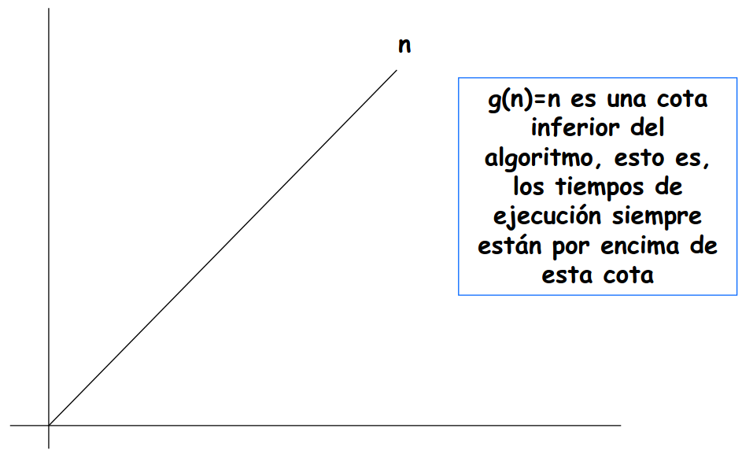

Suponga que para un algoritmo se encontró que $T_1(n) = \Omega(n^2)$ y para otro que $T_2(n) = \Omega(n \lg n)$, ¿qué representan estos resultados?

¿Qué se puede esperar en cuanto al tiempo de ejecución de los algoritmos?

---
**· Contenido adicional ·**

### ¿Qué es la notación $\Omega$?

- Representa una función que sirve de **cota inferior** de otra función cuando el argumento tiende a infinito.
- Formalmente, se dice que para una función $g(n)$, se denota a $\Omega(g(n))$ como el conjunto de funciones tal que:

$$
\Omega(g(n)) = \{f(n) \mid \exists c,n_0 \in \mathbb{Z^+}, \, 0  \leq c \cdot g(n) \leq f(n), \, \forall n \geq n_0\}
$$

- Se dice que $f(n)$ pertenece a $\Omega(g(n))$ si existen constantes positivas $c$ y $n_0$ tales que $f(n)$ pueda ubicarse en o por encima de $c \cdot g(n)$ para un $n$ suficientemente grande.
- Representa una función que sirve de **cota inferior dentro de un factor constante**.

**Ejemplo**

Sea $T(n) = 8n^3+5n^2+7$ queremos probar que:

$$
T(n) = \Omega(n^3)
$$

**Solución**

Utilizamos la definición de cota inferior asintótica. Debemos encontrar constantes positivas $c, n_0$ tal que:

$$
c \cdot n^3 \leq 8n^3+5n^2+7, \quad \forall n \geq n_0
$$

Dividiendo por $n^3$ obtenemos:

$$
c \leq 8 + \frac{5}{n} + \frac{7}{n^2}
$$

Esta desigualdad se cumple para $n \geq 1$, por lo que tomamos:

$$
c = 8, \quad n_0 = 1
$$

---

## Notación $\Theta$

**Notación $\Theta(f(n))$**

$$
f(n) = \Theta(g(n)) \ \text{sii} \ f(n) = O(g(n)) \ \text{y} \ f(n) = \Omega(g(n))
$$

---
**· Contenido adicional ·**

### ¿Qué es la notación $\Theta$?

- Representa una función que sirve de cota tanto superior como inferior de otra función cuando el argumento tiende a infinito.
- Es una cota ajustada de una función.
- Formalmente, para una función $g(n)$, se define:

$$
\Theta(g(n)) = \{f(n) \mid \exists c_1, c_2, n_0 \in \mathbb{Z^+}, 0  \leq c_1 \cdot g(n) \leq f(n) \leq c_2 \cdot g(n) \text{ para todo } n \geq n_0\}
$$

- Se dice que $f(n)$ pertenece a $\Theta(g(n))$ si existen constantes positivas $c_1, c_2, n_0$ tal que $f(n)$ pueda ubicarse entre $c_1 \cdot g(n)$ y $c_2 \cdot g(n)$ para un $n$ suficientemente grande.

**¿Qué hace $\Theta$?**

- Acota una función dentro de unos factores constantes para un tamaño de entrada suficientemente grande.

**¿Cómo decir que $g(n)$ es una cota ajustada de $f(n)$?**

- $f(n) \in \Theta (g(n))$
- $f(n) = \Theta (g(n))$ (notación informal)

**Ejemplo**

Sea $T(n) = \frac{1}{2} n^2 - 3n$, queremos probar que:

$$
\Theta (n^2) = \frac{1}{2} n^2 - 3n
$$

**Solución**

Utilizamos la definición de cota ajustada asintótica. Debemos encontrar constantes positivas $c_1, c_2, n_0$ tal que:

$$
c_1 \, n^2 \leq \frac{1}{2} n^2 - 3n \leq c_2 \, n^2, \quad \forall n \geq n_0
$$

Dividiendo por $n^2$, llegamos a:

$$
c_1 \leq \frac{1}{2} - \frac{3}{n} \leq c_2
$$

Analizamos las desigualdades:

$$
\frac{1}{2} - \frac{3}{n} \leq c_2
$$

se mantiene para cualquier $n \geq 1$ y para $c_2 \geq \frac{1}{2}$.

$$
c_1 \leq \frac{1}{2} - \frac{3}{n}
$$

se mantiene para $n \geq 7$ y para $c_1 \leq \frac{1}{14}$. Finalmente, tenemos:

$$
c_1 = \frac{1}{14}, \quad c_2 = \frac{1}{2}, \quad n_0 = 7
$$

Por lo tanto, se valida la definición:

$$
\Theta (n^2) = \frac{1}{2} n^2 - 3n.
$$

**¿Qué se puede decir con respecto a cualquier polinomio?**

**Teorema:** Para todo polinomio

$$
p(n) = \sum\limits_{i=0}^d a_i \cdot n^i
$$

donde $a_i$ son constantes y $a_d > 0$, entonces:

$$
p(n) = \Theta(n^d)
$$

**¿De qué otras formas se puede utilizar la notación asintótica?**

Dentro de fórmulas matemáticas:

$$
2n^2 + 3n + 1 = 2n^2 + \Theta(n)
$$

**¿Y qué quiere decir esto?**

- Que:

$$
2n^2 + 3n + 1 = 2n^2 + f(n)
$$

donde $f(n) \in \Theta(n)$. En este caso, $f(n) = 3n + 1$, que es $\Theta(n)$.

**¿Cuál es la necesidad de incluir una función en notación asintótica dentro de otra?**

- Se eliminan **detalles innecesarios** y se **depura la ecuación**.
- Muchos algoritmos consisten en **dos o más subprocesos separados**.
- El número de pasos realizados por un computador para solucionar un problema es la **suma** del número de pasos realizados por todos sus subprocesos.

---

## Terminología de complejidades

**Complejidades de los algoritmos**

| Complejidad | Terminología |
|---|---|
| $O(1)$ | Complejidad constante |
| $O(\log n)$ | Complejidad logarítmica |
| $O(n)$ | Complejidad lineal |
| $O(n \log n)$ | Complejidad $n \log n$ |
| $O(n^b)$ | Complejidad polinomial |
| $O(b^n)$ | Complejidad exponencial |
| $O(n!)$ | Complejidad factorial |

---
**· Contenido adicional ·**

### Clasificación de la complejidad

Algunas de las complejidades temporales más comunes son:

- Tiempo constante, no depende del tamaño de la entrada. $O(1)$
- Crecimiento logarítmico, como en la búsqueda binaria. $O(\log n)$
- Tiempo lineal, típico en algoritmos de recorrido. $O(n)$
- Algoritmos eficientes de ordenamiento, como MergeSort y QuickSort. $O(n \log n)$
- Algoritmos cuadráticos, como la ordenación por burbuja. $O(n^2)$
- Tiempo exponencial, común en soluciones de fuerza bruta. $O(2^n)$
- Factorial, extremadamente ineficiente para valores grandes. $O(n!)$

---

## Clasificación de problemas

**Complejidades de los algoritmos**

Un problema que se puede resolver utilizando un algoritmo con complejidad polinómica en el peor caso se llama tratable. De no ser así se llama intratable.

Un problema para el cual no existe un programa que lo pueda solucionar se llama irresoluble. De no ser así se llaman resolubles. (Halting problem - Turing)

> Alan Turing (1912-1954) — Problema de la decisión de Hilbert

Existen problemas que no se pueden resolver, en el peor caso en tiempo polinomial, pero que dada alguna solución, se puede comprobar que es efectivamente una solución. Estos problemas se llaman NP (Polinómico - No determinista).

Existe un conjunto de problemas NP que además, si se llegase a encontrar una solución en tiempo polinómico, daría solución a un conjunto de problemas relacionados. Este tipo de problema se conoce como NP-completos.

El problema de la satisfactibilidad es un problema NP-completo.

Dada una asignación de valores de verdad, se puede verificar en tiempo polinómico si tal asignación satisface, o no, una fórmula proposicional. Sin embargo, no existe un algoritmo que en tiempo polinómico pueda encontrar la asignación de valores de verdad para que una fórmula cualquiera se satisfaga.

---
**· Contenido adicional ·**

### Complejidad Algorítmica

**¿Para qué utilizamos algoritmos?**

- En ciencias de la computación utilizamos algoritmos para resolver problemas.
- Siempre estamos en la búsqueda de los algoritmos más eficientes que resuelvan cierta clase de problemas.

**¿Cómo son estos problemas a los que nos enfrentamos?**

- Problemas con diversos niveles de dificultad.

**¿Cómo podemos distinguirlos?**

- Estableciendo un criterio objetivo que permita diferenciar y categorizar cualquier problema de acuerdo con su nivel de dificultad.

**¿Cómo se establece ese criterio?**

- Ese criterio de dificultad de cada problema se ha establecido como una relación directa con la complejidad temporal del algoritmo que lo resuelve.
- Existen diversos algoritmos que resuelven un mismo problema, cada uno con una complejidad temporal diferente.

**¿Cuáles son los tipos básicos de problemas?**

- Se considera que el grado de dificultad para resolver un problema está dado por la complejidad del mejor de todos los algoritmos encontrados que lo resuelven.
- Gran parte de los problemas que inicialmente se estudian en los cursos de algoritmos se pueden solucionar a través de algoritmos **eficientes**. A estos se les llama problemas tratables o fáciles.
- Sin embargo, aquellos problemas cuyo mejor algoritmo para resolverlo es **ineficiente** se les llama problemas intratables o difíciles.

**¿Qué es la teoría de la Complejidad Computacional?**

- Es la rama de la teoría de la computación que se enfoca en la clasificación de problemas computacionales de acuerdo a su dificultad inherente y en la relación que existe entre dichas clases de complejidad.

**¿Qué son las clases de complejidad?**

- Son las categorías en las cuales se han clasificado los problemas de acuerdo con la complejidad de los algoritmos que los resuelven de forma más eficiente.
- Existen diversas clases de complejidad, incluso hay una clase para los problemas para los que **NO** existe un algoritmo que entregue la solución.
- A estos problemas se les llama **indecidibles o irresolubles**.

**¿Qué es la clase de complejidad P?**

- Pertenecen a esta clase todos los problemas que pueden ser resueltos por un algoritmo eficiente.
- Formalmente, la clase **P** consiste de todos aquellos problemas de decisión que pueden ser resueltos en una máquina determinista secuencial en un período de tiempo polinómico en proporción a los datos de entrada.

**¿Qué es la clase de complejidad NP?**

- Esta compuesta por los problemas que son verificables de manera eficiente. Es decir, si se ofrece una alternativa de solución, ésta puede ser verificada (indicar si es correcta o no) de manera eficiente.
- **NP** es el acrónimo en inglés de *nondeterministic polynomial time*, es decir, tiempo polinomial no determinista.
- Es el conjunto de problemas que pueden ser resueltos en tiempo polinómico por una máquina de Turing no determinista.

**¿Qué es la clase de complejidad NP-completo?**

- Es el subconjunto de los problemas en **NP** tal que todo problema en **NP** se puede reducir en cada uno de los problemas de **NP-completo**.

**¿Por qué resultan tan interesantes los problemas NP-completo?**

- La razón es que de tenerse una solución polinómica para un problema **NP-completo**, todos los problemas de **NP** tendrían también una solución en tiempo polinómico.
- Si se demostrase que un problema **NP-completo**, llamémoslo **A**, no se pudiese resolver en tiempo polinómico, el resto de los problemas **NP-completos** tampoco se podrían resolver en tiempo polinómico.
- Esto se debe a que si uno de los problemas **NP-completos** distintos de **A**, digamos **X**, se pudiese resolver en tiempo polinómico, entonces **A** se podría resolver en tiempo polinómico, por definición de **NP-completo**.
- Varios problemas **NP-completo** son similares a otros problemas a los que se les conocen algoritmos eficientes para solucionarlos.
- Un pequeño cambio a la declaración del problema puede causar un gran cambio en lo que respecta a la eficiencia del mejor algoritmo para solucionar dicho problema.
- Es importante conocer acerca de problemas **NP-completo** ya que, sorprendentemente, su aparición resulta frecuente en aplicaciones de la vida real.
- Al poder reconocer un problema como **NP-completo** se puede evitar realizar un trabajo infructuoso tratando de conseguir la mejor solución.
- Si se prueba que el problema encontrado es **NP-completo**, se puede dedicar el tiempo a encontrar un algoritmo que dé una solución correcta, aunque no sea la óptima.

### Modelos de Computación

**¿Qué es un modelo de computación?**

- Una definición formal y abstracta de un computador.
- Un modelo abstracto que describe una forma de computar.
- Es la definición de un conjunto de operaciones permitidas utilizadas en el cómputo y sus respectivos costos.
- Al asumir un cierto modelo de computación es posible analizar los recursos de cómputo requeridos, como el tiempo de ejecución o el espacio de memoria, o discutir las limitaciones de algoritmos o computadores.

**¿Qué aspectos se deben tener en cuenta al definir un modelo de computación?**

- Representación de las entradas y salidas.
- Operaciones elementales.
- Combinación de las operaciones para el desarrollo del programa.

**¿Qué modelos de computación existen?**

- Existe una amplia variedad de modelos de computación que difieren en el conjunto de operaciones permitidas y su costo de computación.
- Máquinas de acceso aleatorio (RAM).
- Circuitos combinacionales.
- Autómatas finitos.
- Máquinas de Turing.
- ...

**Modelo RAM**

- Es un modelo simple de cómo los computadores se desempeñan.
- Bajo el modelo RAM se mide el tiempo de ejecución de un algoritmo al contar la cantidad de pasos que se toma para una instancia de problema dada.
- Está formado por una cinta de entrada, una de salida, un conjunto de registros y un programa (secuencia de instrucciones).

**¿Qué se debe tener en cuenta en el modelo RAM?**

- Cada operación simple solo toma un paso.
- Los ciclos y las subrutinas no se consideran operaciones simples.
- Estas operaciones se consideran una composición de operaciones de un solo paso.
- Cada acceso a memoria toma un solo paso.
- El modelo RAM no tiene en cuenta si un elemento está en caché o en disco, lo cual simplifica el análisis.

**Circuitos Combinacionales**

- **Entradas:** codificación binaria.
- **Salidas:** codificación binaria.
- **Operaciones elementales:** compuertas lógicas.

**Autómatas Finitos**

- Procesan cadenas de entrada, las cuales son aceptadas o rechazadas.
- Leen símbolos escritos sobre una cinta semi infinita, dividida en celdas, sobre la cual se escribe una cadena de entrada.
- Poseen una cabeza lectora que contiene configuraciones internas llamadas estados.

**Máquinas de Turing**

- Es el modelo de autómata con máxima capacidad computacional.
- **Entradas:** cinta sin fin formada por celdas que almacenan símbolos.
- **Salidas:** contenido final de la cinta.
- **Operaciones elementales:**
  - Transición de estado.
  - Lectura de un símbolo de la cinta.
  - Escritura de un símbolo en la cinta.
  - Movimiento sobre la cinta (izquierda o derecha).

---

## Análisis de algoritmos

*Meta: Comparar algoritmos que resuelven un mismo problema*

- Correctitud
- Eficiencia
  - Tiempo
  - Espacio
- Estructuras de datos utilizadas
- Modelo computacional
- El tipo y número de datos con los cuales trabaja (escalabilidad)

---
**· Contenido adicional ·**

### Análisis de Complejidad

**¿Cuál sería una primera aproximación para medir el desempeño en tiempo de un algoritmo?**

- Establecer distintos tamaños de entradas y tomar el tiempo que el algoritmo se demora en resolver el problema.
- Para obtener una idea del comportamiento temporal del algoritmo, se grafica tamaño de entrada vs tiempo para la solución.

**¿Cuál es el objetivo del análisis de algoritmos?**

- Comparar algoritmos que resuelven un mismo problema.

**¿A través de qué se pueden comparar?**

- **Correctitud**
- **Eficiencia**
- **Tiempo**
- **Espacio**
- **Estructuras de datos**
- **El tipo y número de datos con los que se trabaja**

**¿Por qué es importante?**

El análisis de la complejidad temporal es fundamental para:

- Comparar diferentes algoritmos que resuelven el mismo problema.
- Identificar cuellos de botella y optimizar el rendimiento.
- Predecir el comportamiento del algoritmo a medida que aumenta el tamaño de los datos.

**¿Cómo compararía el desempeño temporal de dos algoritmos que solucionan el mismo problema?**

- Graficando tamaño de entradas vs tiempo.

**¿Para qué sirve el orden de crecimiento del tiempo de ejecución de un algoritmo?**

- Caracterización simple de la eficiencia de un algoritmo.
- Comparación con el desempeño de algoritmos alternativos para solucionar el problema dado.
- Para evitar esfuerzo innecesario.

**¿Por qué esfuerzo innecesario?**

- Las constantes, coeficientes y términos de menor orden de un tiempo de ejecución exacto son dominados por los efectos del tamaño de la entrada cuando este es significativo.
- Cuando se estudian entradas de tamaño suficientemente grande para hacer relevante solamente el orden de crecimiento del tiempo de ejecución del algoritmo, estamos trabajando con su eficiencia asintótica.

**Ejemplo**

Sean tres algoritmos A, B, C tal que:

- $T_A(n) = 100$
- $T_B(n) = 2n + 10$
- $T_C(n) = n^2 + 5$

| $n$ | $T_A(n)$ | $T_B(n)$ | $T_C(n)$ |
|---|---|---|---|
| $1$ | $100$ | $12$ | $6$ |
| $5$ | $100$ | $20$ | $30$ |
| $10$ | $100$ | $30$ | $105$ |
| $100$ | $100$ | $210$ | $10005$ |

---

**Ejemplo 1: suma de matrices**

| # | Instrucción | Costo | Veces |
|---|---|---|---|
| 1 | $i \leftarrow 1$ | $c_1$ | $1$ |
| 2 | **while** $i \leq \text{len(mat1)}$ | $c_2$ | $n+1$ |
| 3 | &nbsp;&nbsp;$j \leftarrow 1$ | $c_3$ | $n$ |
| 4 | &nbsp;&nbsp;**while** $j \leq \text{len(mat2)}$ | $c_4$ | $n(n+1)$ |
| 5 | &nbsp;&nbsp;&nbsp;&nbsp;$mat3[i][j] \leftarrow mat1[i][j] + mat2[i][j]$ | $c_5$ | $n^2$ |
| 6 | &nbsp;&nbsp;&nbsp;&nbsp;$j \leftarrow j + 1$ | $c_6$ | $n^2$ |
| 7 | &nbsp;&nbsp;$i \leftarrow i + 1$ | $c_7$ | $n$ |

**Supuesto:** $\text{len(mat1)} = \text{len(mat2)} = n$ (matrices cuadradas de la misma dimensión). Además, en nuestro pseudocódigo asumimos indexación de arreglos y matrices desde 1.

- **Línea 1:** inicialización, se ejecuta exactamente 1 vez.
- **Línea 2:** el `while` externo evalúa $n+1$ veces ($n$ verdaderas $+$ 1 falsa al salir).
- **Línea 3:** $j$ se reinicia en cada iteración del ciclo externo $\Rightarrow$ $n$ veces.
- **Línea 4:** el `while` interno evalúa $n+1$ veces por cada iteración externa $\Rightarrow$ $n(n+1)$.
- **Línea 5:** el cuerpo interno ejecuta $n$ veces por iteración externa $\Rightarrow$ $n^2$.
- **Línea 6:** igual al cuerpo interno $\Rightarrow$ $n^2$.
- **Línea 7:** $i$ avanza una vez por iteración externa $\Rightarrow$ $n$ veces.

**Costo total** (sumando cada línea):

$$
T(n) = 1 + (n+1) + n + n(n+1) + n^2 + n^2 + n
$$

$$
= 1 + n + 1 + n + n^2 + n + n^2 + n^2 + n
$$

$$
= 3n^2 + 4n + 2
$$

$$
\Rightarrow\quad T(n) = O(n^2)
$$

## Análisis de algoritmos - Conteo de operaciones

```java
import java.util.Scanner;

public class Main {

    static int c1 = 0, c2 = 0, c3 = 0, c4 = 0,
               c5 = 0, c6 = 0, c7 = 0;

    public static int[][] sumarMatrices(int[][] mat1, int[][] mat2) {

        int n = mat1.length;
        int[][] mat3 = new int[n][n];

        int i = 0;
        c1++;                                          //linea 1: 1 vez

        while (++c2 >= 0 && i < mat1.length) {        //linea 2: n+1 veces 
            int j = 0;
            c3++;                                      //linea 3: n veces

            while (++c4 >= 0 && j < mat2.length) {    //linea 4: n*(n+1) veces 
                mat3[i][j] = mat1[i][j] + mat2[i][j];
                c5++;                                  //linea 5: n² veces

                j = j + 1;
                c6++;                                  // inea 6: n² veces
            }

            i = i + 1;
            c7++;                                      //linea 7: n veces
        }

        return mat3;
    }

    public static void main(String[] args) {
        Scanner sc = new Scanner(System.in);
        System.out.print("Ingrese el tamaño n de las matrices: ");
        int n = sc.nextInt();

        int[][] mat1 = new int[n][n];
        int[][] mat2 = new int[n][n];

        //matrices dummy de 1
        for (int i = 0; i < n; i++)
            for (int j = 0; j < n; j++) {
                mat1[i][j] = 1;
                mat2[i][j] = 1;
            }


        int[][] resultado = sumarMatrices(mat1, mat2);

        System.out.println("\nConteo de ejecuciones por linea:");
        System.out.println("c1  (i=0)      : " + c1);
        System.out.println("c2  (while i)  : " + c2 + "  → esperado: " + (n + 1));
        System.out.println("c3  (j=0)      : " + c3 + "  → esperado: " + n);
        System.out.println("c4  (while j)  : " + c4 + "  → esperado: " + (n * (n + 1)));
        System.out.println("c5  (suma)     : " + c5 + "  → esperado: " + (n * n));
        System.out.println("c6  (j++)      : " + c6 + "  → esperado: " + (n * n));
        System.out.println("c7  (i++)      : " + c7 + "  → esperado: " + n);
        System.out.println("Total          : " + (c1+c2+c3+c4+c5+c6+c7));
        sc.close();
    }
}
```

**Análisis de algoritmos — Enfoque por sumatorias**

Para las líneas 1, 2 y 7 el análisis es directo (igual que antes). El interés está en el **zoom en las líneas 3–6**: están dentro del ciclo externo y contienen un ciclo interno, por lo que hay que analizar cuántas veces ejecuta el ciclo interno para cada valor válido de $i$.

**Línea 3:** $j \leftarrow 1$ se ejecuta en cada iteración del ciclo externo. Como $i$ toma $n$ valores válidos $(1, 2, \ldots, n)$:

$$
\text{Línea 3} = n \text{ veces}
$$

Definimos $t_i$ = veces que el `while` interno (línea 4) evalúa su condición cuando $i$ tiene el valor $i$. Para cualquier valor válido de $i$, $j$ recorre:

$$
j = 1,\, 2,\, 3,\, \ldots,\, n,\, \underbrace{n+1}_{\text{falso, sale}}
$$

$\Rightarrow$ $t_i = n+1$ es **constante** para todo $i \in \{1,\ldots,n\}$.

**Línea 4** — sumamos $t_i$ sobre todos los valores válidos de $i$:

$$
\sum_{i=1}^{n} t_i \;=\; \sum_{i=1}^{n}(n+1) \;=\; n\cdot(n+1)
$$

**Líneas 5 y 6** solo ejecutan cuando la condición de línea 4 es **verdadera**: $t_i - 1$ veces por cada $i$ (se resta la evaluación falsa).

$$
\sum_{i=1}^{n}(t_i - 1) \;=\; \sum_{i=1}^{n}(n+1-1) \;=\; \sum_{i=1}^{n} n \;=\; n^2
$$

**Costo total** (mismo resultado, deducido por sumatorias):

$$
T(n) = 1 + (n+1) + n + n(n+1) + n^2 + n^2 + n
$$

$$
     = 3n^2 + 4n + 2 \;\Rightarrow\; T(n) = O(n^2)
$$

**Ejemplo 2**

| # | Instrucción | Costo | Veces |
|---|---|---|---|
| 1 | $s \leftarrow 0$ | $c_1$ | $1$ |
| 2 | $i \leftarrow 1$ | $c_2$ | $1$ |
| 3 | **while** $i \leq n$ | $c_3$ | $n+1$ |
| 4 | &nbsp;&nbsp;$t \leftarrow 0$ | $c_4$ | $n$ |
| 5 | &nbsp;&nbsp;$j \leftarrow 1$ | $c_5$ | $n$ |
| 6 | &nbsp;&nbsp;**while** $j \leq i$ | $c_6$ | zoom |
| 7 | &nbsp;&nbsp;&nbsp;&nbsp;$t \leftarrow t+1$ | $c_7$ | zoom |
| 8 | &nbsp;&nbsp;&nbsp;&nbsp;$j \leftarrow j+1$ | $c_8$ | zoom |
| 9 | &nbsp;&nbsp;$s \leftarrow s+t$ | $c_9$ | $n$ |
| 10 | &nbsp;&nbsp;$i \leftarrow i+1$ | $c_{10}$ | $n$ |

**Líneas 1 y 2:** inicializaciones simples, antes del ciclo. Se ejecutan exactamente 1 sola vez cada una.

**Línea 3:** condición del `while` externo. $i$ toma valores válidos $1, 2, \ldots, n$ y en $i = n+1$ la condición es falsa y se sale.

$$
\Rightarrow\; n + 1 \text{ evaluaciones}
$$

**Líneas 4 y 5:** al nivel del ciclo externo. Solo se ejecutan en las $n$ iteraciones válidas del `while` externo.

$$
\Rightarrow\; n \text{ veces cada una}
$$

**Líneas 9 y 10:** también al nivel del ciclo externo (igual que 4 y 5). Se ejecutan en las $n$ iteraciones válidas.

$$
\Rightarrow\; n \text{ veces cada una}
$$

**Zoom en líneas 6, 7 y 8:** el `while` interno tiene la condición $j \leq i$. El límite cambia con cada iteración del ciclo externo: cuando $i = 1$ va hasta 1, cuando $i=2$ va hasta 2, ... $\Rightarrow$ El número de veces no es constante: usaremos **sumatorias**.

**Análisis — Zoom en líneas 6, 7 y 8**

Definimos $t_i$ = veces que la **línea 6** evalúa su condición cuando el contador externo vale $i$.

Ensayemos caso a caso:

- $i=1$: $j$ toma $1,\,2$. En $j=1$: válido. En $j=2$: rompe. $t_1 = 2 = 1+1$
- $i=2$: $j$ toma $1,2,\,3$. En $j=1,2$: válido. En $j=3$: rompe. $t_2 = 3 = 2+1$
- $i=3$: $j$ toma $1,2,3,\,4$. En $j=1,2,3$: válido. En $j=4$: rompe. $t_3 = 4 = 3+1$

**Patrón general:**

$$
t_i = i + 1
$$

Siempre $i$ valores válidos + 1 evaluación de ruptura.

**Línea 6** — sumatoria sobre todos los $i$ válidos:

$$
\sum_{i=1}^{n}(i+1) = \sum_{i=1}^{n}i + \sum_{i=1}^{n}1 = \frac{n(n+1)}{2} + n = \frac{n(n+3)}{2}
$$

**Líneas 7 y 8** solo ejecutan en las $t_i - 1$ iteraciones *válidas* del ciclo interno (sin contar la evaluación de ruptura):

$$
t_i - 1 = (i+1) - 1 = i
$$

Por tanto, **cada una** de las dos líneas ejecuta:

$$
\sum_{i=1}^{n} i = \frac{n(n+1)}{2}
$$

| $i$ | $j$ válidos | $t_i$ | Líneas 7, 8 |
|---|---|---|---|
| 1 | $1$ | $2$ | $1$ vez |
| 2 | $1,\,2$ | $3$ | $2$ veces |
| 3 | $1,\,2,\,3$ | $4$ | $3$ veces |
| $\vdots$ | $\vdots$ | $\vdots$ | $\vdots$ |
| $n$ | $1,\ldots,n$ | $n+1$ | $n$ veces |
| **Total** | --- | $\dfrac{n(n+3)}{2}$ | $\dfrac{n(n+1)}{2}$ |

**Fórmula de Gauss usada:**

$$
\sum_{i=1}^{n} i = \frac{n(n+1)}{2}
$$

**Análisis — Costo total**

| Línea(s) | Descripción | Veces |
|---|---|---|
| 1, 2 | Inicializaciones | $1 + 1$ |
| 3 | `while` externo | $n+1$ |
| 4, 5 | Inicializaciones internas | $n + n$ |
| 6 | `while` interno | $\dfrac{n(n+3)}{2}$ |
| 7, 8 | Cuerpo del ciclo interno | $\dfrac{n(n+1)}{2} + \dfrac{n(n+1)}{2}$ |
| 9, 10 | Acumuladores externos | $n + n$ |

**Sumando todas las líneas:**

$$
T(n) = 2 + (n+1) + 2n + \frac{n(n+3)}{2} + n(n+1) + 2n
$$

$$
= 3 + 5n + \frac{n^2+3n}{2} + n^2 + n
= 3 + 6n + \frac{n^2+3n}{2} + n^2
$$

$$
= \frac{6 + 12n + n^2 + 3n + 2n^2}{2}
= \frac{3n^2 + 15n + 6}{2}
$$

$$
\Rightarrow\quad \boxed{T(n) = O(n^2)}
$$

## Análisis de algoritmos - Conteo de operaciones 2

```java
import java.util.Scanner;

public class Main {

    static int c1=0, c2=0, c3=0, c4=0, c5=0,
               c6=0, c7=0, c8=0, c9=0, c10=0;

    public static int calcular(int n) {

        int s = 0;
        c1++;                                          // línea 1: s←0       → 1 vez

        int i = 1;
        c2++;                                          // línea 2: i←1       → 1 vez

        while (++c3 >= 0 && i <= n) {                 // línea 3: while i<=n → n+1 veces

            int t = 0;
            c4++;                                      // línea 4: t←0       → n veces

            int j = 1;
            c5++;                                      // línea 5: j←1       → n veces

            while (++c6 >= 0 && j <= i) {             // línea 6: while j<=i → n(n+3)/2 veces

                t = t + 1;
                c7++;                                  // línea 7: t←t+1     → n(n+1)/2 veces

                j = j + 1;
                c8++;                                  // línea 8: j←j+1     → n(n+1)/2 veces
            }

            s = s + t;
            c9++;                                      // línea 9: s←s+t     → n veces

            i = i + 1;
            c10++;                                     // línea 10: i←i+1    → n veces
        }

        return s;
    }

    public static void main(String[] args) {
        Scanner sc = new Scanner(System.in);
        System.out.print("Ingrese el valor de n: ");
        int n = sc.nextInt();

        int resultado = calcular(n);

        System.out.println("\nResultado s = " + resultado);
        System.out.println("\nConteo de ejecuciones por linea:");
        System.out.println("c1  (s=0)        : " + c1  + "  -> esperado: 1");
        System.out.println("c2  (i=1)        : " + c2  + "  -> esperado: 1");
        System.out.println("c3  (while i<=n) : " + c3  + "  -> esperado: " + (n+1));
        System.out.println("c4  (t=0)        : " + c4  + "  -> esperado: " + n);
        System.out.println("c5  (j=1)        : " + c5  + "  -> esperado: " + n);
        System.out.println("c6  (while j<=i) : " + c6  + "  -> esperado: " + (n*(n+3)/2) + "  [n(n+3)/2]");
        System.out.println("c7  (t=t+1)      : " + c7  + "  -> esperado: " + (n*(n+1)/2) + "  [n(n+1)/2]");
        System.out.println("c8  (j=j+1)      : " + c8  + "  -> esperado: " + (n*(n+1)/2) + "  [n(n+1)/2]");
        System.out.println("c9  (s=s+t)      : " + c9  + "  -> esperado: " + n);
        System.out.println("c10 (i=i+1)      : " + c10 + "  -> esperado: " + n);

        int total   = c1+c2+c3+c4+c5+c6+c7+c8+c9+c10;
        int formula = (3*n*n + 15*n + 6) / 2;

        System.out.println("\nTotal real            : " + total);
        System.out.println("Formula (3n^2+15n+6)/2: " + formula);
        System.out.println("Coincide              : " + (total == formula ? "SI" : "NO"));
        sc.close();
    }
}
```

**Ejemplo 3**

| # | Instrucción | Costo | Veces |
|---|---|---|---|
| 1 | $i \leftarrow 1$ | $c_1$ | $1$ |
| 2 | **while** $i \leq n$ | $c_2$ | $n+1$ |
| 3 | &nbsp;&nbsp;$k \leftarrow i$ | $c_3$ | $n$ |
| 4 | &nbsp;&nbsp;**while** $k \leq n$ | $c_4$ | zoom |
| 5 | &nbsp;&nbsp;&nbsp;&nbsp;$k \leftarrow k+1$ | $c_5$ | zoom |
| 6 | &nbsp;&nbsp;$k \leftarrow 1$ | $c_6$ | $n$ |
| 7 | &nbsp;&nbsp;**while** $k \leq i$ | $c_7$ | zoom |
| 8 | &nbsp;&nbsp;&nbsp;&nbsp;$k \leftarrow k+1$ | $c_8$ | zoom |
| 9 | &nbsp;&nbsp;$i \leftarrow i+1$ | $c_9$ | $n$ |

**Supuesto:** el ciclo externo depende de $n$, con paso de 1 en 1.

**Línea 1:** inicialización simple, antes del ciclo. Se ejecuta exactamente 1 sola vez.

**Línea 2:** condición del `while` externo. $i$ toma valores válidos $1, 2, \ldots, n$ y en $i = n+1$ la condición es falsa y se sale.

$$
\Rightarrow\; n + 1 \text{ evaluaciones}
$$

**Líneas 3, 6 y 9:** al nivel del ciclo externo. Solo se ejecutan en las $n$ iteraciones válidas del `while` externo.

$$
\Rightarrow\; n \text{ veces cada una}
$$

**Zoom en líneas 4 y 5:** ciclo `while` $k \leq n$, $k$ parte de $i$, paso 1.

**Zoom en líneas 7 y 8:** ciclo `while` $k \leq i$, $k$ parte de $1$, paso 1.

$\Rightarrow$ Ambos dependen de $i$: usaremos **sumatorias**.

**Análisis — Zoom en ciclos internos**

**Ciclo 1 — líneas 4 y 5:** `while` $k \leq n$, $k$ inicia en $i$, paso 1.

$k$ toma valores válidos $i, i+1, \ldots, n$, por tanto:

$$
\text{iter. válidas} = n-i+1, \qquad t_i^{(4)} = n-i+2
$$

**Línea 4** (cond., incl. ruptura) — sustituimos $j = n-i+1$:

$$
\sum_{i=1}^{n}(n-i+2) = \sum_{j=1}^{n}(j+1) = \frac{n(n+1)}{2} + n = \frac{n(n+3)}{2}
$$

**Línea 5** (cuerpo, iter. válidas):

$$
\sum_{i=1}^{n}(n-i+1) = \sum_{j=1}^{n} j = \frac{n(n+1)}{2}
$$

| $i$ | $k$ válidos | $t_i^{(4)}$ | L5 |
|---|---|---|---|
| 1 | $1,\ldots,n$ | $n+1$ | $n$ |
| 2 | $2,\ldots,n$ | $n$ | $n-1$ |
| 3 | $3,\ldots,n$ | $n-1$ | $n-2$ |
| $\vdots$ | $\vdots$ | $\vdots$ | $\vdots$ |
| $n$ | $n$ | $2$ | $1$ |
| **Total** | --- | $\dfrac{n(n+3)}{2}$ | $\dfrac{n(n+1)}{2}$ |

**Ciclo 2 — líneas 7 y 8:** `while` $k \leq i$, $k$ inicia en $1$, paso 1.

$k$ toma valores válidos $1, 2, \ldots, i$, por tanto:

$$
\text{iter. válidas} = i, \qquad t_i^{(7)} = i+1
$$

**Línea 7** (cond., incl. ruptura):

$$
\sum_{i=1}^{n}(i+1) = \frac{n(n+1)}{2} + n = \frac{n(n+3)}{2}
$$

**Línea 8** (cuerpo, iter. válidas):

$$
\sum_{i=1}^{n} i = \frac{n(n+1)}{2}
$$

| $i$ | $k$ válidos | $t_i^{(7)}$ | L8 |
|---|---|---|---|
| 1 | $1$ | $2$ | $1$ |
| 2 | $1,\,2$ | $3$ | $2$ |
| 3 | $1,\,2,\,3$ | $4$ | $3$ |
| $\vdots$ | $\vdots$ | $\vdots$ | $\vdots$ |
| $n$ | $1,\ldots,n$ | $n+1$ | $n$ |
| **Total** | --- | $\dfrac{n(n+3)}{2}$ | $\dfrac{n(n+1)}{2}$ |

**Gauss:**

$$
\sum_{i=1}^{n} i = \frac{n(n+1)}{2}
$$

**Análisis — Costo total**

| Línea(s) | Descripción | Veces |
|---|---|---|
| 1 | Inicialización $i \leftarrow 1$ | $1$ |
| 2 | `while` externo ($i \leq n$) | $n+1$ |
| 3, 6, 9 | Asignaciones al nivel externo | $n + n + n$ |
| 4 | `while` interno 1 ($k \leq n$) | $\dfrac{n(n+3)}{2}$ |
| 5 | Cuerpo ciclo interno 1 | $\dfrac{n(n+1)}{2}$ |
| 7 | `while` interno 2 ($k \leq i$) | $\dfrac{n(n+3)}{2}$ |
| 8 | Cuerpo ciclo interno 2 | $\dfrac{n(n+1)}{2}$ |

**Sumando todas las líneas:**

$$
T(n) = 1 + (n+1) + 3n + \frac{n(n+3)}{2} + \frac{n(n+1)}{2}
       + \frac{n(n+3)}{2} + \frac{n(n+1)}{2}
$$

$$
= 2 + 4n + n(n+3) + n(n+1)
= 2 + 4n + n^2+3n + n^2+n
$$

$$
= 2n^2 + 8n + 2 = O(n^2)
$$

---
**· Contenido adicional ·**

### Ejemplo adicional: complejidad de Fibonacci

La **sucesión de Fibonacci** se define de la siguiente manera:

$$
F(n) =
\begin{cases}
    0, & \text{si } n = 0 \\
    1, & \text{si } n = 1 \\
    F(n-1) + F(n-2), & \text{si } n \geq 2
\end{cases}
$$

Cada término es la suma de los dos anteriores.

**Código en Java. Recursivo**

```java
public class Fibonacci {
    public static int fibonacciRec(int n) {
        if (n <= 1) return n;
        return fibonacciRec(n - 1) + fibonacciRec(n - 2);
    }
}
```

**Análisis de complejidad**

- La recursión genera un árbol binario de llamadas.
- Cada llamada recursiva crea dos subproblemas, lo que da una recurrencia de: $T(n)=T(n-1)+T(n-2)+O(1)$
- La solución de esta recurrencia es O(2ⁿ), un crecimiento exponencial, lo que lo hace ineficiente.

**Código en Java. Optimizado**

```java
 public class Fibonacci {
 
 	public static int fibonacciOptimizado(int n) {
       	  if (n <= 1) return n;
       	  int a = 0, b = 1, temp;
     	  for (int i = 2; i <= n; i++) {
         	temp = a + b;
            	a = b;
            	b = temp;
        	  }
        	  return b;
        }

	public int fibonacciIterativo(int n) {
       	  if (n <= 1) return n;

       	  int[] fib = new int[n + 1];
        	  fib[0] = 0;
        	  fib[1] = 1;

        	  for (int i = 2; i <= n; i++) {
            		fib[i] = fib[i - 1] + fib[i - 2];
        		}
        	  return fib[n];
    	 }
}   
```

**Recursivo**

- La recursión genera un árbol binario de llamadas.
- Cada llamada recursiva crea dos subproblemas, lo que da una recurrencia de: $T(n)=T(n-1)+T(n-2)+O(1)$
- La solución de esta recurrencia es O(2ⁿ), un crecimiento exponencial, lo que lo hace ineficiente.

**Método Iterativo (sin optimización de espacio)**

Utiliza un array para almacenar los valores previos de Fibonacci.

- Complejidad de tiempo: $O(n)$
- Complejidad de espacio: $O(n)$ (debido al almacenamiento de todos los valores previos en un array)

**Método Optimizado con Espacio**

Solo mantiene en memoria los dos últimos valores de la secuencia en lugar de todo el array.

- Complejidad de tiempo: $O(n)$
- Complejidad de espacio: $O(1)$ (ya que solo usa unas pocas variables, independientemente del tamaño de $n$)

**Otros algoritmos y comparación de sus complejidades**

| Método | Complejidad de Tiempo | Complejidad de Espacio |
|---|---|---|
| Recursivo | O(2ⁿ) | O(n) (por la pila de recursión) |
| Programación Dinámica | O(n) | O(n) (almacenamiento en array) |
| Optimizado con Espacio | O(n) | O(1) |
| Matrices | O(log n) | O(1) |

**Conclusiones**

*Iterativo y optimización*

- Ambos métodos son iterativos y tienen complejidad de tiempo $O(n)$.
- La diferencia está en el espacio usado: el primero usa un array $O(n)$, mientras que el segundo usa solo dos variables $O(1)$.
- Si buscas eficiencia en memoria, el método optimizado con espacio es mejor.

*Otros métodos*

- El método recursivo es ineficiente (O(2ⁿ)), solo útil para valores pequeños.
- La versión optimizada con espacio O(1) es la más usada en la práctica.
- El método de matrices es el más rápido (O(log n)), recomendado para valores grandes de n.
- La programación dinámica mejora el rendimiento a O(n), pero consume más espacio.
- Si necesitas eficiencia en cálculos grandes, usa el método de matrices o la versión optimizada con espacio O(1).

### Ejercicio: cuántas líneas de código se ejecutan

Indique cuántas líneas de código se ejecutan en cada uno de los siguientes algoritmos: búsqueda lineal, búsqueda binaria, ordenamiento burbuja y quicksort.

#### Complejidad Temporal del Algoritmo de Búsqueda Lineal

La **búsqueda lineal** es un algoritmo que busca un elemento dentro de una lista recorriéndola secuencialmente desde el inicio hasta encontrar el elemento deseado o llegar al final de la lista.

**Código en Java**

```java
public class BusquedaLineal {
    public static int buscar(int[] arreglo, int objetivo) {
        for (int i = 0; i < arreglo.length; i++) {
            if (arreglo[i] == objetivo) {
                return i; // Se encontró el elemento en la posición i
            }
        }
        return -1; // El elemento no está en el arreglo
    }
```

**Análisis de Complejidad Temporal**

*Mejor Caso - O(1)*

- Si el primer elemento del arreglo es el buscado, solo se realiza una comparación.

*Peor Caso - O(n)*

- El elemento se encuentra en al final de la lista, requiriendo aproximadamente n comparaciones. En términos de complejidad asintótica, O(n).

*Caso Promedio - O(n)*

- El elemento se encuentra a la mitad de la lista, requiriendo aproximadamente n/2 comparaciones. En términos de complejidad asintótica, sigue siendo O(n).

**Conclusión**

- La búsqueda lineal no es eficiente para grandes listas, ya que en el peor caso requiere recorrer todos los elementos.
- Es útil para listas desordenadas o de tamaño pequeño.
- Para listas ordenadas, se recomienda búsqueda binaria (O(log n)).

#### Complejidad Temporal del Algoritmo de Búsqueda Binaria

La **búsqueda binaria** es un algoritmo eficiente para encontrar un elemento en una lista **ordenada**. En cada paso, **divide el espacio de búsqueda a la mitad**, reduciendo significativamente el número de comparaciones en comparación con la búsqueda lineal.

**Código en Java**

```java
public class BusquedaBinaria {    public static int buscarIterativo(int[] arr, int objetivo) {
    int inicio = 0, fin = arr.length - 1;
    while (inicio <= fin) {
        int medio = inicio + (fin - inicio) / 2;
        if (arr[medio] == objetivo) return medio;
        else if (arr[medio] < objetivo) inicio = medio + 1;
        else fin = medio - 1;
    }
    return -1;
}

}
```

**Análisis de Complejidad Temporal**

*Mejor Caso - O(1)*

- Si el elemento buscado está en el centro del arreglo en la primera comparación, la búsqueda termina inmediatamente.

*Peor Caso - O(log n)*

- En cada iteración, el tamaño de la lista se reduce a la mitad. El número máximo de comparaciones es aproximadamente log₂(n).

*Ejemplo:*

- Para una lista de n = 16, se necesitan como máximo log₂(16) = 4 comparaciones.

*Caso Promedio - O(log n)*

- Dado que en cada iteración se descarta la mitad de los elementos, el tiempo de ejecución promedio sigue siendo O(log n).

**Conclusión**

- La búsqueda binaria es mucho más eficiente que la búsqueda lineal para listas ordenadas.
- Su complejidad O(log n) la hace ideal para grandes conjuntos de datos.
- Limitación: Solo funciona en listas ordenadas. Si la lista está desordenada, primero hay que ordenarla (O(n log n)) antes de aplicar la búsqueda binaria.

#### Complejidad Temporal del Algoritmo de Ordenamiento Burbuja

El **Ordenamiento Burbuja (Bubble Sort)** es un algoritmo de ordenación simple que **compara pares de elementos adyacentes** e intercambia sus posiciones si están en el orden incorrecto. Este proceso se repite hasta que la lista está ordenada.

**Código en Java**

```java
public class OrdenamientoBurbuja {
    public static void ordenar(int[] arr) {
        int n = arr.length;
        for (int i = 0; i < n - 1; i++) {
            for (int j = 0; j < n - i - 1; j++) {
                if (arr[j] > arr[j + 1]) {
                    int temp = arr[j];
                    arr[j] = arr[j + 1];
                    arr[j + 1] = temp;
                }
            }
        }
    }
}
```

**Análisis de Complejidad Temporal**

*Mejor Caso - O(n)*

- Si el arreglo ya está ordenado, el algoritmo solo hace una pasada completa (n iteraciones) y termina sin hacer intercambios.

*Peor Caso - O(n²)*

- Ocurre cuando el arreglo está ordenado de forma inversa. En este caso, el algoritmo debe realizar $(n-1) + (n-2) + ... + 1 = n(n-1)/2 \approx O(n^2)$ comparaciones e intercambios.

*Caso Promedio - O(n²)*

- En la mayoría de los casos, el algoritmo sigue realizando $n^2$ comparaciones e intercambios, lo que lo hace ineficiente para listas grandes.

**Conclusión**

- Ordenamiento Burbuja no es eficiente para grandes conjuntos de datos debido a su complejidad O(n²) en la mayoría de los casos.
- Para mejorar su rendimiento, se recomienda usar algoritmos más eficientes como QuickSort o MergeSort.

#### Complejidad Temporal del Algoritmo Quicksort

El **Quicksort** es un algoritmo de ordenación basado en el principio de **divide y vencerás**. Elige un elemento llamado **pivote**, divide el arreglo en dos subarreglos (**menores y mayores que el pivote**) y ordena recursivamente cada parte.

**Código en Java**

```java
public class QuickSort {
    public static void quicksort(int[] arr, int izq, int der) {
        if (izq < der) {
            int pi = particion(arr, izq, der);
            quicksort(arr, izq, pi - 1);
            quicksort(arr, pi + 1, der);
        }
    }

    private static int particion(int[] arr, int izq, int der) {
        int pivote = arr[der];
        int i = izq - 1;
        for (int j = izq; j < der; j++) {
            if (arr[j] < pivote) {
                i++;
                int temp = arr[i];
                arr[i] = arr[j];
                arr[j] = temp;
            }
        }
        int temp = arr[i + 1];
        arr[i + 1] = arr[der];
        arr[der] = temp;
        return i + 1;
    }
}
```

**Análisis de Complejidad Temporal**

*Mejor Caso (Best Case) - O(n log n)*

- Ocurre cuando el pivote divide el arreglo en dos mitades iguales en cada paso.
- La recursión se realiza en $\log(n)$ niveles y cada nivel tiene O(n) operaciones.
- Complejidad: $O(n\log n)$

*Peor Caso (Worst Case) - O(n²)*

- Ocurre cuando el pivote elegido es el elemento más pequeño o el más grande en cada paso.
- En este caso, no se logra una partición equilibrada y el algoritmo se comporta como un Insertion Sort.
- Número de comparaciones: $n+(n-1)+(n-2)+...+1=O(n^2)$

*Caso Promedio (Average Case) - O(n log n)*

- En la mayoría de los casos, el pivote divide el arreglo de manera aproximadamente balanceada.
- Similar al mejor caso, se obtiene $O(n\log n)$ en promedio.

**Conclusión**

- Quicksort es uno de los algoritmos más eficientes para ordenar grandes conjuntos de datos debido a su $O(n\log n)$ en la mayoría de los casos.
- Su rendimiento depende de la elección del pivote.
- Para evitar el caso peor, se pueden usar técnicas como pivote aleatorio o mediana de tres.

---

Continúa con los [ejercicios de Crecimiento de funciones y Análisis de algoritmos](exercises.md).

*Material adaptado del material original de los profesores Oscar Bedoya y Marlon Gomez.*
