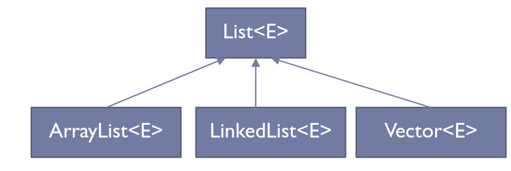
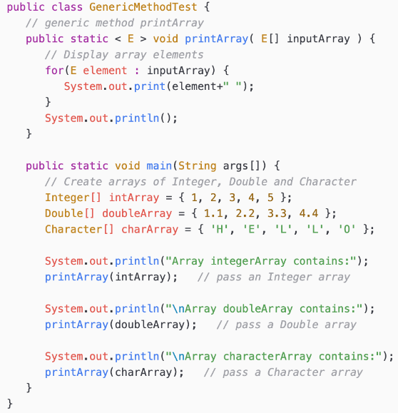

---
# Copyright (c) 2026 Angela Villota, and collaborators from the CyED block
# Licensed under the PolyForm Noncommercial License 1.0.0.
# Commercial use is prohibited without prior written authorization.
title: "Unidad 3: Generics"
---

# Unidad 3: Generics

## Introducción

¿Por qué Generics?

:::{dropdown} Generics
- Generics permite que, al definir una clase, interfaz o método, se puedan utilizar tipos (clases o interfaces) como parámetros.
- Busca independizar el proceso del tipo de datos sobre los que se aplica.
- Definición de modelos generales.
:::

¿Y esto qué acarrea?

Al utilizar parámetros en la definición de clases, interfaces y métodos, se provee una nueva manera de reutilizar código.

Entonces, ¿cuáles son los beneficios de un código que usa Generics y otro que no?

:::{dropdown} Beneficios
- Chequeos de tipos más rigurosos en tiempo de compilación.
- Eliminación de casts.
- Implementación de algoritmos genéricos.
:::

Ejemplo 1, parte 1: clase genérica `Caja`.

```java
public class Caja<T> {
    private T contenido;
    public void setContenido(T contenido) {
        this.contenido = contenido;
    }
    public T getContenido() {
        return contenido;
    }
}
```

Ejemplo 1, parte 2: uso de la clase genérica `Caja` en `main`.

```java
public class Main {
    public static void main(String[] args) {
        Caja<String> cajaDeTextos = new Caja<>();
        cajaDeTextos.setContenido("Usando Generics");
        System.out.println(cajaDeTextos.getContenido());

        Caja<Integer> cajaDeNumeros = new Caja<>();
        cajaDeNumeros.setContenido(123);
        System.out.println(cajaDeNumeros.getContenido());
    }
}
```

Adivine qué clase viene utilizando hace un tiempo y cumple con ser genérica...

:::{dropdown} Respuesta
`ArrayList` es genérica.

```java
public class Main {
    public static void main(String[] args) {
        ArrayList<String> nombres = new ArrayList<>();
        nombres.add("Ana");
        nombres.add("Juan");
        nombres.add("Luis");
        System.out.println(nombres);

        ArrayList<Integer> numeros = new ArrayList<>();
        numeros.add(10);
        numeros.add(20);
        numeros.add(30);
        System.out.println(numeros);
    }
}
```
:::

¿Se pueden utilizar tipos primitivos al utilizar Generics?

:::{dropdown} Consideraciones
- No se pueden utilizar con primitivos pero sí con las clases que corresponden con ellos (clases wrapper).
- No se puede hacer un genérico tipo `int` pero sí un `Integer`.
- Autoboxing a las clases wrappers (conversión automática que realiza el compilador entre un tipo de dato primitivo, como `int`, y su clase contenedora correspondiente, como `Integer`).
:::

¿Qué relación puede existir entre sobrecarga de métodos y generics?

:::{dropdown} Generics y sobrecarga de métodos
- Si las operaciones realizadas por varios métodos sobrecargados son idénticas, pueden codificarse de manera compacta utilizando un método genérico.
- Con base en los tipos de los argumentos que se pasan al método genérico, el compilador maneja cada llamada al método de manera apropiada.
- Además de establecer las llamadas a los métodos, el compilador determina si las operaciones en el cuerpo del método se pueden aplicar a los elementos del tipo almacenado en el argumento de la clase genérica (arreglo, `ArrayList`).
:::

## Tipos genéricos

Ejemplo de clase NO genérica:

```java
public class Caja {
    private Object objeto;
    public void setObjeto(Object objeto) {
        this.objeto = objeto;
    }
    public Object getObjeto() {
        return objeto;
    }
}
```

¿Qué problemas se pueden presentar al utilizar la clase no genérica anterior?

:::{dropdown} Problemas clase NO genérica
- No se puede verificar en tiempo de compilación cómo se utiliza la clase.
- Una parte del código puede ubicar un tipo de objeto en la `Caja` y esperar que se retorne un objeto de ese mismo tipo, mientras que, por error, en otra parte del código se le puede pasar otro tipo de objeto, generando un error en tiempo de ejecución.
:::

---
**· Contenido adicional ·**

### ¿Error en tiempo de compilación o en tiempo de ejecución?

¿Qué es mejor, un error en tiempo de compilación o en tiempo de ejecución?

- Un error en tiempo de compilación.
- Los errores en tiempo de compilación son más fáciles de encontrar.

---

¿Cómo se declara una clase genérica?

:::{dropdown} Declaración clase genérica
- Al momento de declarar la clase, luego del nombre de ésta, se especifican los parámetros de tipos delimitados por `< >`.
- Los objetos a ser utilizados dentro de la clase se reemplazan por el tipo de parámetro de entrada.
- Estas variables de tipo pueden ser de cualquier tipo no primitivo.
- El mismo procedimiento puede utilizarse para declarar interfaces genéricas.
:::

¿Cuál sería la versión genérica del ejemplo previo? Sería precisamente el primer ejemplo visto:

```java
public class Caja<T> {
    private T tipo;
    public void setTido(T tipo) {
        this.tipo = tipo;
    }
    public T getTipo() {
        return tipo;
    }
}
```

¿Cómo se declara una variable de tipo genérica?

:::{dropdown} Declaraciones variables genéricas
- `Caja<Integer> cajaEnteros;`
- `Caja<Double> cajaReales;`
- `Caja<String> cajaString;`
- `Caja< Caja<String> > cajaCajaString;`
:::

¿Cómo se crea un objeto de tipo genérico?

:::{dropdown} Instanciar objetos tipo genéricos
- `Caja<Integer> cajaEnteros = new Caja<Integer>();`
- `Caja<Integer> cajaEnteros = new Caja<>();`
:::

¿Pero por qué es válido `Caja<Integer> cajaEnteros = new Caja<>();`?

:::{dropdown} Instanciar objetos tipo genéricos
- Al invocar el constructor de una clase genérica se pueden reemplazar los argumentos de tipo con un conjunto vacío siempre y cuando el compilador pueda determinarlos o inferirlos a partir del contexto.
- Como este conjunto vacío se denota como `< >` se denomina notación diamante.
:::

¿Puede una clase tener múltiples parámetros de tipos?

:::{dropdown} Múltiples parámetros de tipos
- Sí.
- `Terna<`$T_1,T_2,T_3$`> terna;`
:::

**Ejercicio:** Declare la clase genérica `Terna` (con 7 métodos, constructor, 3 getters y 3 setters) que implemente la interfaz `ITerna`. Posteriormente declare variables de tipo `Terna` e instáncielas utilizando distintos argumentos de tipo.

```java
public interface ITerna<T1,T2,T3> {
    public T1 obtenerPrimero();
    public T2 obtenerSegundo();
    public T3 obtenerTercero();
}
public class Terna<T1,T2,T3> implements ITerna<T1,T2,T3> {
    private T1 primero;
    private T2 segundo;
    private T3 tercero;
    public Terna(T1 primero, T2 segundo, T3 tercero) {
        this.primero = primero;
        this.segundo = segundo;
        this.tercero = tercero ;
    }
    public T1 obtenerPrimero() {
        return primero;
    }
    public T2 obtenerSegundo() {
        return segundo;
    }
    public T3 obtenerTercero() {
        return tercero;
    }
}
```

---
**· Contenido adicional ·**

### Terna con múltiples constructores

Una variante de la clase `Terna` puede ofrecer varios constructores según qué campos se conocen al momento de crear el objeto, además de un constructor de copia:

```java
interface ITerna<T, U, V> {
    T getFirst();
    U getSecond();
    V getThird();
    void setFirst(T first);
    void setSecond(U second);
    void setThird(V third);
}

class Terna<T, U, V> implements ITerna<T, U, V> {
    private T first;
    private U second;
    private V third;

    // Constructor 1: Constructor vacío
    public Terna() {
        this.first = null;
        this.second = null;
        this.third = null;
    }

    // Constructor 2: Un solo parámetro (solo first)
    public Terna(T first) {
        this.first = first;
        this.second = null;
        this.third = null;
    }

    // Constructor 3: Dos parámetros (first y second)
    public Terna(T first, U second) {
        this.first = first;
        this.second = second;
        this.third = null;
    }

    // Constructor 4: Tres parámetros (first, second y third)
    public Terna(T first, U second, V third) {
        this.first = first;
        this.second = second;
        this.third = third;
    }

    // Constructor 5: Solo second y third
    public Terna(U second, V third) {
        this.first = null;
        this.second = second;
        this.third = third;
    }

    // Constructor 6: Solo first y third
    public Terna(T first, V third) {
        this.first = first;
        this.second = null;
        this.third = third;
    }

    // Constructor 7: Inicialización con otro objeto de tipo Terna
    public Terna(Terna<T, U, V> otraTerna) {
        this.first = otraTerna.first;
        this.second = otraTerna.second;
        this.third = otraTerna.third;
    }

    // Getters
    @Override
    public T getFirst() {
        return first;
    }

    @Override
    public U getSecond() {
        return second;
    }

    @Override
    public V getThird() {
        return third;
    }

    // Setters
    @Override
    public void setFirst(T first) {
        this.first = first;
    }

    @Override
    public void setSecond(U second) {
        this.second = second;
    }

    @Override
    public void setThird(V third) {
        this.third = third;
    }

    // Método para mostrar la terna
    public void mostrarTerna() {
        System.out.println("(" + first + ", " + second + ", " + third + ")");
    }
}
```

Uso en `main` con distintos tipos y constructores:

```java
public class Main {
    public static void main(String[] args) {
        // Instanciaciones con distintos tipos de datos
        Terna<Integer, String, Double> terna1 = new Terna<>(1, "Hola", 3.14);
        Terna<String, Boolean, Character> terna2 = new Terna<>("Texto", true, 'A');
        Terna<Double, Integer, String> terna3 = new Terna<>(9.8, 42, "Ejemplo");

        // Instanciaciones usando distintos constructores
        Terna<Integer, String, Double> terna4 = new Terna<>(5);
        Terna<Integer, String, Double> terna5 = new Terna<>(5, "Mundo");
        Terna<Integer, String, Double> terna6 = new Terna<>(null, "Test", 2.71);
        Terna<Integer, String, Double> terna7 = new Terna<>(terna1); // Copia de otra terna

        // Mostrar valores de las ternas
        System.out.print("Terna 1: ");
        terna1.mostrarTerna();

        System.out.print("Terna 2: ");
        terna2.mostrarTerna();

        System.out.print("Terna 3: ");
        terna3.mostrarTerna();

        System.out.print("Terna 4: ");
        terna4.mostrarTerna();

        System.out.print("Terna 5: ");
        terna5.mostrarTerna();

        System.out.print("Terna 6: ");
        terna6.mostrarTerna();

        System.out.print("Terna 7 (Copia de Terna 1): ");
        terna7.mostrarTerna();

        // Modificación de valores
        terna1.setFirst(99);
        terna1.setSecond("Modificado");
        terna1.setThird(2.71);
        System.out.print("Terna 1 modificada: ");
        terna1.mostrarTerna();
    }
}
```

---

¿Cuál sería una interfaz genérica estándar de Java?



**Ejemplo:** uso de `List` genérico.

```java
public class TestArrayList {
    public static void main(String[] args) {
        List<Figura> lista = new ArrayList<Figura>();
        lista.add(new Circulo());
        Figura f = lista.get(0);
        Circulo c = (Circulo) lista.get(0);
    }
}
```

¿Se pueden restringir los tipos genéricos?

:::{dropdown} Restricción de tipos genéricos
- Se pueden restringir los tipos genéricos de tal manera que se pueda trabajar con un tipo específico y sus subtipos.
- Para establecer el límite superior, se coloca después del nombre del parámetro de tipo la palabra clave `extends` y el nombre de la clase o interfaz que representa dicha restricción.
- El `extends` se utiliza para clases e interfaces.
:::

**Ejemplo:** restricción de tipo genérico en Java.

```java
public class CajaNumeros<T extends Number> {
    private T dato;
    public T darElemento() {
        return dato;
    }
    public void modificarDato(T dato) {
        this .dato = dato;
    }
}
```

## Tipos raw

¿Qué es el tipo raw o crudo?

:::{dropdown} Tipo raw
- Es el nombre de una clase o interfaz genérica cuando no se le pasa ningún argumento de tipo.
- `Caja cajaCruda = new Caja();`
- En este caso, `Caja` es un tipo raw de `Caja<T>`.
- Un tipo de clase o interfaz no genérica no es un tipo raw.
:::

¿Qué advertencias se pueden presentar al utilizar tipos raw?

:::{dropdown} Advertencias tipo raw
Se presenta una advertencia ya que a un tipo parametrizado se le asigna un tipo raw.

```java
Caja cajaCruda = new Caja();
Caja<Integer> intCaja = cajaCruda;
```

Se presenta una advertencia pues el tipo raw se salta los chequeos de tipo genérico y así pasa su manejo de código inseguro a tiempo de ejecución.

```java
Caja<String> stringCaja = new Caja<>();
Caja cajaCruda = stringCaja;
cajaCruda.modificar(8);
```
:::

## Métodos genéricos

¿Qué son los métodos genéricos?

:::{dropdown} Métodos genéricos
- Son aquellos métodos que introducen su propio tipo de parámetros.
- Es similar a la declaración de tipo genérica, pero el alcance del parámetro está limitado al método donde se declara.
- Se admiten métodos genéricos estáticos y no estáticos, al igual que constructores genéricos.
- La sintaxis de un método genérico incluye un parámetro de tipo entre `< >` y aparece antes del tipo de retorno del método.
:::



¿Se puede utilizar el operador relacional (`<`, `>`, etc.) con tipos referenciados?

:::{dropdown} Operador relacional
- No, sin embargo, es posible comparar dos objetos de la misma clase, si esa clase implementa a la interfaz genérica `Comparable<T>`.
- Los objetos de clases que implementan `Comparable<T>` tienen el método `compareTo(T t)`.
- Todas las clases de envoltura de tipos para tipos primitivos implementan a `Comparable<T>`.
- Un beneficio de implementar la interfaz genérica `Comparable<T>` es que los objetos de clases que implementan esta interfaz pueden utilizarse con métodos de ordenamiento y búsqueda sobre las clases `Collections`.
:::

**Ejemplo:** interfaz `Comparable`.

```java
public class Libro implements Comparable<Libro> {
    private String titulo;
    private double precio;

    public Libro(String titulo, double precio) {
        this.titulo = titulo;
        this.precio = precio;
    }

    public String getTitulo() { return titulo; }
    public double getPrecio() { return precio; }

    @Override
    public int compareTo(Libro otroLibro) {
        return Double.compare(this.precio, otroLibro.precio);
    }
}
```

**Ejemplo:** uso de la interfaz `Comparable` en `main`.

```java
public class Main {
    public static void main(String[] args) {
        List<Libro> libros = new ArrayList<>();
        libros.add(new Libro("Java Avanzado", 35.99));
        libros.add(new Libro("Python desde cero", 24.50));
        libros.add(new Libro("Introducción a la IA", 40.75));

        Collections.sort(libros);

        for (Libro libro : libros) {
            System.out.println(libro.getTitulo() + " - $" + libro.getPrecio());
        }
    }
}
```

---
**· Contenido adicional ·**

### Método genérico `printArray`

El diagrama de la diapositiva anterior corresponde a un método genérico estático que imprime los elementos de un arreglo de cualquier tipo:

```java
public class GenericMethodTest {
    // método genérico printArray
    public static <E> void printArray(E[] inputArray) {
        // recorrer los elementos del arreglo
        for (E element : inputArray) {
            System.out.print(element + " ");
        }
        System.out.println();
    }

    public static void main(String args[]) {
        // Crear arreglos de Integer, Double y Character
        Integer[] intArray = {1, 2, 3, 4, 5};
        Double[] doubleArray = {1.1, 2.2, 3.3, 4.4};
        Character[] charArray = {'H', 'E', 'L', 'L', 'O'};

        System.out.println("Array integerArray contains:");
        printArray(intArray); // pasa un arreglo de Integer

        System.out.println("Array doubleArray contains:");
        printArray(doubleArray); // pasa un arreglo de Double

        System.out.println("Array characterArray contains:");
        printArray(charArray); // pasa un arreglo de Character
    }
}
```

### Método genérico con restricción: ordenamiento por inserción

Un método genérico también puede restringir su parámetro de tipo con `extends`, para poder invocar operaciones propias de esa restricción (como `compareTo`) dentro del cuerpo del método:

```java
class GenericInsertionSorter {
    public <T extends Comparable<T>> void sort(T[] elems) {
        int size = elems.length;
        for (int outerLoopIdx = 1; outerLoopIdx < size; outerLoopIdx++) {
            for (int innerLoopIdx = outerLoopIdx; innerLoopIdx > 0; innerLoopIdx--) {
                if (elems[innerLoopIdx - 1].compareTo(elems[innerLoopIdx]) > 0) {
                    T temp = elems[innerLoopIdx - 1];
                    elems[innerLoopIdx - 1] = elems[innerLoopIdx];
                    elems[innerLoopIdx] = temp;
                }
            }
        }
    }
}
```

Como `T extends Comparable<T>`, el compilador garantiza que cualquier tipo usado con `GenericInsertionSorter` tiene el método `compareTo`, sin importar de qué tipo concreto se trate.

---

## Wildcards

¿Qué son los comodines o wildcards en Generics?

:::{dropdown} Wildcards
- El signo de interrogación `?`, también denominado comodín o wildcard, representa un tipo no conocido.
- Un comodín de tipo parametrizado es una instancia de un tipo genérico donde al menos un argumento de tipo es un wildcard.
- Ejemplos: `Collection<?>`, `List<? extends Number>`, `Pair<String,?>`.
- Los comodines pueden utilizarse en gran variedad de situaciones, como tipo del parámetro, campo o variable local.
- Los wildcard nunca se utilizan como un argumento de tipo para una invocación de un método genérico o una creación de una instancia de una clase genérica.
:::

**Ejemplo:** wildcard.

```java
public class WildcardDemo {
    public static void imprimirLista(List<?> lista) {
        for (Object elem : lista) {
            System.out.println(elem);
        }
    }

    public static void main(String[] args) {
        List<String> palabras = Arrays.asList("hola", "mundo");
        List<Integer> numeros = Arrays.asList(1, 2, 3);

        imprimirLista(palabras);
        imprimirLista(numeros);
    }
}
```

## Lo no permitido por Generics

¿Qué no permite Generics?

:::{dropdown} Lo no permitido por Generics
- No se puede definir un miembro de una clase como estático genérico parametrizado. Cualquier intento de este tipo produce un error de compilación, pues hace una referencia estática a un tipo `T` no estático.
- No se pueden crear instancias de tipo `T` (tipo genérico).
- Generics no es compatible con tipos de datos primitivos. Aunque sí se pueden utilizar las clases wrappers en lugar de los tipos de datos primitivos y luego usar los primitivos cuando se pasan los valores.
- No se puede crear una clase Excepción genérica.
:::

## Ejemplos

### Ejemplo: Pila Genérica

Para convertir nuestra clase `Pila` vista en la sesión, en una clase genérica que pueda manejar cualquier tipo de dato (no solo enteros), se debe usar genéricos (`<T>`) y cambiar el arreglo de `int[]` a un arreglo de `T[]`.

Como en Java no se pueden crear arreglos genéricos directamente, hay un truco con un arreglo de `Object` y un casting.

```java
public class PilaGenerica<T> {
  private T[] arreglo;
  private int top;
  private int size;


  public PilaGenerica(int n) {
    this.arreglo = (T[]) new Object[n];
    this.top = 0;
    this.size = n;
}
```

```java
public void Push(T x) throws IndexOutOfBoundsException {
    if(this.top < this.size) {
      this.arreglo[top] = x;
      this.top++;
    } else {
      throw new StackOverflowError();
    }
  }
```

```java
  public T Pop() throws IndexOutOfBoundsException {
    if(this.top > 0) {
      this.top--;
      return this.arreglo[top];
    } else {
      throw new IndexOutOfBoundsException();
    }
  }
```

```java
public T[] getArreglo() {
    return arreglo;
  }

  public int getTop() {
    return top;
  }

  public int getSize() {
    return size;
  }
```

```java
  public void setArreglo(T[] arreglo) {
    this.arreglo = arreglo;
  }

  public void setTop(int top) {
    this.top = top;
  }

  public void setSize(int size) {
    this.size = size;
  }
```

### Ejemplo: Pila con Caja Genérica

```java
public class PilaCaja<T> {
  private Caja<T>[] arreglo;
  private int top;
  private int size;

  @SuppressWarnings("unchecked")
  public PilaCaja(int n) {
    this.arreglo = (Caja<T>[]) new Caja[n]; // arreglo genérico
    this.top = 0;
    this.size = n;
  }

```

```java
public void Push(Caja<T> caja) throws IndexOutOfBoundsException {
    if (this.top < this.size) {
      this.arreglo[top] = caja;
      this.top++;
    } else {
      throw new StackOverflowError();
    }
  }
```

```java
public Caja<T> Pop() throws IndexOutOfBoundsException {
    if (this.top > 0) {
      this.top--;
      return this.arreglo[top];
    } else {
      throw new IndexOutOfBoundsException();
    }
  }

```

```java
public Caja<T>[] getArreglo() {
    return arreglo;
  }

  public int getTop() {
    return top;
  }

  public int getSize() {
    return size;
  }
```

```java
  public void setArreglo(Caja<T>[] arreglo) {
    this.arreglo = arreglo;
  }

  public void setTop(int top) {
    this.top = top;
  }

  public void setSize(int size) {
    this.size = size;
  }
```

### Ejemplo: Pila con Caja Genérica y Wildcard

Para crear una clase `PilaCajaGenericaWildcard` que sea una pila que no sea genérica en sí misma, pero cuyo contenido sea objetos de la clase genérica `Caja<T>`, lo que se puede hacer es:

- Declarar la pila con arreglo de `Caja<?>[]` para poder contener cajas con cualquier tipo (`?` es wildcard).
- Así la pila almacena distintas `Caja<T>`, cada una con diferente tipo, como `Caja<String>`, `Caja<Integer>`, etc.
- Los métodos `Push` y `Pop` manipulan objetos `Caja<?>`.

```java
public class PilaCajaGenericaWildcard {
  private Caja<?>[] arreglo;
  private int top;
  private int size;

  public PilaCajaGenericaWildcard(int n) {
    this.arreglo = (Caja<?>[]) new Caja<?>[n];
    this.top = 0;
    this.size = n;
  }
}
```

```java
public void Push(Caja<?> caja) throws IndexOutOfBoundsException {
    if (this.top < this.size) {
      this.arreglo[top] = caja;
      this.top++;
    } else {
      throw new StackOverflowError();
    }
  }
```

```java
public Caja<?> Pop() throws IndexOutOfBoundsException {
    if (this.top > 0) {
      this.top--;
      return this.arreglo[top];
    } else {
      throw new IndexOutOfBoundsException();
    }
  }
```

```java
public Caja<?>[] getArreglo() {
    return arreglo;
  }

  public int getTop() {
    return top;
  }

  public int getSize() {
    return size;
  }
```

```java
  public void setArreglo(Caja<?>[] arreglo) {
    this.arreglo = arreglo;
  }

  public void setTop(int top) {
    this.top = top;
  }

  public void setSize(int size) {
    this.size = size;
  }
```

---
**· Contenido adicional ·**

### Listas enlazadas genéricas

Una *lista enlazada* (*Linked List*) es una estructura de datos lineal y dinámica donde los elementos (*nodos*) están conectados mediante punteros o referencias en lugar de ocupar posiciones contiguas en memoria.

Cada nodo contiene:
- Un *dato* (*valor almacenado*).
- Una *referencia al siguiente nodo* en la lista.

**Tipos de listas enlazadas**

- *Lista Enlazada Simple (SLL)*: cada nodo apunta al siguiente. Se recorre en una sola dirección.
- *Lista Doblemente Enlazada (DLL)*: cada nodo apunta al siguiente y al anterior. Se puede recorrer en ambas direcciones.
- *Lista Circular*:
  - En la versión *simple*, el último nodo apunta al primero.
  - En la versión *doble*, el primer y el último nodo están conectados en ambos sentidos.

Ejemplo de organización de un proyecto de listas enlazadas en Java:

```
src/
  listas/
    simple/
      Nodo.java
      ListaSimple.java
    doble/
      NodoDoble.java
      ListaDoble.java
    circular/
      NodoCircular.java
      ListaCircular.java
  main/
    Main.java
```

- [Listas Enlazadas](https://github.com/marlongv098/Estructuras/tree/master/3_Estructuras_NO_Recursivas/3_Generics/1_ListasEnlazadas)

### Lista enlazada genérica de personas

Un proyecto de práctica habitual es implementar una lista enlazada personalizada para almacenar objetos de tipo `Persona`, organizada en capas:

- En el paquete `persona` se definen las clases `Persona` y `PersonaGenerica`, que representan los datos que se almacenan en la lista.
- En el paquete `estructuras` se encuentra la lógica de la estructura de datos, incluyendo la clase `Nodo` que representa cada elemento de la lista y `ListaEnlazada`, que implementa los métodos para agregar, eliminar, etc.
- En `ui`, la clase `Main` actúa como punto de entrada del programa, donde se crean instancias y se demuestra el funcionamiento de la lista enlazada.
- En la carpeta `test` se encuentra `ListaEnlazadaTest.java`, con pruebas unitarias para verificar el correcto comportamiento de la estructura.

```
LinkedListPersonas/
  src/
    persona/
      Persona.java
      Entidad.java
    estructuras/
      Nodo.java
      ListaEnlazada.java
    ui/
      Main.java
  test/
    ListaEnlazadaTest.java
```

- [LinkedListPersonas](https://github.com/marlongv098/Estructuras/tree/master/3_Estructuras_NO_Recursivas/3_Generics/2_LinkedListPersonas)

**¿Vale la pena hacer `Persona` genérica?**

Ventajas de hacer `Persona` genérica:

- Mayor flexibilidad: se podrían crear diferentes tipos de "personas" que tengan atributos de diferentes tipos. Por ejemplo, `Persona<String, Integer>` para nombre y edad, o `Persona<String, Double>` si se quisiera almacenar la altura como un número decimal.
- Reutilización: si se necesitan crear objetos similares a `Persona` pero con diferentes tipos de datos, una clase genérica podría evitar la duplicación de código.

Desventajas de hacer `Persona` genérica:

- Complejidad innecesaria: en muchos casos, los atributos de una persona (nombre, edad, etc.) tienen tipos de datos bien definidos. Hacer la clase genérica podría añadir complejidad sin aportar beneficios significativos.
- Pérdida de claridad: si los tipos de datos de los atributos no son relevantes para la lógica de la aplicación, hacer la clase genérica podría dificultar la lectura y comprensión del código.
- Posibles problemas de tipado: si no se usan correctamente, los genéricos pueden llevar a errores de tipado más difíciles de depurar.

¿Cuándo podría ser útil hacer `Persona` genérica?

- Si se necesita almacenar atributos de `Persona` que pueden variar en tipo de datos.
- Si se está creando una biblioteca o framework que necesita ser muy flexible.
- Si la aplicación tiene una lógica muy compleja que se beneficia de la flexibilidad de los genéricos.

---

Continúa con los [ejercicios de Generics](exercises.md).

*Material adaptado del material original de los profesores Andrés Aristizábal y Marlon Gomez.*
