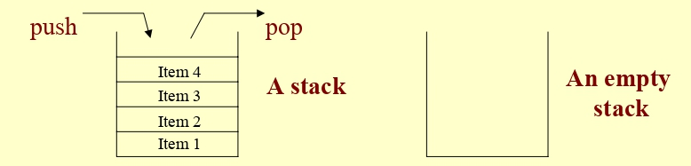
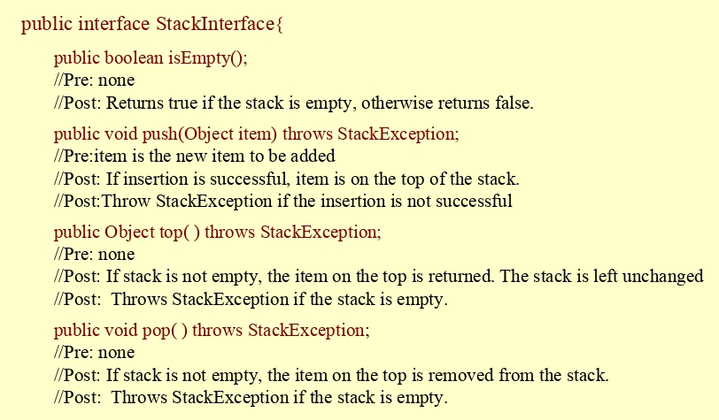
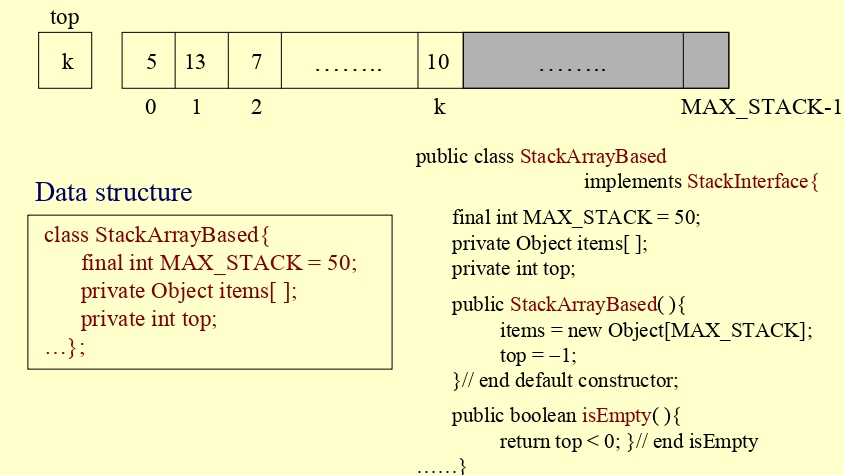
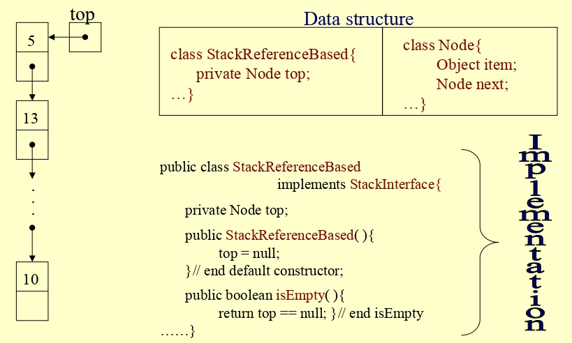
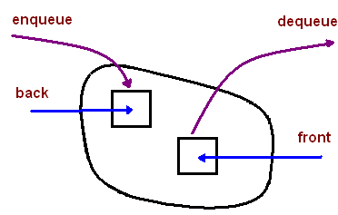

---
# Copyright (c) 2026 Angela Villota, and collaborators from the CyED block
# Licensed under the PolyForm Noncommercial License 1.0.0.
# Commercial use is prohibited without prior written authorization.
title: "Unidad 3: Pilas y Colas"
---

# Unidad 3: Pilas y Colas

---
**· Contenido adicional ·**

### Estructuras de datos secuenciales

Son aquellas que almacenan datos en una secuencia lineal, donde existe un primer y último elemento, y a menudo se accede a ellos uno tras otro. Algunas características son:

- Están definidas con una capacidad máxima (fija o por diseño).
- Cuando se llenan, ya no aceptan más elementos (ocurre un overflow).
- El acceso y las operaciones siguen funcionando dentro de este límite.

Dos ejemplos clásicos:

**Arreglo**

- Una estructura de datos de acceso aleatorio.
- Se puede acceder a cualquier elemento en tiempo constante.
- Un ejemplo típico de acceso aleatorio es un libro.
- El acceso aleatorio es fundamental en varios algoritmos, como la búsqueda binaria.

**Lista enlazada**

- Una estructura de datos de acceso secuencial.
- Solo se puede acceder a un elemento en un orden específico.
- Un ejemplo típico de acceso secuencial es un rollo de papel o una cinta magnética.

**¿Existen otros tipos de estructuras de datos?**

- Existen subcasos de las estructuras de datos secuenciales: las **estructuras de acceso limitado**.

**Ejemplos de estructuras de acceso limitado:**

- Pilas
- Colas

---

## Pilas

**Pila**

Una pila es una estructura de datos tipo LIFO (Last In First Out), por lo que el último elemento insertado será el primero en ser borrado.

**Operaciones básicas:**

- `STACK-EMPTY(S)`
- `PUSH(S,x)`
- `POP(S)`

**Implementación con arreglo**

Una forma de implementar la pila es por medio de un arreglo unidimensional:

| Índice | 1 | 2 | 3 | 4 | 5 |
|---|---|---|---|---|---|
| **S** | 10 | 4 | 5 | | |

Esto supone varios aspectos:

- La pila tiene una capacidad limitada.
- Se cuenta con un atributo adicional, llamado `top[S]`, que almacena el índice en el arreglo que guarda el último valor, esto es, el tope de la pila.
- Cuando la pila esté vacía, `top[S]=0`.

**Trace con la pila $S$ (`top[S]=3`):**

| Índice | 1 | 2 | 3 | 4 | 5 |
|---|---|---|---|---|---|
| **S** | 10 | 4 | 5 | | |

Indique lo que sucede después de cada instrucción, siendo $S$ la pila que se muestra arriba:

```
STACK-EMPTY(S)
PUSH(S,4)
PUSH(S,12)
PUSH(S,7)
```

:::{dropdown} Resultado
Al ejecutar `PUSH(S,7)` se produce **Overflow** — desbordamiento en su capacidad máxima.
:::

Partiendo de nuevo de la misma pila $S$ (`top[S]=3`):

```
STACK-EMPTY(S)
POP(S)
POP(S)
POP(S)
STACK-EMPTY(S)
POP(S)
```

:::{dropdown} Resultado
Al ejecutar la última instrucción `POP(S)` (con la pila ya vacía) se produce **Underflow**.
:::

**Indique un algoritmo para cada operación básica, acompañado de su respectiva complejidad usando la notación $O$:**

- `STACK-EMPTY(S)`, retorna true o false
- `PUSH(S,x)`, adiciona x al tope, no devuelve ningún valor
- `POP(S)`, borra el elemento que esté en el tope y devuelve ese valor

**`STACK-EMPTY(S)`**

```
1  if (top[S]==0)
2      then return true
3      else return false
```

$T(n) = O(1)$, tiempo constante.

**`PUSH(S,x)`**

```
1  if (top[S] == n)
2      then error "overflow"
3      else top[S] = top[S] + 1
4           S[top[S]] = x
```

$T(n) = O(1)$, tiempo constante.

**`POP(S)`**

```
1  if (top[S] == 0)
2      then error "underflow"
3      else top[S] = top[S] - 1
4           return S[top[S] + 1]
```

$T(n) = O(1)$, tiempo constante.

---
**· Contenido adicional ·**

### Pilas (teoría adicional)

**¿Qué es una pila?**

- Es un contenedor de objetos donde se pueden insertar y extraer elementos según el principio LIFO (*Last In, First Out*).
- Tiene dos operaciones básicas:
  - **Push**: Inserta un elemento.
  - **Pop**: Extrae un elemento.
- Se considera una estructura de acceso limitado, ya que solo se puede insertar y extraer desde la parte superior.
- Es una estructura recursiva.

:::{image} images/stack.png
:alt: Pila
:width: 100%
:::

**¿Cuál sería una definición estructural de una pila?**

- Una pila puede estar vacía.
- O puede estar compuesta por dos partes:
  - La cima de la pila (un valor).
  - El resto (otra pila).

**¿Qué nos dice esta definición?**

- Que sigue el patrón normal de una definición recursiva.

**Casos:**

- **Caso base:** Un conjunto vacío es un valor válido para la pila.
- **Caso recursivo:** Una cima y otra pila también son valores válidos para una pila.



**Ejemplo**

Sea $S = (7,(29,(11,\emptyset)))$, ¿es $S$ una pila válida?

**Definición del TAD Pila (Abstract Data Type)**

**Nombre**

TAD Pila

**Objeto abstracto**

$Stack = \langle \langle e_1,e_2,e_3,...,e_n \rangle, top \rangle$

**Invariante**

$0 \leq n \, \wedge \, Size(Stack) = n \, \wedge \, top = e_n$

**Operaciones del Constructor**

*Stack*

Tipo: $\longrightarrow Stack$

- **Descripción:** Construye una pila vacía.
- **Precondiciones:** Ninguna.
- **Postcondiciones:** La pila es $Stack = \emptyset$.

**Operaciones Modificadoras**

*push*

$Stack \times Element \longrightarrow Stack$

- Agrega el nuevo elemento $e$ a la pila $s$.
- **Precondiciones:**
  - Pila $s = \langle e_1,e_2,e_3,...,e_n \rangle$ y elemento $e$
  - o $s = \emptyset$ y elemento $e$
- **Postcondiciones:**
  - Pila $s = \langle e_1,e_2,e_3,...,e_n, e \rangle$
  - o $s = \langle e \rangle$

*pop*

$Stack \longrightarrow Stack$

- Extrae de la pila $s$ el elemento insertado más recientemente.
- **Precondiciones:**
  - Pila $s \neq \emptyset$, es decir, $s = \langle e_1,e_2,e_3,...,e_n \rangle$
- **Postcondiciones:**
  - Pila $s = \langle e_1,e_2,e_3,...,e_{n-1} \rangle$

**Operaciones Destructoras**

*~Stack*

$Stack \longrightarrow -$

- Destruye la pila $s$ liberando memoria.
- **Precondiciones:** Pila $s$
- **Postcondiciones:** Ninguna.

**Operaciones adicionales en la Pila (Stack)**

*top*

$Stack \longrightarrow Element$

- Recupera el valor del elemento en la cima de la pila.
- **Precondiciones:** Pila $s \neq \emptyset$, es decir, $s = \langle e_1,e_2,e_3,...,e_n \rangle$
- **Postcondiciones:** Elemento $e_n$

*isEmpty*

$Stack \longrightarrow boolean$

- Determina si la pila $s$ está vacía o no.
- **Precondiciones:** Pila $s$
- **Postcondiciones:**
  - `True` si $s = \emptyset$
  - `False` si $s \neq \emptyset$

**Ejemplo de impresión de una pila**

```java
printStack(Stack s) {
  while (!s.isEmpty()) { 
    elem = s.top();
    s.pop();
    print elem;
  }
}
```

**Axiomas que deben cumplir las operaciones de acceso en un TAD Pila**

Sea $s$ una pila y $e$ un elemento.

- $(s.Stack()).isEmpty() = true$
- $(s.push(e)).isEmpty() = false$
- $(s.Stack()).top() = error$
- $(s.push(e)).top() = e$
- $(s.Stack()).pop() = error$
- $(s.push(e)).pop() = e$

**Similitudes entre una pila y una lista**

- `top()` es equivalente a obtener el primer elemento de una lista.
- `pop()` es equivalente a eliminar el primer elemento de la lista.
- `push(e)` es equivalente a agregar un elemento al inicio de la lista.

**Principales operaciones en la clase `Stack` de Java**

- `boolean empty()` → (`isEmpty()`)
- `E peek()` → (`top()`)
- `E pop()` → (`pop()`)
- `E push(E item)` → (`push(E item)`)

**Implementación del TAD de una Pila**

*¿Interfaz?*



**Implementación basada en arreglos**



**Implementación dinámica**



---

## Colas

**Cola**

Una cola es una estructura de datos tipo FIFO (First In First Out), por lo que el primer elemento que es insertado, es el primero en ser borrado.

**Operaciones básicas:**

- `ENQUEUE(Q,x)`
- `DEQUEUE(Q)`

**Implementación con arreglo**

Una forma de implementar la cola es por medio de un arreglo unidimensional:

| Índice | 1 | 2 | 3 | 4 | 5 | 6 | 7 | 8 | 9 |
|---|---|---|---|---|---|---|---|---|---|
| **Q** | | | | 5 | 1 | 9 | 6 | | |

`head[Q]=4`, `tail[Q]=8`

Esto supone varios aspectos:

- La cola tiene una capacidad limitada.
- Se cuenta con dos atributos adicionales: `head[Q]`, que guarda el índice del frente, y `tail[Q]`, que apunta al siguiente lugar disponible para insertar.
- En esta implementación se usa además `size`, que representa la cantidad de elementos actualmente almacenados.
- Cuando la cola está vacía, `size = 0`.
- Cuando la cola está llena, `size = n`.

**Cola $Q$ inicial:**

| Índice | 1 | 2 | 3 | 4 | 5 | 6 | 7 | 8 | 9 |
|---|---|---|---|---|---|---|---|---|---|
| **Q** | | | | 5 | 1 | 9 | 6 | | |

`head[Q]=4`, `tail[Q]=8`

Ejecutamos:

```
ENQUEUE(Q,2)
ENQUEUE(Q,8)
ENQUEUE(Q,3)
```

:::{dropdown} Resultado
Tras `ENQUEUE(Q,2)`, al ejecutar `ENQUEUE(Q,8)` se llega al final del arreglo, por lo que se intenta insertar en la posición 1. El estado final, tras las tres instrucciones, es:

| Índice | 1 | 2 | 3 | 4 | 5 | 6 | 7 | 8 | 9 |
|---|---|---|---|---|---|---|---|---|---|
| **Q** | 3 | | | 5 | 1 | 9 | 6 | 2 | 8 |

`head[Q]=4`, `tail[Q]=2`
:::

Considerando el mismo estado final de $Q$:

| Índice | 1 | 2 | 3 | 4 | 5 | 6 | 7 | 8 | 9 |
|---|---|---|---|---|---|---|---|---|---|
| **Q** | 3 | | | 5 | 1 | 9 | 6 | 2 | 8 |

`head[Q]=4`, `tail[Q]=2`

**¿Cómo sabe que la cola está llena?**

:::{dropdown} Respuesta
- En el TAD clásico: `tail[Q] == head[Q]`
- En esta implementación: `size == n`

Inicialmente `tail[Q] = head[Q] = 1` y `size = 0`.
:::

**Indique un algoritmo para cada operación básica, acompañado de su respectiva complejidad usando la notación $O$:**

- `ENQUEUE(Q,x)`
- `DEQUEUE(Q)`

**`ENQUEUE(Q,x)`**

```
1  if (size[Q] == n)
2      then error "overflow"
3      else Q[tail[Q]] = x
4           if (tail[Q] == n)
5               then tail[Q] = 1
6               else tail[Q] = tail[Q] + 1
7           size[Q] = size[Q] + 1
```

$T(n) = O(1)$, tiempo constante.

**`DEQUEUE(Q)`**

```
1  if (size[Q] == 0)
2      then error "underflow"
3      else x = Q[head[Q]]
4           if (head[Q] == n)
5               then head[Q] = 1
6               else head[Q] = head[Q] + 1
7           size[Q] = size[Q] - 1
8           return x
```

$T(n) = O(1)$, tiempo constante.

**Cola: arreglo físico vs orden lógico**

Tras varios `ENQUEUE` y `DEQUEUE`, el arreglo puede verse así:

| Índice | 1 | 2 | 3 | 4 | 5 | 6 | 7 | 8 | 9 |
|---|---|---|---|---|---|---|---|---|---|
| **Q** | 6 | | | | 2 | 3 | 4 | 5 | |

`head[Q]=5`, `tail[Q]=2`

**Arreglo físico:** `[6, _, _, _, 2, 3, 4, 5, _]`

El 6 está en la posición 1, *antes* del 2.

**Cola lógica (FIFO):** `[2, 3, 4, 5, 6]`

`head` apunta al frente real; el recorrido da la vuelta con `% n`.

**Fórmula de recorrido lógico:** `índice = (head - 1 + i) % size_max`, con $i = 0, 1, \ldots, \texttt{size}-1$

---
**· Contenido adicional ·**

### Colas (teoría adicional)

**¿Qué es una cola?**

- Es un contenedor de objetos donde se pueden insertar y extraer elementos siguiendo el principio FIFO (First In, First Out).
- Tiene dos operaciones básicas:
  - **Enqueue** (insertar un elemento).
  - **Dequeue** (extraer un elemento).
- Es una estructura de acceso limitado, ya que solo se puede insertar un elemento en la parte trasera y extraer desde el frente.



**Operaciones principales en la interfaz `Queue` en Java**

- `boolean isEmpty()` → Determina si la cola está vacía.
- `E peek()` → Devuelve el elemento en el frente sin eliminarlo (`front()`).
- `E poll()` → Extrae el elemento en el frente (`dequeue()`).
- `boolean offer(E item)` → Inserta un elemento al final de la cola (`enqueue(E item)`).

**Definición del TAD Cola (Queue ADT)**

**Nombre:** TAD Cola

**Objeto abstracto:**

$Queue = \langle \langle e_1,e_2,e_3,...,e_n \rangle, front, back \rangle$

**Invariante:**

$0 \leq n \, \wedge \, Size(Queue) = n \, \wedge \, front = e_1 \, \wedge \, back = e_n$

**Operaciones del Constructor**

*Queue*

Tipo: $~ \longrightarrow Queue$

- **Descripción:** Construye una cola vacía.
- **Precondiciones:** Ninguna.
- **Postcondiciones:** La cola es $Queue = \emptyset$

**Operaciones Modificadoras**

*enqueue*

Tipo: $Queue \times Element \longrightarrow Queue$

- **Descripción:** Inserta un nuevo elemento $e$ al final de la cola $q$.
- **Precondiciones:**
  - $q = \langle e_1,e_2,e_3,...,e_n \rangle$ y un elemento $e$,
  - o $q = \emptyset$ y un elemento $e$.
- **Postcondiciones:**
  - $q = \langle e_1,e_2,e_3,...,e_n, e \rangle$,
  - o $q = \langle e \rangle$.

*dequeue*

Tipo: $Queue \longrightarrow Element$

- **Descripción:** Extrae el elemento del frente de la cola $q$.
- **Precondiciones:** $q \neq \emptyset$, es decir, $q = \langle e_1,e_2,e_3,...,e_n \rangle$.
- **Postcondiciones:**
  - $q = \langle e_2,e_3,e_4,...,e_{n-1} \rangle$.
  - Elemento devuelto: $e_1$.

**Operaciones Destructoras**

*~Queue*

- **Descripción:** Destruye la cola $q$ y libera la memoria.
- **Precondiciones:** Existe una cola $q$
- **Postcondiciones:** La cola es eliminada.

**Operaciones adicionales en la Cola (Queue)**

*front*

Tipo: $Queue \longrightarrow Element$

- **Descripción:** Recupera el valor del elemento en el frente de la cola.
- **Precondiciones:** $q \neq \emptyset$, es decir, $q = \langle e_1,e_2,e_3,...,e_n \rangle$
- **Postcondiciones:** Retorna el elemento $e_1$.

*isEmpty*

- **Descripción:** Determina si la cola $q$ está vacía o no.
- **Precondiciones:** Existe una cola $q$
- **Postcondiciones:**
  - Retorna `True` si $q = \emptyset$
  - Retorna `False` si $q \neq \emptyset$

**Axiomas que deben garantizar las operaciones de acceso en una Cola ADT**

Sea $q$ una cola y $e$ un elemento:

1. $(q.Queue()).isEmpty() = true$
2. $(q.enqueue(e)).isEmpty() = false$
3. $(q.Queue()).front() = \text{error}$
4. **Precondición:** $q.isEmpty() = true$
   $(q.enqueue(e)).front() = e$
5. $(q.Queue()).dequeue() = \text{error}$
6. **Precondición:** $q.isEmpty() = false$
   $(q.enqueue(e)).dequeue() = (q.dequeue()).enqueue(e)$

**¿Cómo implementar la Cola ADT?**

- De manera dinámica
- De manera estática

---

## Implementación en Java

**Constructor y `STACK-EMPTY` — `Pila.java` (1/3)**

```java
public Pila(int n) {
    this.size    = n;
    this.arreglo = new int[n]; // capacidad fija
    this.top     = 0;          // top[S] = 0 -> pila vacia
}

public boolean stackEmpty() {
    return this.top == 0;      // top[S] == 0  ->  true
}
```

- `top = 0` representa directamente la condición `top[S] = 0` del pseudocódigo.
- `stackEmpty()` es una traducción literal de `STACK-EMPTY(S)`.

**`PUSH(S,x)` — `Pila.java` (2/3)**

```java
public void push(int x) {
    if (this.top == this.size) {      // top[S] == n -> overflow
        throw new StackOverflowError();
    }
    this.top++;                       // top[S] = top[S] + 1
    this.arreglo[this.top - 1] = x;  // S[top[S]] = x
}
```

- Las líneas 5-6 traducen literalmente los pasos 3-4 del pseudocódigo.
- Se usa `top - 1` porque Java indexa desde 0 y el TAD indexa desde 1.

**`POP(S)` y `peek` — `Pila.java` (3/3)**

```java
public int pop() {
    if (this.top == 0) {              // top[S] == 0 -> underflow
        throw new java.util.EmptyStackException();
    }
    this.top--;                       // top[S] = top[S] - 1
    return this.arreglo[this.top];    // return S[top[S] + 1]
}

public int peek() {
    if (this.top == 0)
        throw new java.util.EmptyStackException();
    return this.arreglo[this.top - 1]; // lee sin modificar top
}
```

`peek` no existe en el pseudocódigo del libro pero es conveniente: consulta el tope sin extraerlo — $T(n) = O(1)$.

**Constructor y `QUEUE-EMPTY` — `Cola.java` (1/3)**

```java
public Cola(int n) {
    this.head     = 1;  // head[Q] = 1
    this.tail     = 1;  // tail[Q] = 1
    this.size_max = n;  // capacidad maxima
    this.size     = 0;  // elementos actuales <- atributo extra
    this.arreglo  = new int[n];
}

public boolean queueEmpty() {
    return this.size == 0; // vacia cuando size == 0
}
```

- Inicialmente `head = tail = 1` y `size = 0`.
- `size` elimina la ambigüedad de `tail == head`: `size = 0` ⟹ vacía; `size = n` ⟹ llena.

**`ENQUEUE(Q,x)` — `Cola.java` (2/3)**

```java
public void enqueue(int x) {
    if (this.size == this.size_max)   // size == n -> overflow
        throw new RuntimeException("Overflow");
    this.arreglo[this.tail - 1] = x; // Q[tail[Q]] = x
    this.tail = (this.tail == this.size_max)
                ? 1 : this.tail + 1; // si tail==n -> tail=1
    this.size++;                     // size[Q] = size[Q] + 1
}
```

- El operador ternario reemplaza el `if/then/else` de los pasos 4-6 del pseudocódigo.
- `tail - 1` convierte el índice base-1 del TAD al índice base-0 de Java.

**`DEQUEUE(Q)` — `Cola.java` (3/3)**

```java
public int dequeue() {
    if (this.size == 0)               // size == 0 -> underflow
        throw new java.util.NoSuchElementException();
    int valor = this.arreglo[this.head - 1]; // x = Q[head[Q]]
    this.head = (this.head == this.size_max)
                ? 1 : this.head + 1; // si head==n -> head=1
    this.size--;                     // size[Q] = size[Q] - 1
    return valor;
}
```

- Estructura simétrica a `enqueue`: avanza `head` circularmente.
- `toString` recorre con `(head - 1 + i) % size_max` para mostrar el orden lógico correcto.

---

Continúa con los [ejercicios de Pilas y Colas](exercises.md).

*Material adaptado del material original de los profesores Oscar Bedoya y Marlon Gomez.*
