---
# Copyright (c) 2026 Angela Villota, and collaborators from the CyED block
# Licensed under the PolyForm Noncommercial License 1.0.0.
# Commercial use is prohibited without prior written authorization.
title: "Unidad 3: TAD"
---

# Unidad 3: TAD

## ¿Qué es un Tipo Abstracto de Dato (TAD)?

Intuitivamente, ¿qué es un tipo abstracto de datos (TAD)?

:::{dropdown} TAD
Es la conjunción de variables, operaciones y aserciones que modela un dominio de datos.
:::

¿Cuál es la diferencia entre TAD y tipo de dato?

:::{dropdown} TAD
- A diferencia de un tipo de dato, un TAD es especificado de forma precisa.
- Diseñado independiente de cualquier implementación.
:::

---
**· Contenido adicional ·**

### Desacoplado

El diseño desacoplado es un principio fundamental en el desarrollo de software que busca reducir las dependencias entre los distintos componentes de un sistema. Al desacoplar módulos, clases o servicios, se logra una arquitectura más flexible, mantenible y escalable, en la que los cambios en una parte del sistema no afectan directamente a otras. Este enfoque promueve una mayor reutilización de código y facilita la realización de pruebas automatizadas y el trabajo en equipo.

[Desacoplado](https://github.com/marlongv098/Estructuras/tree/master/3_Estructuras_NO_Recursivas/2_NotificacionesDesacoplado)

```
📦 src
 ┣ 📂 notificacion   --> (Contiene la interfaz y las implementaciones concretas)
 ┃ ┣ 📜 Notificador.java
 ┃ ┣ 📜 NotificadorEmail.java
 ┃ ┣ 📜 NotificadorSMS.java
 ┃ ┗ 📜 NotificadorWhatsApp.java (Opcional)
 ┣ 📂 servicio       --> (Contiene la clase de alto nivel que usa Notificador)
 ┃ ┗ 📜 ServicioNotificacion.java
 ┣ 📂 main           --> (Contiene la clase principal que ejecuta el programa)
 ┃ ┗ 📜 Main.java
```

**¿Por qué está desacoplado?**

- La clase `ServicioNotificacion` no depende de una implementación específica de notificación.
- Si queremos agregar `NotificadorWhatsApp`, solo implementamos la interfaz sin modificar el código existente.
- Se facilita la prueba con mocks y la extensión sin romper código.

**Conclusiones**

**Facilita la mantenibilidad del código**

- Permite modificar o mejorar partes del código sin afectar otras, lo que reduce errores y facilita la evolución del software.
- Si se necesita cambiar la forma de enviar notificaciones (por ejemplo, agregar WhatsApp), solo se crea una nueva implementación de `Notificador` sin modificar `ServicioNotificacion`.

**Promueve el uso de interfaces y abstracción**

- Separa la definición (`Notificador`) de la implementación (`NotificadorEmail`, `NotificadorSMS`), lo que permite cambiar comportamientos fácilmente.
- Sigue el Principio de Inversión de Dependencias (D en SOLID): las clases dependen de abstracciones y no de implementaciones concretas.

**Mejora la reutilización del código**

- Componentes desacoplados pueden ser usados en diferentes proyectos sin depender del resto del código.
- `Notificador` puede utilizarse en otros sistemas sin necesidad de modificar su lógica interna.

**Facilita la inyección de dependencias**

- Permite usar frameworks como Spring para inyectar dependencias sin necesidad de instanciar clases directamente en `Main`.
- Evita el uso excesivo de `new`, lo que hace que el código sea más flexible y testable.

**Facilita las pruebas unitarias**

- Se pueden crear mocks o stubs para probar `ServicioNotificacion` sin depender de implementaciones reales de `Notificador`.
- Ejemplo: se puede probar `ServicioNotificacion` con un `Notificador` falso (Mock) sin realmente enviar emails o SMS.

El desacoplamiento en Java mejora la modularidad, reutilización, escalabilidad y testabilidad del código. Usando interfaces, abstracción e inyección de dependencias, se logra un diseño más limpio y flexible, reduciendo la complejidad en el mantenimiento del software.

---

## ¿Por qué nace la noción de TAD?

:::{dropdown} TAD
- Los lenguajes de programación traen de forma nativa un conjunto de tipos que son útiles pero desafortunadamente insuficientes para resolver todo tipo de problemas.
  - Si se quisiese tomar los datos de todos los empleados de una empresa y realizar consultas y reportes, resultaría muy ineficiente crear una variable para cada dato de cada empleado.
:::

## ¿Cuáles son sus características esenciales?

:::{dropdown} TAD
- Independiente de un lenguaje.
- Descriptivo.
- Ajustado a las necesidades del diseñador.
  - Por ello no es raro encontrar diferentes definiciones de listas, colas, árboles, etc.
:::

## ¿Cuáles son los componentes comunes de un TAD?

:::{dropdown} Componentes
- La estructura del TAD (representación).
- Colección de operaciones.
- Conjunto de axiomas (para el TAD y cada una de las operaciones).
:::

---
**· Contenido adicional ·**

### ¿Cuáles son los componentes comunes de un TAD?

- **Estructura del TAD** (representación).
- **Colección de operaciones**.
- **Conjunto de axiomas** (para el TAD y cada una de las operaciones).

---

## ¿Cómo se especifica un TAD de manera formal?

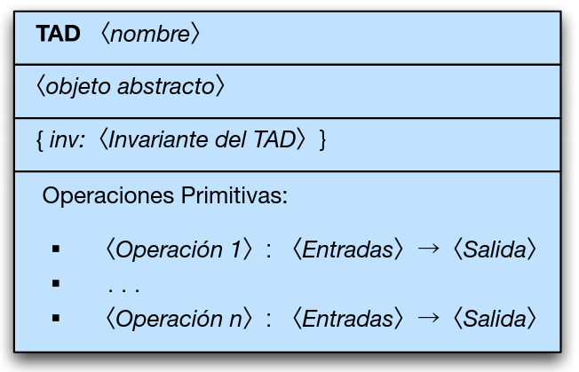

## ¿Cuáles son los elementos de esta especificación formal?

:::{dropdown} Elementos
- Nombre
  - Único y que lo identifique plenamente.
- Objeto abstracto.
  - Representado de manera matemática o gráfica.
  - Pueda usarse para referenciarse en formalismos y notaciones de operaciones.
- Invariante
  - Serie de condiciones que no varían nunca al interior del TAD.
:::

:::{dropdown} Listado de operaciones
- Aquellas operaciones que pueden realizarse con los objetos del tipo del TAD.
- Se especifican con las entradas a ellas y la salida que retornará el proceso.
- Adicionalmente, para cada una de las operaciones se debe escribir su comportamiento a manera de aserciones.
  - Una para mostrar qué se debe cumplir antes de ejecutar la operación (precondición).
  - Otra para decir cómo queda el sistema después de terminar el proceso (postcondición).
:::

---
**· Contenido adicional ·**

### ¿Cuáles son los elementos de esta especificación formal?

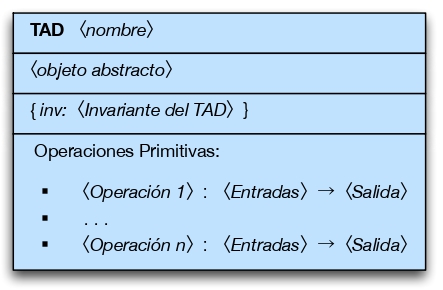

- **Nombre**
  - Único y que lo identifique plenamente.
- **Objeto abstracto**
  - Representado de manera matemática o gráfica.
  - Puede usarse para referenciarse en formalismos y notaciones de operaciones.
- **Invariante**
  - Serie de condiciones que no varían nunca al interior del TAD.

### Listado de operaciones

- Aquellas operaciones que pueden realizarse con los objetos del tipo del TAD.
- Se especifican con las entradas y la salida que retornará el proceso.
- Adicionalmente, para cada una de las operaciones se debe escribir su comportamiento a manera de aserciones.
  - **Precondición**: lo que se debe cumplir antes de ejecutar la operación.
  - **Poscondición**: cómo queda el sistema después de terminar el proceso.

---

## ¿Cómo se describen formalmente las operaciones?

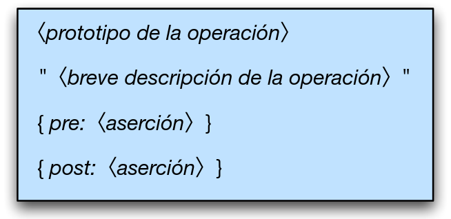

---
**· Contenido adicional ·**

### ¿Cómo se describen formalmente las operaciones?

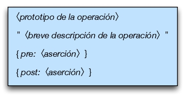

---

## ¿Por qué han de definirse formalmente las precondiciones y poscondiciones?

:::{dropdown} Razones
- El formalismo describe el propósito de la operación sin lugar a ambigüedades y con mucha exactitud.
- La formalidad acerca el diseño a la implementación (entre más formal sea el diseño del TAD más fácil será concretizarlo en algún lenguaje de programación).
:::

---
**· Contenido adicional ·**

### ¿Por qué las precondiciones y poscondiciones deben definirse formalmente?

- El formalismo describe el propósito de la operación sin ambigüedades y con exactitud.
- La formalidad acerca el diseño a la implementación (entre más formal sea el diseño del TAD, más fácil será concretizarlo en un lenguaje de programación).

---

## Ejemplo: TAD Empleado

- Suponga que una compañía tiene la información de Nombre, Foto, Documento de identidad, Cargo y Salario por cada empleado.
- Si se quisiera almacenar estos datos sería desastroso usar una variable por cada dato o empleado.
- Una forma eficiente es crear un tipo de dato Empleado para guardar la información.
- El objeto abstracto de este nuevo tipo de dato podría verse como un carné donde se encuentran la información del empleado.
- La invariante del TAD es una propiedad que hace respetar la ley que dice que ninguna persona puede ganarse un salario menor al salario mínimo mensual vigente reglamentado por el gobierno.

---
**· Contenido adicional ·**

### Ejemplo: TAD Empleado

- Una compañía tiene la información de Nombre, Foto, Documento de identidad, Cargo y Salario por cada empleado.
- Usar una variable por cada dato o empleado sería ineficiente.
- Una forma eficiente es crear un **tipo de dato Empleado** para guardar la información.
- El objeto abstracto de este nuevo tipo de dato podría verse como un carné donde se encuentra la información del empleado.
- La **invariante del TAD** es una propiedad que hace respetar la ley de que ninguna persona puede ganar un salario menor al salario mínimo mensual vigente.

---

## Primera aproximación al TAD Empleado

¿Cuál sería la primera aproximación al TAD Empleado?

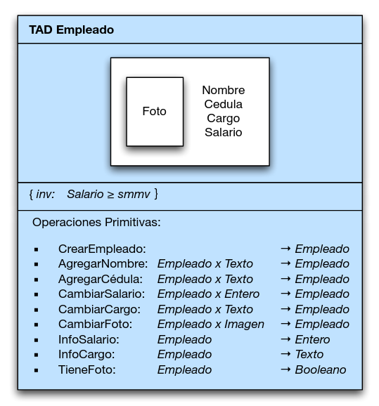

---
**· Contenido adicional ·**

### Primera aproximación al TAD Empleado

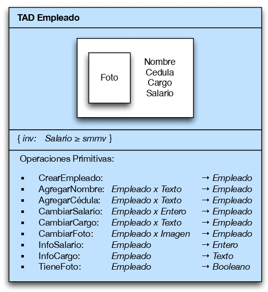

---

### Operaciones formales de la primera aproximación

¿Cómo se describe formalmente la operación CrearEmpleado?

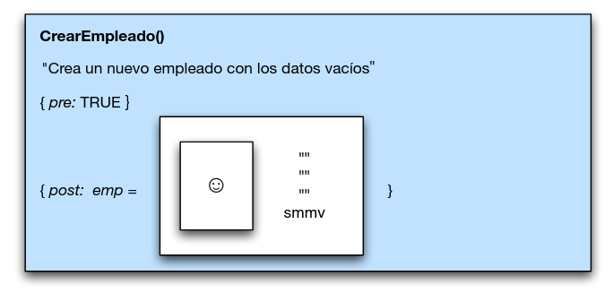

¿Cómo se describe formalmente la operación AgregarNombre?

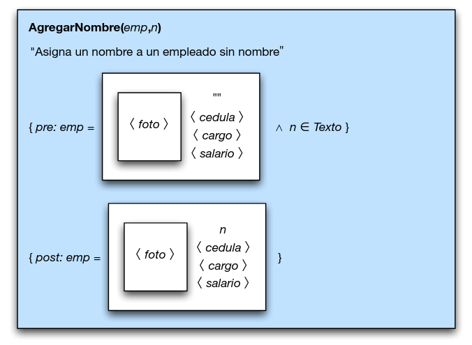

¿Cómo se describe formalmente la operación AgregarCedula?

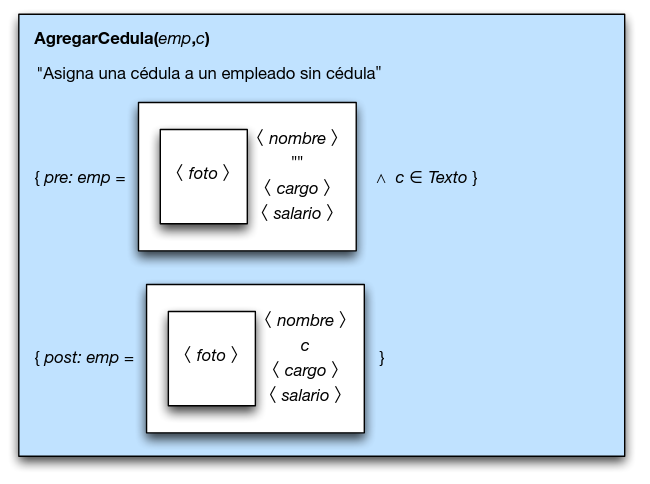

¿Cómo se describe formalmente la operación CambiarSalario?

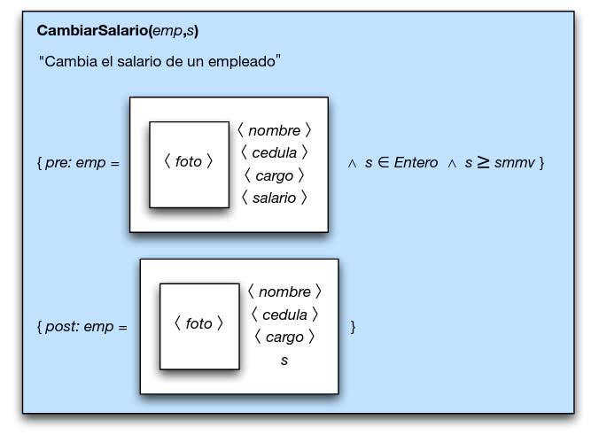

¿Cómo se describe formalmente la operación CambiarCargo?

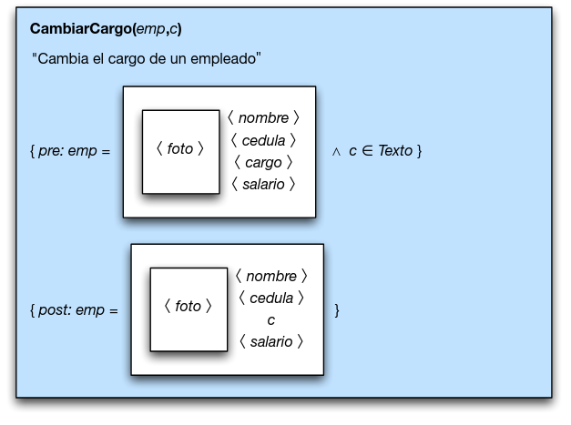

¿Cómo se describe formalmente la operación CambiarFoto?

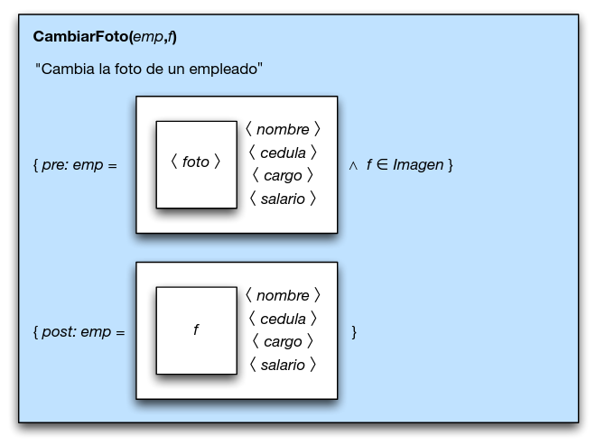

¿Cómo se describe formalmente la operación InfoSalario?

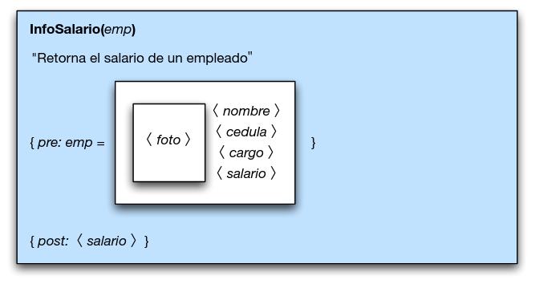

¿Cómo se describe formalmente la operación InfoCargo?

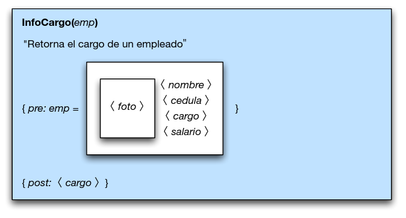

¿Cómo se describe formalmente la operación TieneFoto?

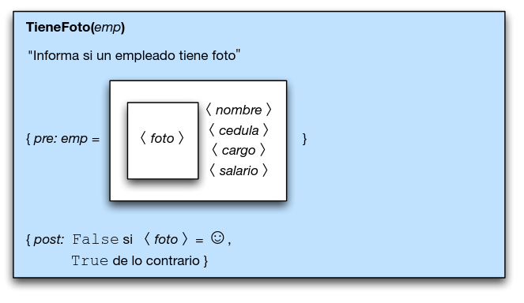

---
**· Contenido adicional ·**

### Operaciones formales de la primera aproximación

Las operaciones formales de esta primera aproximación son: **CrearEmpleado**, **AgregarNombre**, **AgregarCedula**, **CambiarSalario**, **CambiarCargo**, **CambiarFoto**, **InfoSalario**, **InfoCargo** y **TieneFoto**. Su especificación formal (prototipo, precondición y poscondición) coincide con la mostrada en la sección principal.

---

## ¿Cuál es el problema con la primera aproximación que dimos al TAD Empleado?

:::{dropdown} Problema
- Debido a que el objeto abstracto es una imagen, resulta de cierta manera incómoda su traducción a un lenguaje de programación en el momento de ser implementado el TAD.
- Al definir el objeto abstracto como una tupla, su traducción a la mayoría de lenguajes de programación sería más directa.
:::

---
**· Contenido adicional ·**

### Problema con la primera aproximación al TAD Empleado

- Debido a que el objeto abstracto es una imagen, resulta incómoda su traducción a un lenguaje de programación.
- Al definir el objeto abstracto como una **tupla**, su traducción a la mayoría de lenguajes de programación sería más directa.

---

## Segunda aproximación al TAD Empleado

¿Cuál sería la segunda aproximación al TAD Empleado?

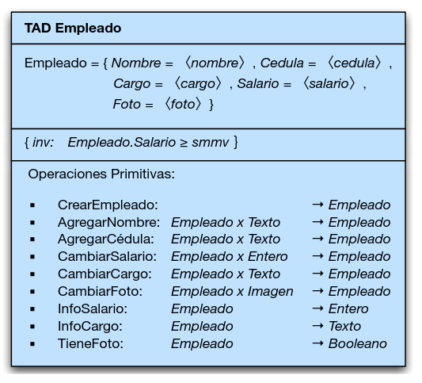

---
**· Contenido adicional ·**

### Segunda aproximación al TAD Empleado

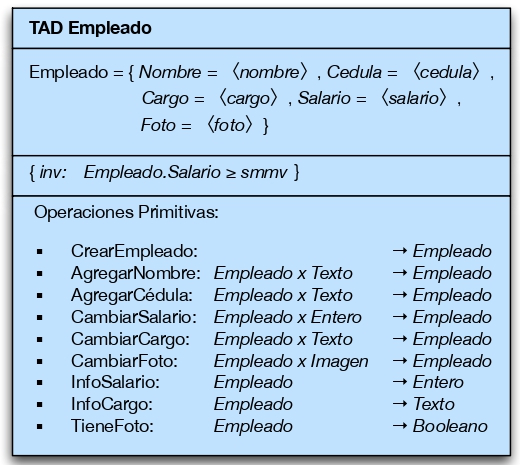

---

### Operaciones formales de la segunda aproximación

¿Cómo se describe formalmente la operación CrearEmpleado?

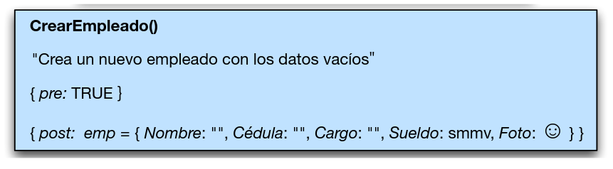

¿Cómo se describe formalmente la operación AgregarNombre?

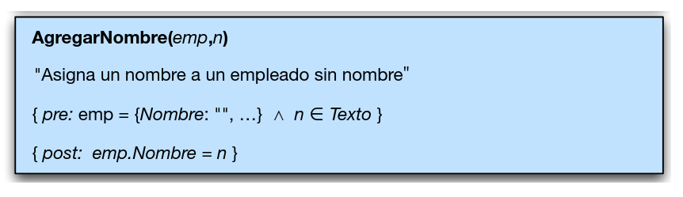

¿Cómo se describe formalmente la operación AgregarCedula?

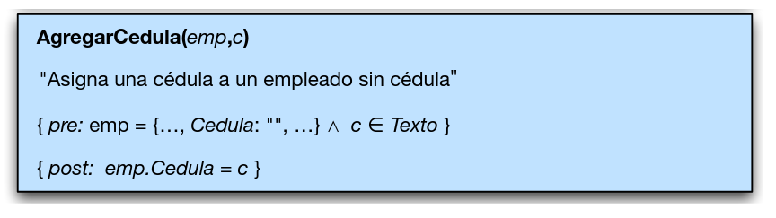

¿Cómo se describe formalmente la operación CambiarSalario?

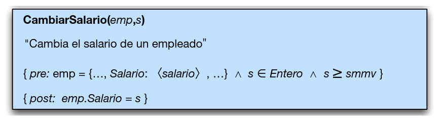

¿Cómo se describe formalmente la operación CambiarCargo?

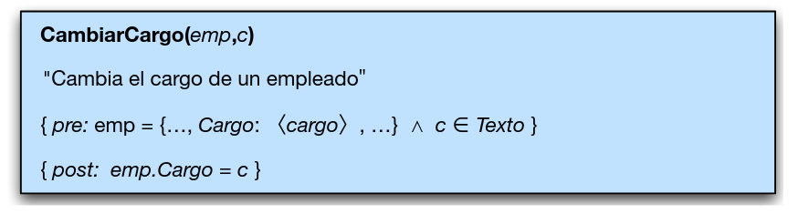

¿Cómo se describe formalmente la operación CambiarFoto?

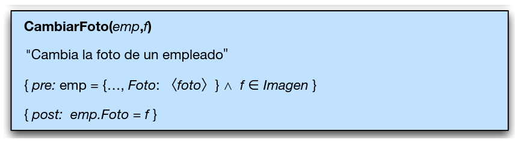

¿Cómo se describe formalmente la operación InfoSalario?

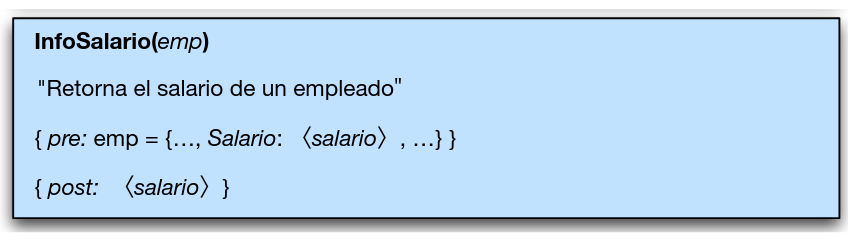

¿Cómo se describe formalmente la operación InfoCargo?

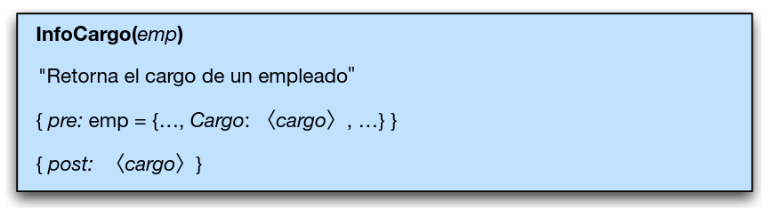

¿Cómo se describe formalmente la operación TieneFoto?

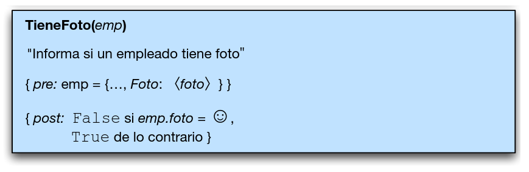

---
**· Contenido adicional ·**

### Operaciones formales de la segunda aproximación

Al representar el objeto abstracto como una tupla, la traducción de cada operación a Java (constructor, *setters*, *getters*) es directa: **CrearEmpleado**, **AgregarNombre**, **AgregarCedula**, **CambiarSalario**, **CambiarCargo**, **CambiarFoto**, **InfoSalario**, **InfoCargo** y **TieneFoto** conservan la misma especificación de precondición/poscondición mostrada en la sección principal, ahora sobre los campos de la tupla `Empleado`.

---

## ¿En qué se dividen las operaciones primitivas de un TAD?

:::{dropdown} Clasificación
- Principales
  - Constructoras
  - Modificadoras
  - Analizadoras
- Secundarias
  - Destructoras
  - Persistencia
:::

---
**· Contenido adicional ·**

### ¿En qué se dividen las operaciones primitivas de un TAD?

- **Principales**
  - Constructoras
  - Modificadoras
  - Analizadoras
- **Secundarias**
  - Destructoras
  - Persistencia

---

Continúa con los [ejercicios de TAD](exercises.md).

*Material adaptado del material original de los profesores Andrés Aristizábal y Marlon Gomez.*
