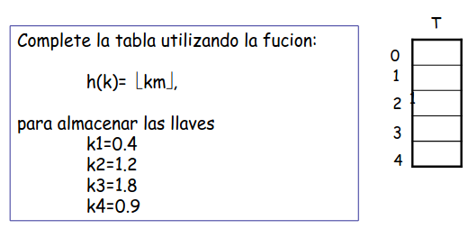

---
# Copyright (c) 2026 Angela Villota, and collaborators from the CyED block
# Licensed under the PolyForm Noncommercial License 1.0.0.
# Commercial use is prohibited without prior written authorization.
title: "Tablas Hash: Ejercicios"
---

# Tablas Hash: Ejercicios

Use esta página después de leer el [material de estudio de Tablas Hash](index.md).

**Ejercicio 1.** Considere $K = \{1, 2, 3, 4, 5\}$ el conjunto de llaves actuales, $U = \{0, 1, \ldots, 9\}$ y las siguientes operaciones:

- `DIRECT-ADDRESS-INSERT(T,2)`
- `DIRECT-ADDRESS-INSERT(T,4)`
- `DIRECT-ADDRESS-INSERT(T,3)`
- `DIRECT-ADDRESS-INSERT(T,1)`

Muestre el contenido de la tabla de direccionamiento directo.

**Ejercicio 2.** Describa un procedimiento para encontrar el elemento máximo de una tabla $T$ de tamaño $m$. Indique su complejidad.

**Ejercicio 3.** Considere una tabla hash (suponga que $\text{key}(x) = x$ y $m = 5$), con $h(1)=1$, $h(4)=1$, $h(2)=3$, $h(5)=3$, $h(3)=4$, y las siguientes operaciones:

- `HASH-INSERT(T,1)`
- `HASH-INSERT(T,2)`
- `HASH-INSERT(T,3)`
- `HASH-INSERT(T,4)`
- `HASH-INSERT(T,5)`

Muestre la tabla hash.

**Ejercicio 4.** Muestre la tabla $T$ después de insertar las llaves $5, 28, 19, 15, 20, 33, 12, 17, 10$ en una tabla hash con 9 slots siendo la función hash $h(k) = k \bmod 9$.

**Ejercicio 5.** ¿Si se mantuvieran ordenados los elementos de cada lista encadenada, cómo cambian los tiempos para insertar, borrar, y buscar?

**Ejercicio 6.** Complete la tabla utilizando la función:

$$
h(k)= \lfloor km \rfloor,
$$

para almacenar las llaves $k_1=0.4$, $k_2=1.2$, $k_3=1.8$, $k_4=0.9$ (tabla $T$ con slots $0$ a $4$, es decir $m=5$):

**Ejercicio 7.** Sea $m = 10000$, $A = 0.61803$, muestre los valores $h(k)$ que se asignarían para $K = 1000$, $123400$, $40321$ y $10002$, utilizando

$$
h(k) = \lfloor 10000 \cdot (0.61803 \cdot k \bmod 1) \rfloor
$$

---
**· Contenido adicional ·**

### Ejercicio de método de división a nivel de bits

Con el método de división $h(k) = k \bmod m$ y $m = 2^3 = 8$, calcule $h(k)$ para cada una de las siguientes llaves y verifique que corresponde a los 3 bits menos significativos de $k$:

1. $k = 8$
2. $k = 16$
3. $k = 24$
4. $k = 4$
5. $k = 12$
6. $k = 20$
7. $k = 28$

**Solución:**

- $k = 8 \quad \longrightarrow \quad 8 \bmod 8 = 0 \quad \longrightarrow \quad 1\underline{000}$
- $k = 16 \quad \longrightarrow \quad 16 \bmod 8 = 0 \quad \longrightarrow \quad 10\underline{000}$
- $k = 24 \quad \longrightarrow \quad 24 \bmod 8 = 0 \quad \longrightarrow \quad 11\underline{000}$
- $k = 4 \quad \longrightarrow \quad 4 \bmod 8 = 4 \quad \longrightarrow \quad \underline{100}$
- $k = 12 \quad \longrightarrow \quad 12 \bmod 8 = 4 \quad \longrightarrow \quad 1\underline{100}$
- $k = 20 \quad \longrightarrow \quad 20 \bmod 8 = 4 \quad \longrightarrow \quad 10\underline{100}$
- $k = 28 \quad \longrightarrow \quad 28 \bmod 8 = 4 \quad \longrightarrow \quad 11\underline{100}$

---

*Material adaptado del material original de los profesores Oscar Bedoya y Marlon Gomez.*
