---
# Copyright (c) 2026 Angela Villota, and collaborators from the CyED block
# Licensed under the PolyForm Noncommercial License 1.0.0.
# Commercial use is prohibited without prior written authorization.
title: "Unidad 3: Tablas Hash"
---

# Unidad 3: Tablas Hash

---
**· Contenido adicional ·**

### ¿Qué es un diccionario y por qué usar tablas hash?

**¿Qué es una estructura de datos de tipo diccionario?**

- Es una estructura utilizada para manipular objetos en la que se insertan y extraen elementos periódicamente.
- Se puede verificar si un elemento específico pertenece o no a la colección.
- También se conoce como **arreglo asociativo** o **mapa**.

Cada elemento de un diccionario tiene una **clave (key)** y un **valor (value)** asociado a esa clave, igual que en un diccionario del mundo real, donde las palabras son las claves y las definiciones son los valores. Los datos se almacenan como pares **(clave, valor)**; la clave se usa para buscar y encontrar el valor.

En un **array**, la clave debe ser un número entero no negativo; en un **diccionario**, la clave puede ser cualquier tipo de objeto.

Operaciones básicas de un diccionario:

- $void\ Add(K\ key, V\ value)$ → agregar un par clave-valor.
- $V\ Get(K\ key)$ → obtener el valor asociado a una clave.
- $boolean\ Remove(K\ key)$ → eliminar un par clave-valor.
- $boolean\ Contains(K\ key)$ → verificar si una clave está en el diccionario.
- $int\ Count()$ → obtener la cantidad de elementos almacenados.

**Ejemplo real.** Los compiladores mantienen una **tabla de símbolos** en la que las claves son cadenas de caracteres arbitrarias que corresponden a los identificadores del lenguaje (variables, funciones, etc.).

**¿Cuál es una forma eficiente de implementar diccionarios?** Utilizando **tablas hash**.

**¿Por qué?** Aunque en el peor caso la búsqueda en una tabla hash puede tardar $\Theta(n)$, en la práctica el rendimiento es muy bueno: bajo suposiciones razonables, el tiempo promedio de búsqueda es $O(1)$.

**¿Qué es una tabla hash?**

Una tabla hash es una estructura de datos que asocia claves con valores mediante una función de hash, permitiendo búsquedas, inserciones y eliminaciones rápidas en tiempo promedio $O(1)$. Generaliza la noción de un array ordinario: acceder directamente a una posición en un array se hace en $O(1)$, y cuando el número de claves almacenadas es pequeño comparado con el número total de claves posibles, las tablas hash son una alternativa eficiente frente a reservar un array de tamaño el universo de claves.

Características principales:

- Almacenamiento basado en clave-valor.
- Uso de una función hash para calcular la posición de almacenamiento.
- Eficiencia alta en búsquedas, inserciones y eliminaciones ($O(1)$ en promedio).
- Puede manejar colisiones mediante **encadenamiento** o **direccionamiento abierto** (en Java, `HashMap` usa encadenamiento).

---

## Lista enlazada

Antes de estudiar las tablas hash, se repasa brevemente la lista simplemente enlazada, estructura sobre la cual se construye la resolución de colisiones por encadenamiento.

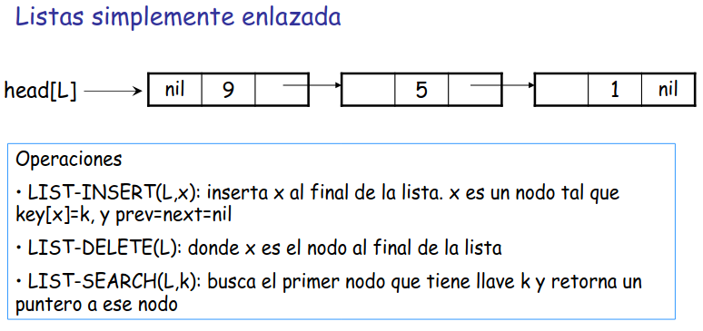

Operaciones:

- `LIST-INSERT(L,x)`: inserta $x$ al final de la lista. $x$ es un nodo tal que $key[x]=k$, y $prev=next=nil$.
- `LIST-DELETE(L)`: donde $x$ es el nodo al final de la lista.
- `LIST-SEARCH(L,k)`: busca el primer nodo que tiene llave $k$ y retorna un puntero a ese nodo.

## Tablas de direccionamiento directo

La siguiente secuencia muestra, paso a paso, cómo se llega de la idea de una tabla de símbolos ingenua a la noción formal de **tabla de direccionamiento directo**.

**Paso 1.** Un compilador necesita una tabla de símbolos cuya llave son los identificadores de las variables. Para el programa `programa1(int n)`, la tabla se representa inicialmente como una simple tabla de dos columnas (llave, valor):

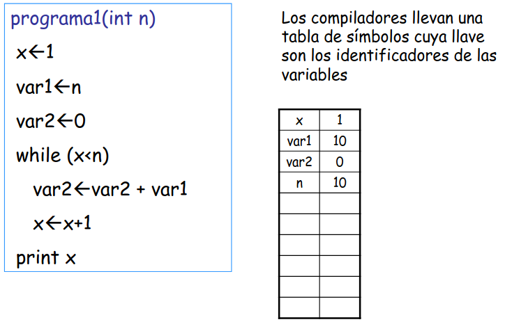

**Paso 2.** Esa misma tabla de símbolos se dibuja ahora como un arreglo indexado de $0$ a $9$, donde cada slot apunta (mediante un puntero) al registro (llave, valor) correspondiente:

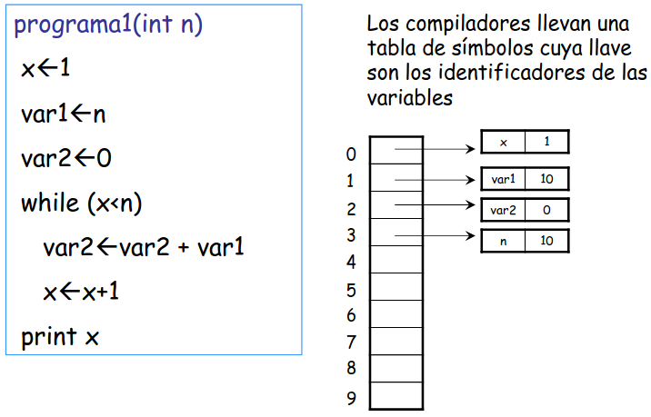

**Paso 3.** Sobre esta representación se identifican las operaciones básicas: **Insertar**, **Borrar** y **Buscar**.

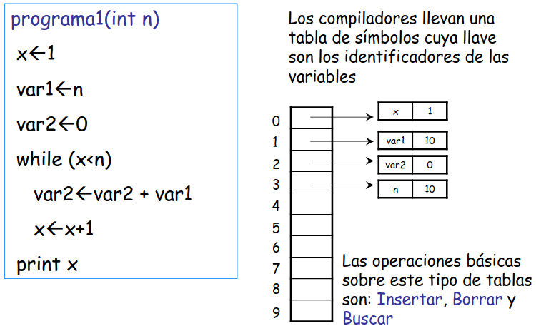

**Paso 4.** ¿Qué tan costoso puede ser **insertar** un par (llave, valor) en la tabla? ¿En qué posición de la tabla se debería almacenar un nuevo dato?

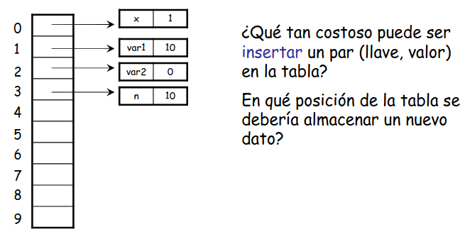

**Paso 5.** ¿Qué tan costoso puede ser **buscar** un par (llave, valor) en la tabla?

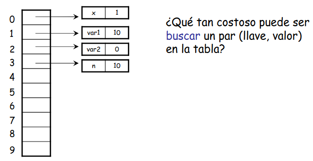

**Paso 6.** Las llaves se manejan como valores numéricos; en el caso de cadenas de caracteres, se convierten a un número entero utilizando código ASCII:

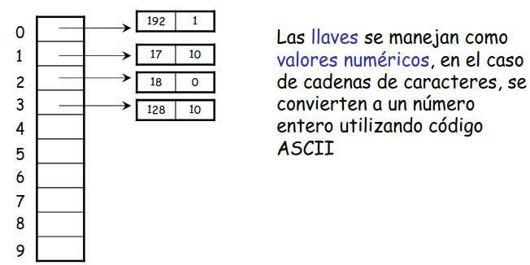

**Paso 7.** Una estrategia consiste en aprovechar que las llaves son numéricas y almacenar el par (llave, valor) directamente en la posición "llave" de la tabla. Esta estrategia se conoce como **tabla de direccionamiento directo**. ¿Cuál es el tiempo de búsqueda ahora?

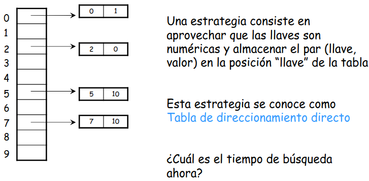

**Paso 8.** Pseudocódigo de las operaciones sobre una tabla de direccionamiento directo:

```
DIRECT-ADDRESS-INSERT(T,X)
  T[key[x]] ← x

DIRECT-ADDRESS-SEARCH(T,k)
  return T[k]

DIRECT-ADDRESS-DELETE(T,k)
  T[key[x]] ← nil
```

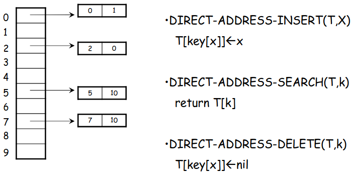

**Paso 9.** Todas estas operaciones toman tiempo constante $\mathcal{O}(1)$.

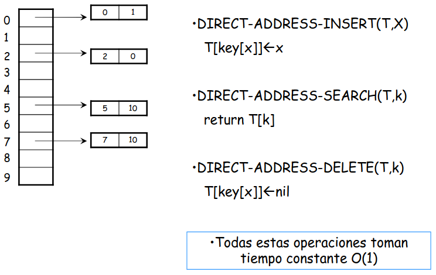

**Paso 10.** Se formaliza la diferencia entre el **universo de llaves $U$** y las **llaves utilizadas $K$** (con $K \subseteq U$):

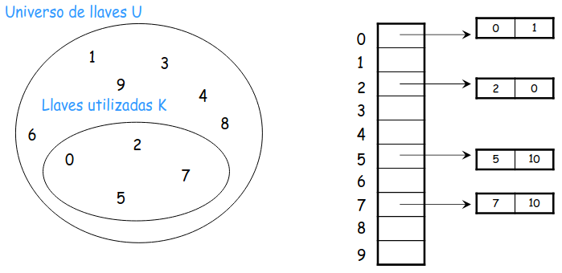

**Paso 11.** $U=\{0,1,\ldots,m-1\}$, donde $|U|=m$. La tabla de direccionamiento directo $T$ se puede ver como un arreglo $T[0,\ldots,m-1]$ donde cada posición, o *slot*, corresponde a una llave en $U$.

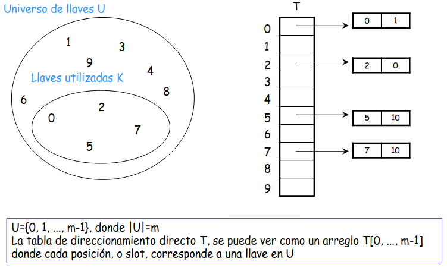

---
**· Contenido adicional ·**

### Direccionamiento directo

Es una técnica sencilla que funciona bien cuando el universo $U$ de claves es relativamente pequeño. Supongamos que una aplicación necesita un conjunto dinámico en el que cada elemento tiene una clave tomada del universo $U = \{0,1,\ldots,m-1\}$, donde $m$ no es muy grande y no hay dos elementos con la misma clave.

- Para representar el conjunto dinámico se usa un **array** o **tabla de direccionamiento directo**, denotado como $T[0..m-1]$.
- Cada posición o **slot** en el array corresponde a una clave en el universo $U$.
- El **slot $k$** apunta a un elemento del conjunto con clave $k$.
- Si el conjunto no contiene un elemento con clave $k$, entonces $T[k] = NIL$.

```java
// Búsqueda en direccionamiento directo
T[k]

// Inserción en direccionamiento directo
T[x.key] = x

// Eliminación en direccionamiento directo
T[x.key] = NIL
```

Cada una de estas operaciones tiene un tiempo de ejecución de $O(1)$.

**Ejemplo.** Dado el universo $U=\{0,1,\ldots,9\}$ y el conjunto de claves $K=\{2,3,5,8\}$:

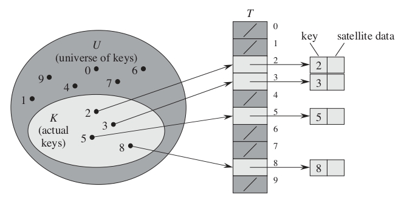

**¿Cuál es la desventaja del direccionamiento directo?**

- Si el universo $U$ es muy grande, almacenar una tabla $T$ de tamaño $|U|$ puede ser impráctico o incluso imposible debido a las limitaciones de memoria de un ordenador típico.
- Si $|K| \ll |U|$, la mayor parte del espacio reservado para $T$ sería desperdiciado.

---

Considere el caso en el que tuviese que almacenar 1000 datos utilizando una tabla de direccionamiento directo.

¿Qué pasa si $|K| \ll |U|$?

Los requerimientos de memoria pueden llegar a ser de $\mathcal{O}(|U|)$ aun cuando no se utilicen todos los slots.

Las **tablas hash** ofrecen un mecanismo para asignar la posición de almacenamiento para las llaves, de tal forma que los requerimientos de memoria pueden ser de $\mathcal{O}(|K|)$.

## Tablas hash

**Paso 12.** Las tablas hash utilizan una función $h: U \rightarrow \{0,1,\ldots,m-1\}$. Ahora $|U|>m$, así que varias llaves del universo se asignan (mediante $h$) a los mismos slots que antes:

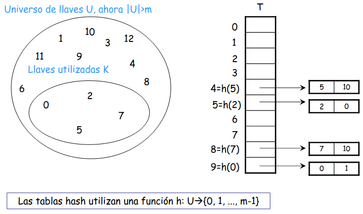

**Paso 13.** La tarea de $h$ es asignar el slot a cada llave: $h(k_1)$, $h(k_2)$, $h(k_5)$, $h(k_7)$, etc.

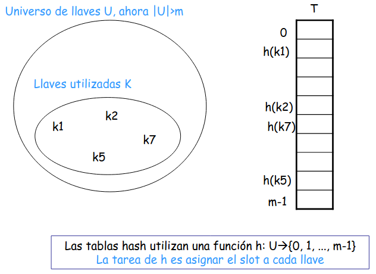

**Paso 14.** Como $|U|>m$, pueden existir dos llaves en el mismo slot; a esto se le llama una **colisión** (aquí $h(k_7)=h(k_{100})$):

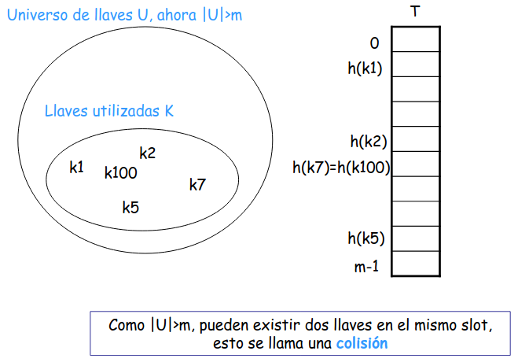

---
**· Contenido adicional ·**

### El hashing y el problema de las colisiones

Mientras que en el direccionamiento directo un elemento con clave $k$ se almacena en la posición $k$, con hashing se almacena en la posición $h(k)$. Se utiliza una función hash $h$ para calcular la posición a partir de la clave $k$. La función $h$ mapea el universo $U$ de claves en los slots de una tabla hash $T[0..m-1]$:

$$
h:U\to\{0,1,\ldots,m-1\}
$$

Donde $m \ll |U|$. La función hash reduce el rango de índices del array y, por lo tanto, el tamaño del array: en lugar de tener un tamaño de $|U|$, la tabla puede tener un tamaño de $m$.

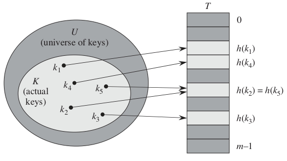

**¿Cuál es el problema con esta solución?** Dos claves pueden generar el mismo valor hash, es decir, pueden ser asignadas al mismo espacio en la tabla. A esta situación se le llama **colisión**.

**¿Cómo resolver el problema de las colisiones?** La solución ideal sería evitarlas por completo, eligiendo una función hash $h$ adecuada que parezca aleatoria para minimizar las colisiones. Sin embargo, dado que $|U| > m$, al menos dos claves deben compartir el mismo valor hash, por lo que **es imposible evitarlas por completo**. Otra manera de resolver este problema es mediante técnicas de **resolución de colisiones**, como el **encadenamiento**.

---

**Paso 15.** Las colisiones se tratan con diferentes técnicas. La más conocida es la **resolución de colisiones por encadenamiento**.

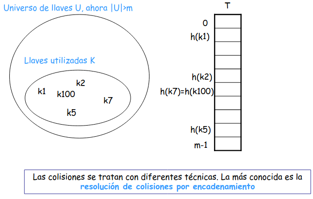

**Paso 16.** Cada slot $T[j]$ tiene una lista encadenada de todas las llaves cuyo valor hash es $j$ (nótese cómo $k_7$ y $k_{100}$, que colisionan, quedan en la misma lista):

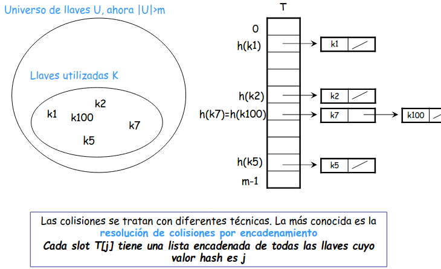

**Paso 17.** Pseudocódigo de las operaciones con encadenamiento:

```
CHAINED-HASH-INSERT(T,x)
  insertar x en la cabeza de la lista T[h(key[x])]

CHAINED-HASH-SEARCH(T,k)
  buscar por un elemento con llave k en la lista T[h(key[k])]

CHAINED-HASH-DELETE(T,k)
  borrar x de la lista T[h(key[k])]
```

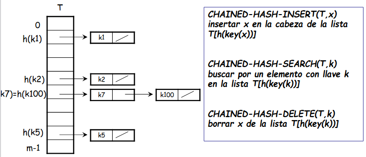

**Paso 18.** Analice las complejidades de las operaciones.

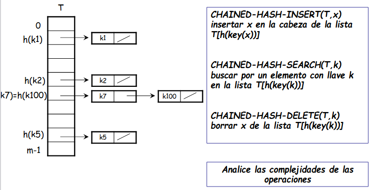

---
**· Contenido adicional ·**

### Encadenamiento

Es un mecanismo donde todos los elementos que generan el mismo hash se agrupan en una **lista enlazada**. El **espacio $j$ de la tabla contiene un puntero** a la cabeza de la lista de elementos que tienen el mismo hash. Si no hay elementos en ese espacio, **contiene NIL**.

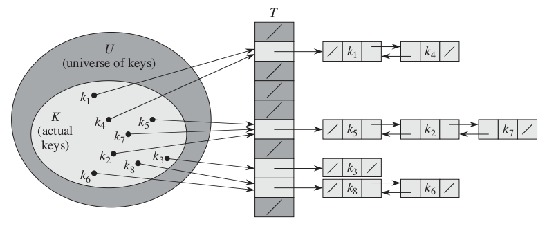

Implementación de operaciones en un diccionario usando hash y encadenamiento:

```java
// Inserción en hash con encadenamiento
CHAINED-HASH-INSERT(T, x)
  insertar x al inicio de la lista T[h(x.key)]

// Búsqueda en hash con encadenamiento
CHAINED-HASH-SEARCH(T, k)
  buscar un elemento con clave k en la lista T[h(k)]

// Eliminación en hash con encadenamiento
CHAINED-HASH-DELETE(T, x)
  eliminar x de la lista T[h(x.key)]
```

**¿Cuáles son los tiempos de ejecución de estas operaciones?**

- Inserción: $O(1)$ en el peor caso.
- Búsqueda: depende de la longitud de la lista, en el peor caso puede ser $O(n)$.
- Eliminación: $O(1)$ si las listas están doblemente enlazadas.

*Nota:* en la eliminación, la función `CHAINED-HASH-DELETE` recibe el elemento $x$ en lugar de su clave $k$, para evitar una búsqueda adicional.

---

**Teorema 1.** En una tabla hash en la cual las colisiones son resueltas con encadenamiento, una búsqueda **sin éxito** toma en promedio $\Theta(1+\alpha)$, bajo la suposición de hashing uniforme.

**Teorema 2.** En una tabla hash en la cual las colisiones son resueltas con encadenamiento, una búsqueda **exitosa** toma en promedio $\Theta(1+\alpha)$, bajo la suposición de hashing uniforme.

---
**· Contenido adicional ·**

### Factor de carga y rendimiento del encadenamiento

Sea una tabla hash $T$ con $m$ espacios y $n$ elementos. Se define el **factor de carga** $\alpha$ de $T$ como $\alpha=\dfrac{n}{m}$; $\alpha$ representa el número promedio de elementos en cada lista.

En el peor caso, todas las claves colisionan en el mismo espacio, generando una lista de longitud $n$. En ese caso, el tiempo de búsqueda sería $\Theta(n)$, más el tiempo para calcular la función hash. Por eso no usamos tablas hash por su rendimiento en el peor caso, sino por su rendimiento en promedio.

El rendimiento promedio del hashing con encadenamiento depende de qué tan bien la función hash $h$ distribuya uniformemente los elementos. Se asume **hashing uniforme simple**, donde cada elemento es igualmente probable de ser asignado a cualquier espacio de la tabla.

Casos de búsqueda:

- Búsqueda sin éxito: no hay un elemento con clave $k$.
- Búsqueda exitosa: encontramos un elemento con clave $k$.

*Teoremas* (bajo el supuesto de hashing uniforme): tanto la búsqueda sin éxito como la exitosa toman, en promedio, tiempo $\Theta(1+\alpha)$.

**¿Qué significa este análisis?** Si el número de espacios en la tabla es proporcional al número de elementos, es decir $n=O(m)$, entonces

$$
\alpha=\frac{O(m)}{m}=O(1)
$$

La búsqueda toma tiempo constante en promedio, y todas las operaciones del diccionario pueden realizarse en $O(1)$ en promedio.

---

## Funciones hash

**Paso 19.** La peor función hash posible es aquella en la que todas las llaves caen en el mismo slot. Una **buena función hash** debería tener una distribución uniforme para la asignación de slots. ¿Por qué?

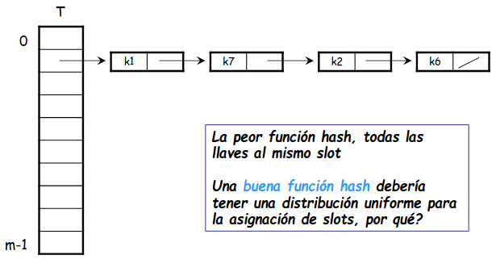

**Paso 20.** Dada una tabla $T$ con $m$ slots que almacena $n$ elementos, el valor $\alpha=n/m$ se conoce como **factor de carga**. Este valor indica, en promedio, cuántas llaves deberían quedar en cada slot. Se asume que cualquier elemento tiene la misma probabilidad de ser asignado a cualquiera de los slots, independientemente de dónde se hayan asignado otros elementos: esta es la **suposición de hashing uniforme**.

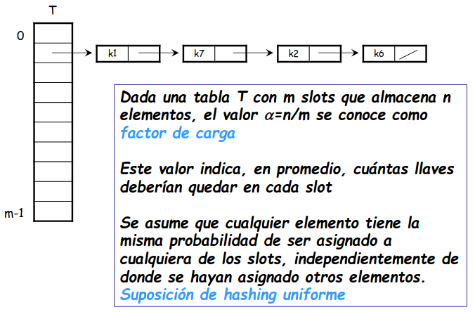

Una buena función hash satisface:

$$
\sum_{k:\, h(k)=j} P(k) = \frac{1}{m}
\qquad \text{para } j = 0, 1, \ldots, m-1
$$

Es común tener en un programa nombres de identificadores que son similares, `var1`, `var2`, por ejemplo. Una buena función hash debería asignarlos a slots diferentes, así se muestra que existe independencia entre cada par de llaves.

---
**· Contenido adicional ·**

### ¿Qué hace buena a una función hash?

Que satisfaga (aproximadamente) la suposición de hashing uniforme simple: que cada clave tenga la misma probabilidad de dispersarse en cualquiera de los $m$ espacios, independientemente de dónde hayan sido asignadas otras claves. Desafortunadamente, típicamente no tenemos forma de verificar esta condición, ya que rara vez conocemos la distribución de probabilidad de la que provienen las claves.

**Ejemplo: identificadores similares.** Es bastante común en un programa tener nombres de identificadores similares, como `var1`, `var2`, etc. Una buena función hash debe asignarlos a diferentes espacios; de esta manera se puede observar la independencia entre cada par de claves.

**Ejemplo: distribución conocida de claves.** Ocasionalmente conocemos la distribución de las claves. Si sabemos que son números reales aleatorios $k$, distribuidos de manera uniforme e independiente en el rango $0 \leq k \leq 1$, entonces la función hash $h(k) = \lfloor km \rfloor$ satisface la condición de hashing uniforme simple.

---

**Llaves de tipo string.** Cuando una llave es un string, se utiliza una transformación del código ASCII, en el cual se consideran los caracteres de 0 a 127.

$$
\texttt{pt} = 112 \cdot 128^{1} + 116 \cdot 128^{0} = 14452
$$

**Funciones hash.** ¿Cómo evitar las colisiones o que por lo menos ocurran de tal forma que cualquier colisión sea igual de probable?

**Una función hash.** Para el caso en que las llaves sean números reales distribuidos en el rango $0 \leq k < 1$,

$$
h(k) = \lfloor km \rfloor, \quad \text{donde } T[0, 1, \ldots, m-1]
$$

---
**· Contenido adicional ·**

### Llaves de tipo cadena de texto

La mayoría de las funciones hash asumen que el universo de claves es el conjunto $\mathbb{N} = \{0,1,\ldots\}$. Si las claves no son números naturales, debemos encontrar una forma de interpretarlas como tales. Para interpretar una cadena de texto podemos usar la tabla ASCII, que asigna valores entre 0 y 127 a los caracteres.

Podemos interpretar el identificador $pt$ como el par de enteros decimales $(112, 116)$, ya que en ASCII $p = 112$ y $t = 116$. Finalmente, lo expresamos como un número en base 128:

$$
pt = 112 \times 128^1 + 116 \times 128^0 = 14452
$$

---

### Método de división

Utiliza la función hash:

$$
h(k) = k \bmod m
$$

---
**· Contenido adicional ·**

### Método de división

- $h(k) = k \bmod m$.
- En este caso, $m$ no debe ser una potencia de $2$.
- Si $m = 2^p$, entonces $h(k)$ son simplemente los $p$ bits menos significativos de $k$.
- Una buena elección para $m$ suele ser un número primo que no esté demasiado cerca de una potencia de $2$.

**Ejemplo.** Método de división con $m = 2^3 = 8$. Aquí, $h(k)$ corresponde a los 3 bits menos significativos de $k$:

- $k = 8 \quad \longrightarrow \quad 8 \bmod 8 = 0 \quad \longrightarrow \quad 1\underline{000}$
- $k = 16 \quad \longrightarrow \quad 16 \bmod 8 = 0 \quad \longrightarrow \quad 10\underline{000}$
- $k = 24 \quad \longrightarrow \quad 24 \bmod 8 = 0 \quad \longrightarrow \quad 11\underline{000}$
- $k = 4 \quad \longrightarrow \quad 4 \bmod 8 = 4 \quad \longrightarrow \quad \underline{100}$
- $k = 12 \quad \longrightarrow \quad 12 \bmod 8 = 4 \quad \longrightarrow \quad 1\underline{100}$
- $k = 20 \quad \longrightarrow \quad 20 \bmod 8 = 4 \quad \longrightarrow \quad 10\underline{100}$
- $k = 28 \quad \longrightarrow \quad 28 \bmod 8 = 4 \quad \longrightarrow \quad 11\underline{100}$

---

**Paso 22.** Complete la tabla utilizando la función $h(k) = k \bmod m$, para almacenar las llaves $k_1=4$, $k_2=2$, $k_3=8$, $k_4=9$ en una tabla $T$ con $m=4$ slots (vacía):

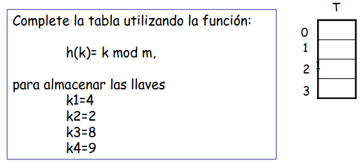

**Paso 23.** Solución: $h(k_1)=4\bmod 4=0$, $h(k_3)=8\bmod 4=0$ (colisionan en el slot $0$), $h(k_4)=9\bmod 4=1$, $h(k_2)=2\bmod 4=2$:

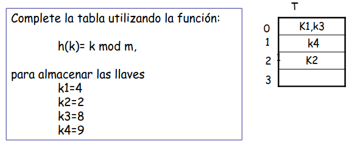

**Paso 24.** A nivel de bits, si $m$ es potencia de $2$, se cumple que el valor $h(k)$ dependerá de los bits de más bajo orden de $k$, haciendo que $h(k)$ no dependa de todos los valores de $k$:

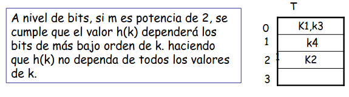

### Método de multiplicación

Utiliza la función hash:

$$
h(k) = \lfloor m \cdot (kA \bmod 1) \rfloor
\quad \text{donde } A \text{ es cualquier número real entre 0 y 1}
$$

El valor de $A$ no es crítico.

---
**· Contenido adicional ·**

### Método de multiplicación

- $h(k) = \lfloor m \times (k \cdot A \bmod 1) \rfloor$, donde $k \cdot A \bmod 1$ es la parte fraccionaria de $k \cdot A$, es decir, $(k \cdot A - \lfloor k \cdot A \rfloor)$.
- Se debe cumplir que $0 < A < 1$.

**Consideraciones.** El valor de $m$ no es crítico: no es necesario evitar ciertos valores de $m$ como en el método de división. Comúnmente, $m$ se elige como una potencia de $2$ ($m = 2^p$ para algún entero $p$), lo cual simplifica los cálculos.

**Elección óptima del valor de $A$.** Aunque este método funciona con cualquier valor de la constante $A$, algunos valores ofrecen mejores resultados. La elección óptima depende de las características de los datos a dispersar. **Knuth** sugiere usar

$$
A \approx \frac{(\sqrt{5} - 1)}{2}=0.6180339887\ldots
$$

---
**· Contenido adicional ·**

### Hashing universal

En el hashing universal, al inicio de la ejecución se selecciona aleatoriamente una función hash de una clase cuidadosamente diseñada. Sea $\mathcal{H} = \{h_1, h_2, \ldots, h_l\}$ una colección finita de funciones hash que asignan un universo $U$ de claves al rango $\{0,1,\ldots,m-1\}$.

Dicha colección se considera **universal** si, para cada par de claves distintas $x, y \in U$, la cantidad de funciones hash $h \in \mathcal{H}$ que cumplen $h(x) = h(y)$ es como máximo $|\mathcal{H}| / m$. En otras palabras, al elegir una función hash al azar de $\mathcal{H}$, la probabilidad de colisión entre dos claves distintas $x, y$ no es mayor que $1/m$, lo que equivale a una asignación aleatoria e independiente en el rango $\{0,1,\ldots,m-1\}$.

---

## Implementación en Java

**Estructura de la implementación.** La tabla hash se construye sobre tres clases:

- `Nodo<T>` — unidad básica con un dato y puntero al siguiente nodo.
- `ListaEnlazadaGenerica<T>` — cadena de nodos; resuelve colisiones por *encadenamiento*.
- `TablaHash` — arreglo de listas de `Integer`; llave y valor son ambos `int`.

`TablaHash` es un arreglo de `ListaEnlazadaGenerica`, y cada `ListaEnlazadaGenerica` está compuesta de nodos `Nodo<Integer>`.

**`Nodo.java`**

```java
public class Nodo<T> {
    public T dato;
    public Nodo<T> siguiente;

    public Nodo(T dato) {
        this.dato = dato;
        this.siguiente = null;
    }
}
```

- `T` es el tipo genérico: en esta tabla, `T = Integer`.
- `siguiente` encadena nodos formando la lista enlazada.
- Al crearse, `siguiente = null` indica que es el último nodo.

**`ListaEnlazadaGenerica.java`**

```java
public class ListaEnlazadaGenerica<T> {
    private Nodo<T> cabeza;
    private int size;

    public void agregar(T dato) { ... }
    public T obtener(int indice) { ... }
    public void eliminar(int indice) { ... }
    public int size() { return size; }
    public boolean estaVacia() { return size == 0; }
}
```

- Cada slot de la tabla almacena **una instancia** de esta lista con los valores enteros.
- `agregar` recorre hasta el último nodo y enlaza el nuevo: $\Theta(n)$.
- `obtener` e `eliminar` también recorren: $\Theta(n)$ en el peor caso.
- Con hashing uniforme, cada lista tiene en promedio $\alpha = n/m$ elementos.

**`TablaHash.java` — estructura interna**

```java
public class TablaHash {
  private ListaEnlazadaGenerica<Integer>[]
          tabla;
  private int size;

  @SuppressWarnings("unchecked")
  public TablaHash(int n) throws Exception {
    this.tabla = new ListaEnlazadaGenerica[n];
    this.size  = n;
  }

  private int hashFunction(int k)
      throws Exception {
    return k % this.size;
  }
}
```

- `tabla`: arreglo de $m$ listas; cada posición es un *slot* o *bucket*.
- Cada lista almacena valores `Integer` directamente — no se necesita clase auxiliar.
- `hashFunction`: implementa $h(k) = k \bmod m$.

**`TablaHash.java` — `insert`**

```java
public void insert(int k, int value)
    throws Exception {
  int pos = hashFunction(k);
  if (tabla[pos] == null)
    tabla[pos] = new ListaEnlazadaGenerica<>();
  tabla[pos].agregar(value);
}
```

- Calcula $h(k) = k \bmod m$.
- Crea la lista del slot si aún no existe.
- Siempre **agrega** el valor al final — permite duplicados.
- Costo promedio: $\Theta(1)$.

**`TablaHash.java` — `search` y `delete`**

```java
public boolean search(int k, int value)
    throws Exception {
  int pos = hashFunction(k);
  ListaEnlazadaGenerica<Integer> lista =
      tabla[pos];
  if (lista != null)
    for (int i = 0; i < lista.size(); i++)
      if (lista.obtener(i) == value)
        return true;
  return false;
}

public void delete(int k, int v)
    throws Exception {
  int pos = hashFunction(k);
  ListaEnlazadaGenerica<Integer> lista =
      tabla[pos];
  if (lista == null || lista.estaVacia())
    return;
  for (int i = 0; i < lista.size(); i++)
    if (lista.obtener(i) == v) {
      lista.eliminar(i); return;
    }
}
```

- `search`: recorre el slot buscando el *valor* exacto; retorna `boolean`.
- `delete`: localiza el índice `i` y llama `eliminar(i)`.
- Ambos: $\Theta(1+\alpha)$ promedio.

**¿Qué es `hashCode()` en Java?**

Todo objeto en Java hereda de `Object` el método:

```java
public int hashCode();
```

- Para `Integer k`: `k.hashCode()` retorna el propio valor entero $k$.
- Para `String "pt"`: suma ponderada de caracteres ASCII,
  $$
  \texttt{"pt"}.hashCode() = 112 \cdot 31^1 + 116 \cdot 31^0 = 3588
  $$
- Para objetos propios: se debe **sobreescribir** `hashCode()` manualmente.
- Contrato: si `a.equals(b)` entonces `a.hashCode() == b.hashCode()`.

**La función hash en esta implementación**

```java
private int hashFunction(int k)
    throws Exception {
  return k % this.size;
}
```

- La llave `k` ya es `int`: no se necesita `hashCode()`.
- `% this.size` garantiza resultado en $[0,\, m-1]$.
- Equivale a $h(k) = k \bmod m$.
- Para llaves negativas conviene `Math.abs(k) % size`.

**Ejemplos con $m=10$**

| Llave $k$ | $h(k) = k \bmod 10$ |
|---|---|
| 42 | 2 |
| 17 | 7 |
| 130 | 0 |

*Si se extendiera a llaves genéricas, bastaría reemplazar `k` por `Math.abs(k.hashCode())`.*

---

Continúa con los [ejercicios de Tablas Hash](exercises.md).

*Material adaptado del material original de los profesores Oscar Bedoya y Marlon Gomez.*
